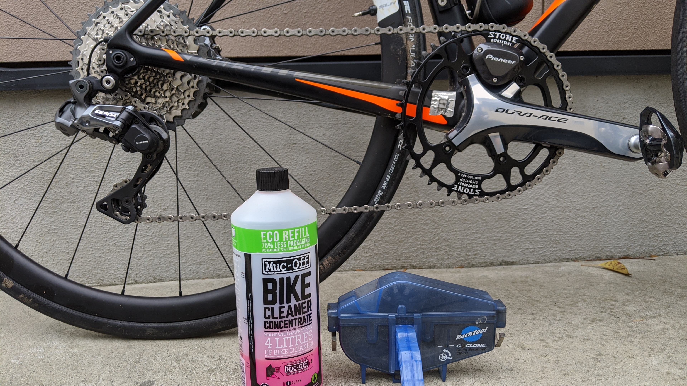
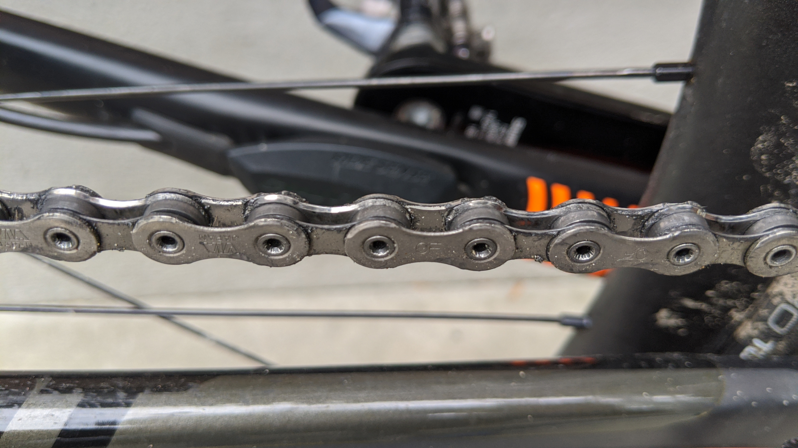
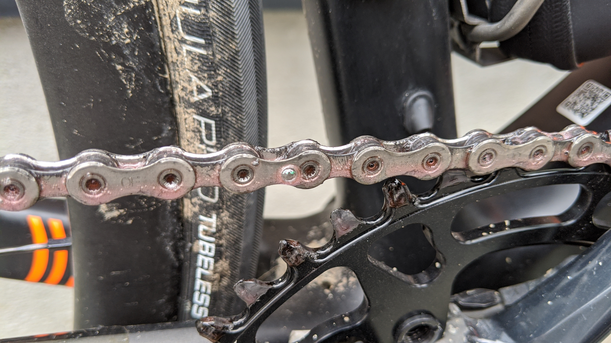
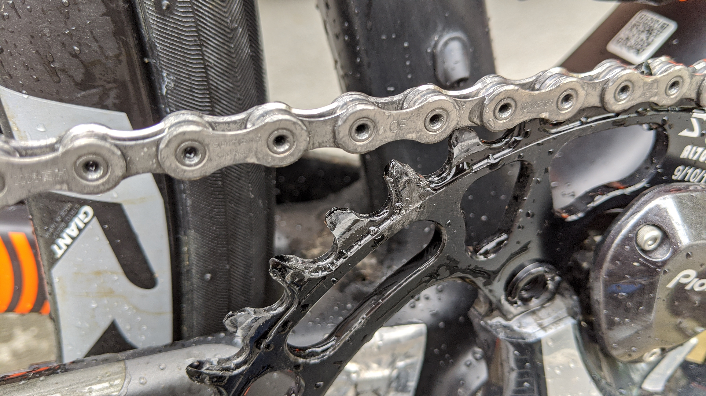

[良いディグリーザーのレビュー](/post/2020/03/ghakinalpha/)をしたばかりだが、以前[シクロワイヤードのナノテッククリーナー紹介記事](https://www.cyclowired.jp/news/node/317325)で衝撃的な一文があった。

> 詰め替え用は 4 倍濃縮されており、水で薄めるか、強力な脱脂剤として使用することができる。

ディグリーザーとして使えることを全く知らなかったので、今回ロードバイクで試してみた。

<LinkBox isAmazonLink url="https://www.amazon.co.jp/dp/B07T22FKHB/" />

## 洗浄前

見ての通り、サイドプレートは綺麗だが内部には黒くなった砂利やら鉄粉やらがこびりついている。

前回利用した[グゥーキンアルファ](https://amzn.to/2QSgPOK)はこういったものを一瞬で溶かし出してくれたが、果たして原液とはいえクリーナーで油汚れが落ちるものなのだろうか…

## 洗浄

まずはパークツールの[CM-5.3](https://amzn.to/2yfivLK)に原液を投入。ディグリーザーとしての使用なので、チェーンツールの公式 Fill ラインを守っていれてみる。

非常に粘度が高く、ドロッとした感触。チェーンマシンをガラガラ回す。

ピンク色の液体と泡がチェーンにまとわりついていく。粘度が高かっただけあって、サラサラと滴り落ちることはなくチェーンに洗浄剤がしっかり絡んでいる。

ナノテッククリーナーのお作法に従い、浸透するまで待つ。

もちろん完全に垂れないわけではないので、チェーンステーなどにクリーナーが落ちてくるが…垂れ落ちたクリーナーにかなり鉄粉が含まれている！これは期待大。

3 分ほど待って、チェーンマシンで濯ぐ。全然落ちねえ…

10 回ほどチェーンマシンを回したところでチェーンに泡が立たなくなったが、チェーンリングに残っているクリーナーがしつこいので直接水をかけて落とした。粘度が高いぶんだけ非常に濯ぎが手間だった。

## 洗浄後

洗浄後がこちら！チェーン内部の鉄粉やらはほぼ完璧に除去されている。鉄粉より細かい泥の粒子を綺麗に流し落とすだけのことはあり、こういった汚れには強い模様。

ただ、チェーンリングの汚れはあまり落ちなかった。粒子と言うよりも汚れた油が主成分だからか？この点は[グゥーキンアルファ](https://amzn.to/2QSgPOK)に軍配。

## コスト比較・性能比較

汚れ落とし、濯ぎの面では完全に[グゥーキンアルファ](https://amzn.to/2QSgPOK)に軍配が上がるが、チェーン内の異物除去には[ナノテッククリーナー](https://amzn.to/2WQ5N04)も中々の実力を見せた。（半分くらいはチェーンマシンのおかげだが）

前者は本日時点で 1000ml \1,758, 後者は 1000ml \3,564 である。ナノテッククリーナーは Wiggle で時々 1000 円位で売っていたりもするけれど…チェーンマシン 1 回あたりの使用量を 50ml, 刷毛塗布を 20ml とすると 1 回あたりのコストは以下の通り。

- [グゥーキンアルファ](https://amzn.to/2QSgPOK)を刷毛で塗る：35 円
- [グゥーキンアルファ](https://amzn.to/2QSgPOK)をチェーンマシンで使う：87.9 円
- [ナノテッククリーナー](https://amzn.to/2WQ5N04)をチェーンマシンで使う：178.2 円
- [ナノテッククリーナー](https://amzn.to/2WQ5N04)をチェーンマシンで使う(wiggle セール価格)：50 円

手間を考えると[グゥーキンアルファ](https://amzn.to/2QSgPOK)の圧勝か？チェーンマシンで使えば前回記事よりきれいになる余地もあるし、スプロケも同時に掃除できる…

ただ、1 本でなんでも賄えるという点を重視するなら、[ナノテッククリーナー](https://amzn.to/2WQ5N04)を wiggle/CRC セール時に買いだめするという手もありかもしれない。

CRC ではパウチではなく[1 本ボトル](https://www.chainreactioncycles.com/jp/ja/muc-off-%E6%BF%83%E7%B8%AE%E3%83%90%E3%82%A4%E3%82%AF%E3%82%AF%E3%83%AA%E3%83%BC%E3%83%8A%E3%83%BC-1l-/rp-prod106331)がまだ売っている。今回使ったのはこちら。原液のまま脱脂剤として利用可能と確かに書いてあった…完全に見落とし。

<LinkBox isAmazonLink url="https://www.amazon.co.jp/dp/B01LN1TYKQ/" />
