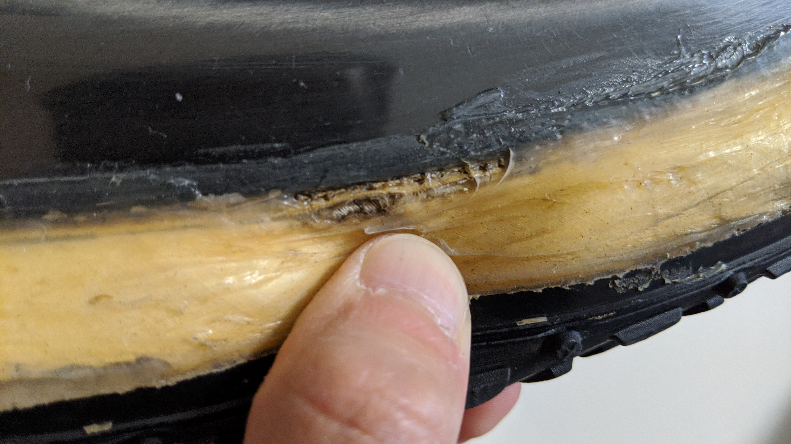
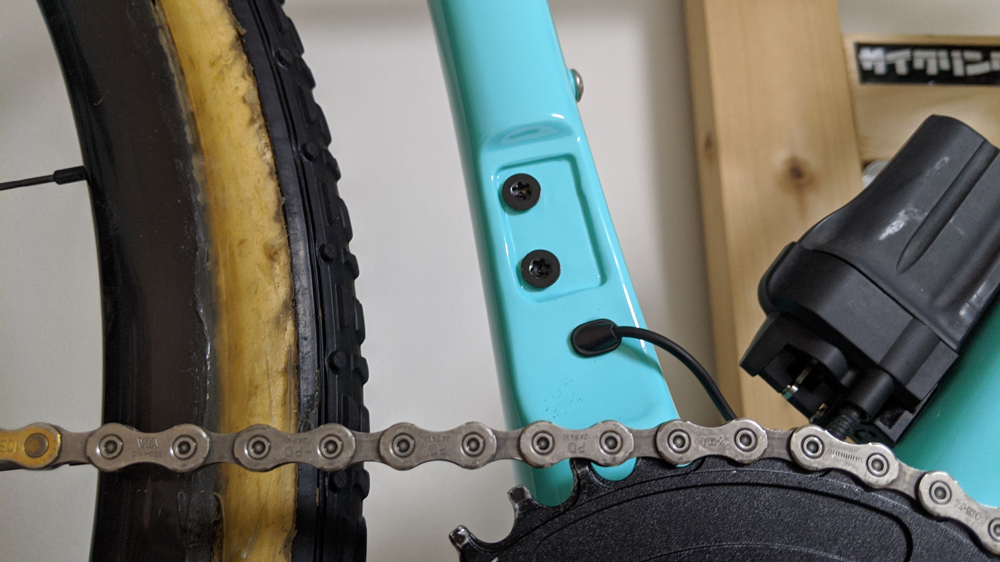
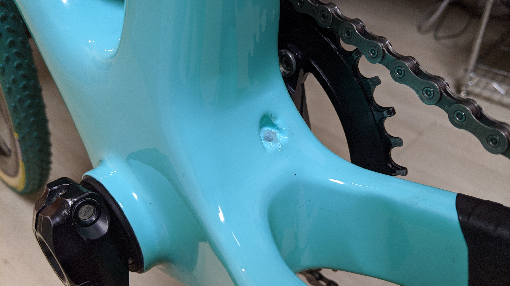

2020-2021 シーズンは今まで使っていた TCX SLR から Bianchi Zolder Pro にバイクを変更しました。

念願のカーボン CX バイクです！その他の機材は基本的に TCX から続投で、最終レースでバーストしたタイヤに替えてミシュランの[power CX Mud](https://amzn.to/35cWauv)のチューブラーモデルに変更しています。

後輪も 1.5 シーズン利用でなかなか危うい状態になっていますが、おそらく今年のシーズンはレース数が少なめになるので、何とか保つでしょう…（保ってくれ）

## 下処理 1: FD ハンガー外し

フロントシングル運用なので、FD のハンガーは外しています。

特に機能的なメリットはないのですが、洗車時の出っ張りを減らすことでほんの少し洗うのが楽になります。

見ての通り外装 Di2 バッテリーを利用しているので、FD の e-tube を出す場所からバッテリー用の e-tube を出しています。

## 下処理 2: ワイヤー穴塞ぎ

機械式コンポーネントを使っている場合、ここから FD 用のインナーワイヤーが出てくるのでしょうが、自分は絶対に使わないので[シリコンシーラント](https://amzn.to/3bMVoqF)で塞いでいます。

この位置は思いっきり泥が堆積する場所なので、塞いでおくことでフレーム内に水やら泥やら砂やらが侵入することを防げます。

## 下処理 3: チェーンステーカバー

フレームセットにはここのガードが付属していなかったので、軽くて糊残りもない[自己融着テープ](https://amzn.to/3bMWVgi)を使ってカバーを施しました。

## インプレ

一言で表すと、ハイエンドロードのような乗り味のシクロクロスフレームです。

ペダリングパワーを逃さない剛性感と、カーボン特有の丸くなった振動吸収力を兼ね備えています。今までアルミのシクロクロスにしか乗ったことがなかったので、この乗り心地の改善は予想していたと同時に C1 の長丁場では確実にプラスになると踏んでいます。

ジオメトリはトラディショナルな BB 高めのシクロクロスジオメトリで、フロント側のグリップを使ってグイグイコーナーを攻める感覚のものになっています。TCX はかなり「フロントから曲がる」感覚が強かったのですが、それよりはややマイルド。一方で、BB ハイトそのものは(Zolder48 サイズ、TCX XS サイズで)TCX よりも高いのでバイクが傾きやすいのと同時に空中で斜めになりやすいように思えるのでバニーホップ・ポゴの練習をじっくりとしておいたほうが良さそうです。

シクロクロスのジオメトリは TCX やこの Zolder のようなフロントから曲がるようなフレームと、Boone や Crux のような前後輪で同じラインをなぞるように曲がるフレームに別れており、メーカーの設計思想が如実に現れています。

オフロードではジオメトリ、もっと言えば機材が走りに与える影響がオンロードに比べて明らかに大きいので、しっかりと研究開発をしているのかといった点がバイクにモロに現れるので、いろんなバイクを乗り比べるのは非常に面白いです。

Zolder はおそらく 2021 年でモデルチェンジして、ワウト・ファンアールトが CX 世界選手権で乗っていた後ろ三角が小型化したモデルが販売されるのでしょうが、この 2020 年モデルもラース・ボームとビアンキ MTB チームが使うこととして作成されたフレームですので、かなりレース向けの完成度の高いものになっていると感じました。

ロットユンボに供給を始めてからのビアンキは、モデルチェンジの頻度が高くなりプロツアーチームからのフィードバックを取り入れているそうです。数十年間自転車をやっている人にとってビアンキはレースブランドだったそうですが、近年少し離れたせいか私のようなここ 10 年で自転車を始めたペーペーにはそんなイメージはありません。が、またレーシングブランドとしての立ち位置を手に入れかけているのではないでしょうか。

<a href="https://www.amazon.co.jp/dp/B07W8FZJW6/?tag=gensobunya-22" name="amachazllink" rel="nofollow" target="_blank">BIANCHI ビアンキ HELMET BLADE AF ヘルメット</a>
posted with <a href="https://creazy.net/amazon_quick_affiliate/" title="BIANCHI ビアンキ HELMET BLADE AF ヘルメット" rel="nofollow" target="_blank">Amaquick</a> at 2020.04.23

<a href="https://www.amazon.co.jp/dp/B07W8FZJW6/?tag=gensobunya-22" name="amachazllink" rel="nofollow" target="_blank">Amazon.co.jpで詳細を見る</a>

