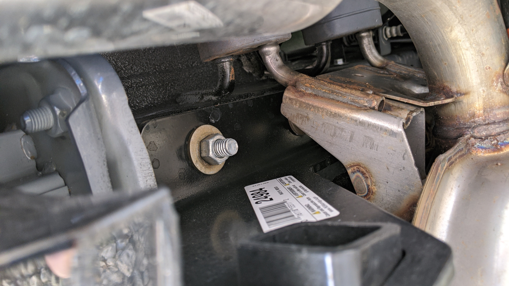
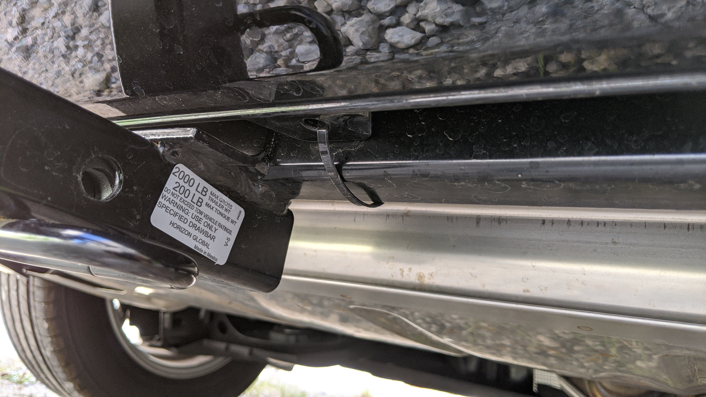
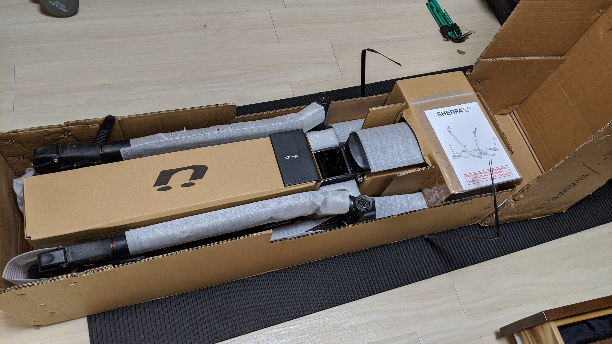

## 遠征車の長距離適性は重要！

車のメインの用途がレースの遠征になるので、そのための装備に特化しています。具体的には

- ~400km くらいの往復でも疲れない乗り心地
- ACC などの運転支援機能
- 自転車そのものの積載力

などを勘案して Mazda3 を選びました。ツッコミたくなると思うのですが、最後の項目は妥協しています。

### シート・ペダルレイアウト

Mazda3 を選んだ最も大きな理由です。

マツダのシートは非常に出来が良く、脊柱が自然な R を描くような設計になっている他、ペダルを踏むための脚が自然な位置のままペダルを操作できるよう工夫されています。

その他にも、椅子の後部と前部の高さを別々に調整できるので完璧なポジションを追求できます。
おかげで少しの不自然さもない体勢で運転ができるので、長時間のドライブでも圧倒的に疲れません。

ついでに、オールシーズンタイヤを買う前提で 16 インチタイヤにダウンオプションを付けたので、その分乗り心地もよく無駄な体力消費を避けられます。

### 燃費

遠征における燃費の効果は、航続距離です。

Mazda3 のディーゼルモデルで、航続スピードにもよりますが遠征の実効燃費は 20km/l 前後。もちろん経済的にも助かるのですが…（減税とか特に）往復で給油しなくて済むと田舎のめっちゃ高い GS で給油せずに済みますし時間を有効に使えます。

### 安全性・先進装備

前者追従型のクルーズコントールは遠征の強い味方です。

マツダ車は見切りが悪いことで有名なのでいろいろなレーダーやバックモニタ（使えれば）便利です。遠征先で事故とかしたくないですしね。

## Mazda3 XD は良いシートに燃費と先進装備もバッチリ、ただ…

乗る分には最高なのですが、車内空間はぶっちぎりで狭いです。つまり積載性がとっても悪い…

先行して販売していた北米・欧州モデルでは公式オプションにルーフベースが存在しており、フォーラムにも Mazda3 に前アクセラ用のベースキャリアを取り付けられたという報告もあったので、思い切って発注しました。

しかし、購入時は Thule が専用フットベースを開発中とのことだったのですが、蓋を開けてみれば『申し訳有りませんが、開発を行わないことになりました』というサポートデスクの回答が…

非公式ですが、アクセラ用のフットベースを使えるかと思いきや、こちらの[価格コムのスレッド](https://bbs.kakaku.com/bbs/K0001159813/SortID=22718207/)によると、日本モデルにはなんとフィックスポイントが無い…！

つまりこの時点では基本外付けのキャリアを利用できないわけです。見た目や安定性を妥協して[SARIS のトランクマウント](http://shop.kirschberg.co.jp/?pid=150014295)を使うか…？といったところ。もしくは[Terzo の定番モデル](https://amzn.to/2YrfiUf)が候補でしょうか。格好良くはないですが…

## Mazda3 に頑張って自転車を載せる

最初はペットシートを使って後部座席へ載せていました。

これで車内を汚さず、半分浮いている状態であることも生きて衝撃にもちょっと強めです。しかも 2000 円と非常にお安い。

<a href="https://www.amazon.co.jp/dp/B00TWT9JVG/?tag=gensobunya-22" name="amachazllink" rel="nofollow" target="_blank">槌屋ヤック 車用 カーゴマット リアトランクシート RV-66</a>
posted with <a href="https://creazy.net/amazon_quick_affiliate/" title="槌屋ヤック 車用 カーゴマット リアトランクシート RV-66" rel="nofollow" target="_blank">Amaquick</a> at 2020.04.23

<a href="https://www.amazon.co.jp/dp/B00TWT9JVG/?tag=gensobunya-22" name="amachazllink" rel="nofollow" target="_blank">Amazon.co.jpで詳細を見る</a>

## ヒッチキャリア輸入

しかし、ペットシートを使っているとはいえ、シクロクロスは泥とお友達の競技。車内に持ち込むのはそれなりに抵抗が出てきます。ましてや、それに至るまでにホイール外して、いい感じにチェーンを保持するという過程がとてつもなく面倒…ましてや雨の日はさらに鬱になること請け合いです。そもそも晴れの日でも土埃でそれなりに汚れます。

元々、シクロクロス会場ではヒッチキャリアを使っている人も多くその簡単さに惹かれていたので、半分これ幸いとヒッチキャリアの導入を決意。ヒッチキャリアそのものの導入おすすめは[TKC Productions さんのブログ](http://www.tkcproduction.com/blog/2011/02/post_54.shtml)が参考になります。

Mazda3 はいわゆる C で牽引等ができる車格ではなく、ヒッチメンバーは 1.25 インチモデルしかありません。2 台が積載限度となります。室内積みでも分解すればそもそも 2 台くらいは乗るのですが、オフロード車は車外に載せたい！

※Mazda3 を選んだのは、海外でも展開の多いグレードなのでヒッチメンバーが入手しやすいという読みもありました

## モデルチョイス

ヒッチメンバーは Draw-tite の[#24984](https://www.draw-tite.com/products/trailer-hitches/class-i-1-1-4-hitch/class-i-trailer-hitch/WfzaCtfZMf25wM9znIGUwlD6ZzAUIKRT)を ebay で購入。[いいセラー](https://www.ebay.com/itm/233350888400)を見つけたので、ヒッチメンバーは送料込み 2 万円以下で調達できました。これの出現を待つ数週間が本当に辛かった。

ヒッチキャリアは Mazda3 の車格を考慮して、最軽量クラスの[Kuat Sherpa2.0](https://www.kuatracks.com/product/sherpa-2-0/)を購入しました。フレームマウントではなくタイヤマウントのものが欲しかったので、少々値が張りましたがここをケチって自転車を落下させるより遥かにマシなので Jenson USA でセール時に購入しました。それでも送料込みで 480USD ほどでしたが…

## ヒッチメンバー取り付け

知人に整備工場を営んでいる人がいましたので、取り付けは全面的におまかせしました（その人も CXer でヒッチ利用者）

[公式のインストールマニュアル(PDF です)](https://www.draw-tite.com/support/installation/N24984.pdf)がありましたので、英語ですがそちらを参照するように依頼して適宜よろしく作業していただきました。

Mazda3 の場合は一旦マフラーをおろして、リアの樹脂製パーツを取り外す必要があります。樹脂パーツはそのまま外したままになるのですが、そのままだとリアバンパーの固定がゆるくなるのでタイラップで固定する必要があったとのこと。

## セットアップ

箱は意外とコンパクトですが、全体で 20kg ほどの重量なのでかなりズッシリしたものです。（本体は約 16kg）

説明書通りに組み立てるのですが、箱がそのまま組み立てスタンドになるような仕組みとなっています。組立時間が少ないことも Kuat のウリ文句のひとつなのですが、とんでもなく長いボルトを本体の内部の穴に上手く通して固定する必要があり、器用でない自分のような人間にはかなり時間がかかりました…

### 幅は？

MTB もギリギリサイドミラーより内側に収まっています。ロード/CX は車体より狭いので余裕（いい写真がありませんでした）

折りたたむとほとんど奥行きを取りません。室内駐車の人でもスペースには困らないと思います。ただし、バックする際は時速 4km 以下程度で移動するか障害物検知ブレーキをオフにしないとヒッチキャリアを障害物と検知し、自動ブレーキが作動してしまうので普段は外しています…

### おまけ：ピンの加工

Mazda3 のリア部分の形状と Kuat の純正ロックピンの相性が悪く、振動でキーシリンダーや曲がったピン部分がボディにあたってしまうので路面のギャップを通ったりするたびにテールカバー（樹脂）の部分にぶつかって精神衛生上よろしくありません。

[Curt 純正のストレートタイプのロックピン](https://amzn.to/3ciDnAW)に交換すると解決する…のですが、Kuat のヒッチキャリアはガタ取りを内部で行う都合上、太いピンが通りません。

そこで、ホームセンターのネジ先端キャップを購入して当たる部分だけガードしておきました。キーシリンダー側は水の侵入を防ぐゴムキャップがあるので、当たっても一応傷は避けられます。

今の御時世ではこのヒッチキャリアもなかなか出番がありませんが、特に MTB・CX を趣味にしている自転車乗りには是非ともおすすめしたい装備です。  
トランクマウントのキャリアのほうが、ヒッチと同じく燃費と全高を維持しつつ手軽ですが、揺れや傷に強くマウントも簡単なヒッチキャリアは投資する価値があります。

<a href="https://www.amazon.co.jp/dp/B00IUMN1VA/?tag=gensobunya-22" name="amachazllink" rel="nofollow" target="_blank">Terzo テルッツォ (by PIAA) サイクルキャリア 2台積み リア用 SARIS 折りたたみ収納可能 ブラック EC16BK</a>
posted with <a href="https://creazy.net/amazon_quick_affiliate/" title="Terzo テルッツォ (by PIAA) サイクルキャリア 2台積み リア用 SARIS 折りたたみ収納可能 ブラック EC16BK" rel="nofollow" target="_blank">Amaquick</a> at 2020.04.23

<a href="https://www.amazon.co.jp/dp/B00IUMN1VA/?tag=gensobunya-22" name="amachazllink" rel="nofollow" target="_blank">Amazon.co.jpで詳細を見る</a>

