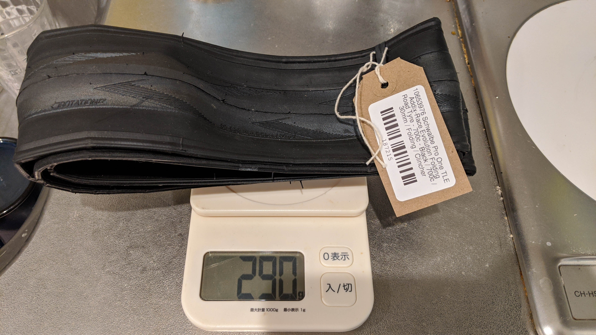
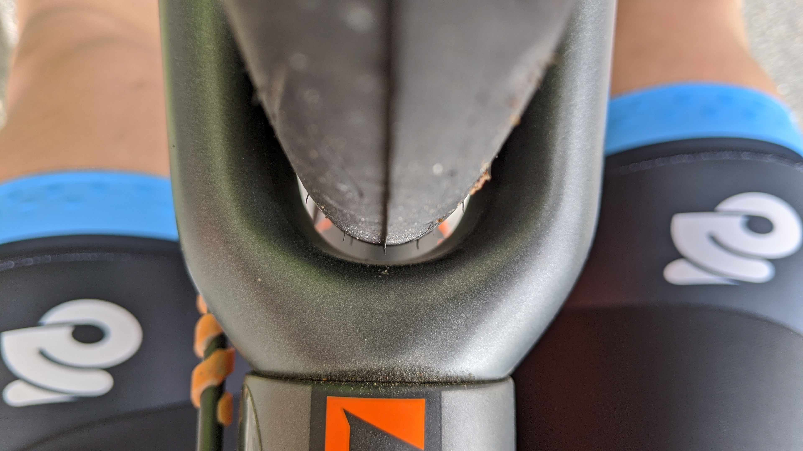
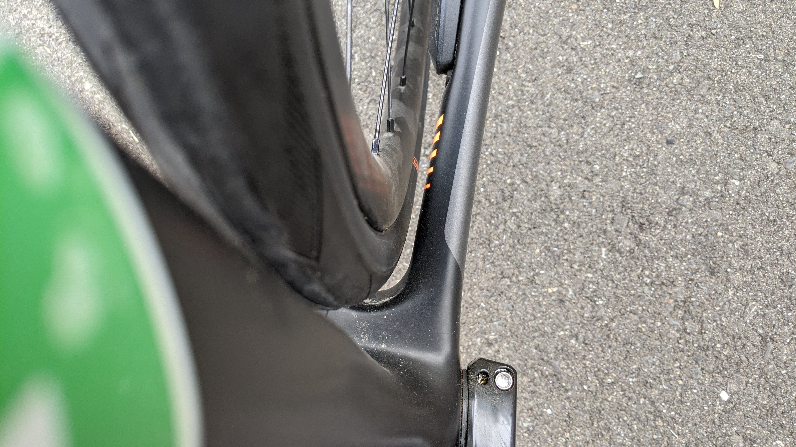

周辺で、最近のロードチューブレスレディはいいぞという声がよく聞こえてきたので、今まで使っていた IRC の[Formula Pro TL RBCC](https://amzn.to/3eJaIWs)から SCHWALBE の[PRO ONE Tubeless Easy](https://www.amazon.co.jp/dp/B07WPV58SC/?tag=gensobunya-22)へ交換することにしました。

<LinkBox isAmazonLink url="https://www.amazon.co.jp/dp/B07WPV58SC/" />

結論から言うと、過去使ったどのチューブレスロードタイヤよりも、測って軽く乗って軽くグリップもしっかりという神タイヤです。2021 年現在で定価 12000 円するだけのことはある。

PRO ONE はロードレース向けのタイヤですが、昨今のタイヤ幅・リム幅の拡大傾向に伴ってかなり広いタイヤ幅をラインナップしています。

TLE はいわゆるチューブレスレディのことで、シーラントの使用が前提です。

## 装着

装着そのものは素手であっさりと嵌まりました、チューブレス（以下 TL）からチューブレスレディ（以下 TLR）になったので、触った感じはかなりタイヤが薄くなりました。重量も RBCC が 28c でシーラント付着した状態で 340g あったのに対して、PRO ONE TLE は新品状態でわずか 290g です。

完全な TL タイヤである RBCC は気密性についてシーラントが不要なのですが、今はホイール側がほぼ TLR になっているので結局シーラントの利用が必要です。昔はチューブレスでリムテープ不要のホイールが結構あったんですけれどね…

[Formula Pro TL RBCC 28c](https://amzn.to/3eJaIWs) (外した際についていたシーラント込)は 340g

[PRO ONE Tubeless Easy 30c](https://www.amazon.co.jp/dp/B07WPV58SC/?tag=gensobunya-22) 新品で 290g

## タイヤクリアランス

現行の 2021 年モデル TCR はディスクブレーキモデル 32c 対応がウリですが、自分の TCR ADVANCED PRO は 1 つ前の世代なので、そんなにクリアランスが広くありません。

フロントクリアランスは、上・左右ともに結構ギリギリです。

リアはそれなりにクリアランスがありますが、それでも 2~3mm といったところ。

写真ではわかりにくいですが、2mm ほど左右と垂直方向のクリアランスが確保できています。ISO 的には 4mm の左右クリアランスが必要な中、2mm は現実的なホイールの歪みを考慮した限界にほぼ近いクリアランスでしょうか。

これは完成車付属のホイールを使っていますが、今話題の ZIPP 303s や ENVE Foundation のようなグラベルタイヤも履けるようなロードホイールの場合は更にタイヤ幅が広がってしまうので 30c は履けないでしょう。20mm 以上のリム内幅のホイールはエアロダイナミクスも考慮した 28c が最適になるかと思います。

## 走行インプレ

ライダーの体重は 64kg、ビード上げした直後なので、推奨空気圧 MAX の 5.5 bar で乗っています。いつもの峠道を走行。

PRO ONE TLE は重量的にも体感的にもかなり軽快です。

RBCC はこれに比べるとかなり重く（使っている 28c は 公称 320g）、直進安定性が高すぎて、ハンドルが取られる感覚がありました。久しぶりのロードバイクということもあり、住宅街の激坂で軽くダンシングをしていたら 2 分ほどのセグメントで PR をゲット！

また、路面ギャップをほぼ無効化できるので、28c だった RBCC がかなり固いタイヤに思えてきてしまうほど。やはりというか、エアボリュームは正義です。ただでさえ安心だった下りが更に安心。

もちろん RBCC の乗り心地が悪いわけではないのですが、軽いホッピングで障害物を越えるときの着地で PRO ONE がしっかりエアボリュームで衝撃吸収してくれるのに対して、RBCC は変形がほとんど感じられませんでした。肘や膝で衝撃吸収をするのですが、PRO ONE ではジャンプの程度によってはそれすら不要なほどです。

## ライバルはグラベルキング？

290g という 30c とは思えない軽量 TLR タイヤである PRO ONE ですが、実は 32c で 300g を切る TLR タイヤが存在しています。

<LinkBox isAmazonLink url="https://www.amazon.co.jp/dp/B07D6X5DYX/" />

グラベルキングのチューブレスレディバージョンは幅広かつ同重量です。グラベル向きなので、当然耐久性に振ってあるため用途によっては PRO ONE より適しているかもしれません。何より国内流通で安く手に入る点が Good です。色もアメサイドカラーが選べますしね。

TLR タイヤを使ってしまうと、純 TL タイヤは重いし固いしなんだったのか…という気持ちにさせられてしまいます。

今は ETRTO の再定義もされて、リム規格も安定してきたと言えるので数年前のような相性問題に悩まされることも減っていると思います。事実、今回もインフレーターを使って一発でビードが上がりました。（インフレーターの普及によってフロアポンプによるビード上げを考慮しなくなったのかもしれませんが…）

もちろん、これら 2 つのタイヤはそもそもターゲットとしているライディングが違うので単純比較してしまうのもおかしいのですが、太いタイヤを求める人は恐らくエンデュランス能力を気にしている人が多いのでは？

太いタイヤが履けることの多いディスクロードのタイヤは、軽快さとグリップの PRO ONE, 耐久性のグラベルキングという観点で軽量 TLR タイヤの定番になりそうです。

<LinkBox isAmazonLink url="https://www.amazon.co.jp/dp/B07WPV58SC/" />
