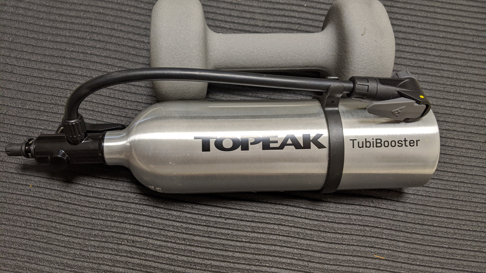
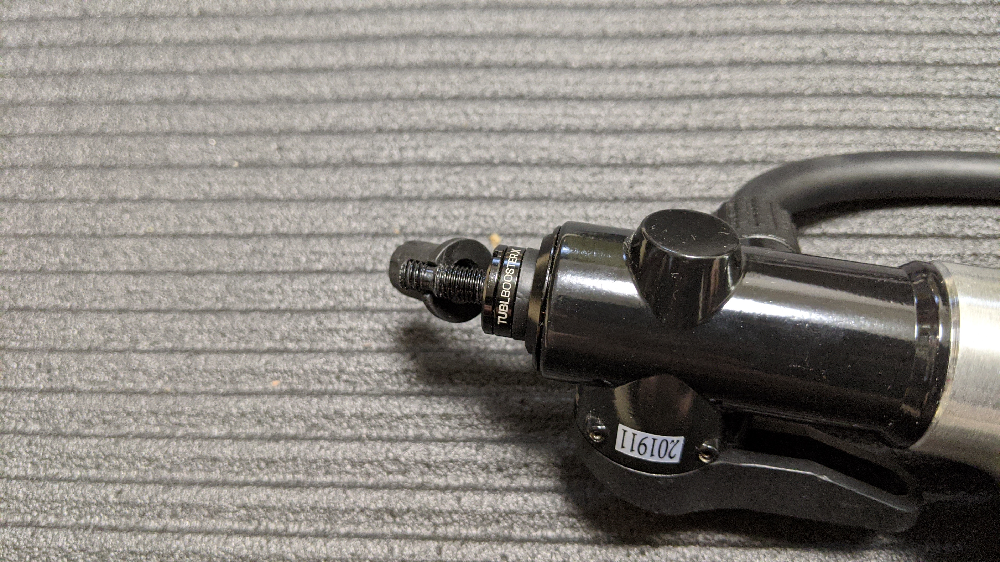

これまで、チューブレスタイヤの装着用のインフレーターには色々使ってきましたが、中々決定版と言えるものがありませんでした。

私は[LEZYNE CLASSIC FLOOR DRIVE](https://www.amazon.co.jp/dp/B0753CL283/?tag=gensobunya-22)の木製取手と、[ヒラメ横カム](https://www.amazon.co.jp/dp/B01G1O3JBA/?tag=gensobunya-22)の収まりの良さを非常に気に入っており、これを捨てきれずなんとかフロアポンプを活かしたままチューブレス運用をしています。

ビード上げ用の機材は「ビード上げ用の一体型ポンプ」「単体のインフレータータンク」の 2 通りの選択肢があります。

前者では[GIYO(ジーヨ) GF-94T チューブレス対応 アルミフロアポンプ GF-94T](https://www.amazon.co.jp/dp/B01JG277DA/?tag=gensobunya-22)、後者では GIANT の[CONTROL TANK](https://www.giant.co.jp/giant20/acc_datail.php?p_id=A0000131)を使ったことがあり、最近は主に CONTROL TANK を使っています。

CONTROL TANK は米式バルブでしか空気を入れられないという欠点があり、[ヒラメ横カム](https://www.amazon.co.jp/dp/B01G1O3JBA/?tag=gensobunya-22)を使った[CLASSIC FLOOR DRIVE](https://www.amazon.co.jp/dp/B0753CL283/?tag=gensobunya-22)では直接エアを充填できないので珍しい米仏変換アダプターを活用していました。

それでも、安定して高圧を充填するにはヒラメヘッドの締め付けをかなり強くする必要があり、ストレスが強いのでずっと仏式バルブで充填でき、米仏どちらでもビード上げできるインフレーターを探していました。

## 入力側が仏式のタンクたち

私の思いが通じたのか、最近ついに仏式入力対応のタンクが出てきました。

[SCHWALBE TIRE BOOSTER](https://www.amazon.co.jp/dp/B0773KVMV6/?tag=gensobunya-22)と、[TOPEAK Tubibooster X](https://topeak.jp/pump/ppm11300.html)です。

<linkBox isAmazonLink url="https://www.amazon.co.jp/dp/B0773KVMV6/?tag=gensobunya-22" />

こいつらの優秀な点は

- 充填用ホースがあること
- 仏式入力
- 米仏出力

です。これらの要件は自宅で作業するにはマストだと思います。

充填用ホースがあれば、ホイールにセットしたままエアを充填できますし、仏式入力はヒラメのため、米仏出力でバルブコア外した状態でのビード上げに対応できます。※仏式バルブで内部が詰まって場合、エアが一気に入らないのでコアを抜いて米式ポンプで空気充填する裏技があります

Tubibooster のほうがちょっと安いのでこちらを買いました。Amazon では置いていなかったので、Paypay モールで。

思ったよりも本体サイズが小さく、MTB タイヤに使う場合などは本体を 10 気圧オーバーまで充填したほうがいい感じに利用できます。フロアポンプ側もそれなりに性能が求められるので、注意が必要かも。強度が心配ですが一応 ISO に沿った記載があります。

バルブはしっかり仏式でカバーもあるので破損の心配も少ないです。レバーも開放側がわかりやすく記載されています。

## 使用感

[プロワン TLE](https://www.amazon.co.jp/dp/B07WPV58SC/?tag=gensobunya-22)の装着に使いましたが、GIANT の CONTROL TANK に比べてタンク内を高圧にする必要があるので、やや疲れます。

エアボリュームは十分なので、MTB タイヤでも問題なく利用できました。

仏式と米式の切り替えは内部部品を切り替える必要があるのでちょっと時間がかかります。[スマートヘッド アップグレード キット](https://www.amazon.co.jp/dp/B004BUC576/?tag=gensobunya-22)などを使えばこの切替が更に早くなり、使い勝手が良くなりそうです。ホース径は要確認。

<linkBox isAmazonLink url="https://www.amazon.co.jp/dp/B004BUC576/?tag=gensobunya-22" />
