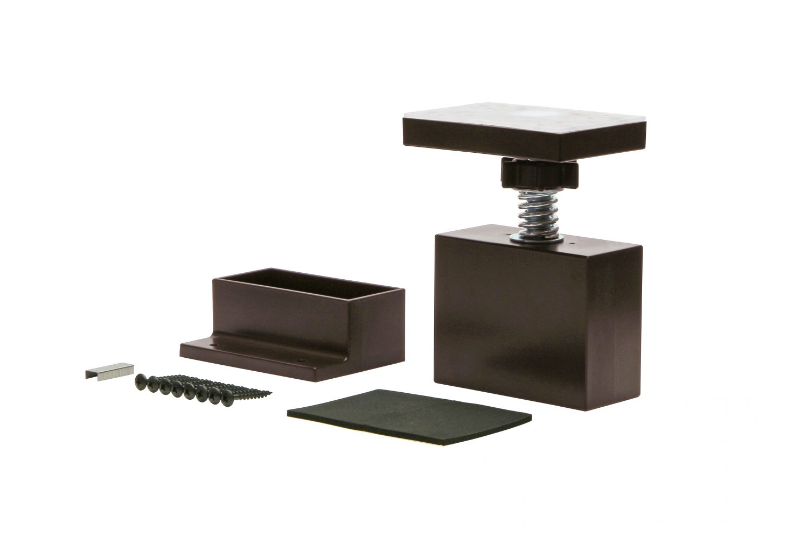
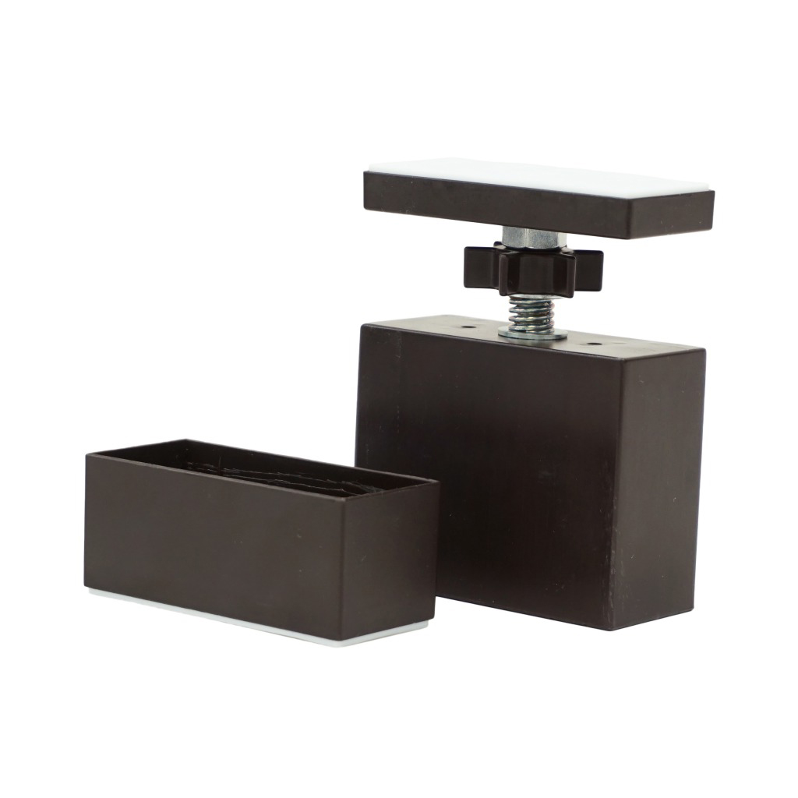
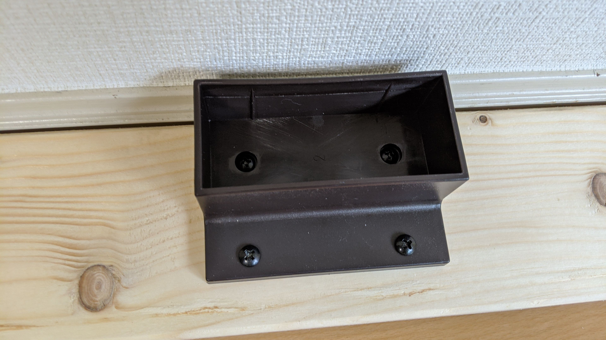
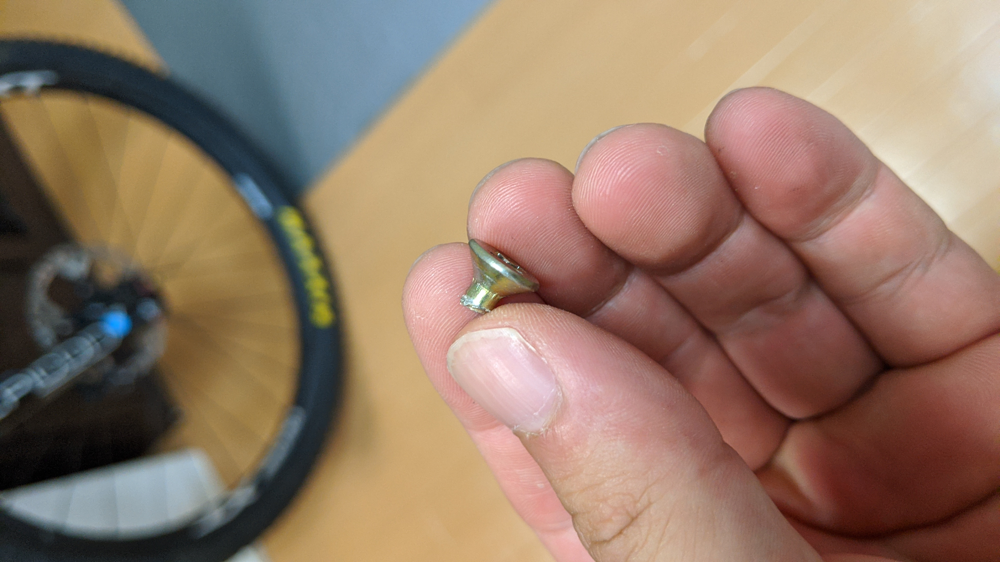
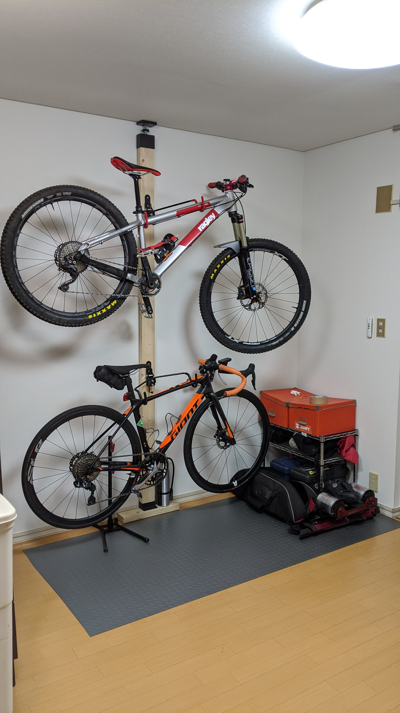

## 手間なしのディアウォール、調整幅のラブリコ

引っ越しに伴い、自宅の自転車ラックを新調する必要があったので、今までと同じく 2x4 材を使った自転車ラックを作ることにしました。

ディアウォールはバネ入りで非常にかんたんに組み立てられますが、実はあまり誤差を許容できません。前の家でも、2x4 材が短くなりすぎて下部にコラムスペーサーや木製のブロックを仕込んで長さを調整していました。

ホームセンターなどでカットを依頼すると、数ミリの誤差は機械の都合でどうしても出てしまいます（カットサービスの申込書にも書いてあります）
天井の高さを正確に計測することの難しさと相まって、木材の長さがバネの調整できる範囲外を越えてしまっていたということになります。

その点、[LABRICO のアジャスター](https://amzn.to/32LE9Et)はねじ式なので、ネジの長さ分だけ柔軟に調整することができ、カットの誤差を吸収しやすいため自分はこちらが好みです。

<linkBox isAmazonLink url="https://www.amazon.co.jp/dp/B01HTRVZ0A/?tag=gensobunya-22" />

以前は棚の両端を縦置きしていたのですが、今回は部屋レイアウトの都合で横置きをしたかったので、新たに 1 本作り直すことにして今までの木材はそのまま棚として引き継ぐことにしました。

## ラブリコアジャスターファミリー、増殖

どうやら自分が思っている以上にこの市場が大きくなっており、ラブリコアジャスターのバリエーションが増えていました。

転倒対策がなされた[STAPLER](https://amzn.to/3fUJygk)、屋外利用が可能な[アイアンシリーズ](https://amzn.to/2CHdCxp)、そして今回自分が使った[強力タイプ](https://amzn.to/2WOgL5H)。

<linkBox isAmazonLink url="https://www.amazon.co.jp/dp/B083WKJ7V6/?tag=gensobunya-22" />

使用例からして自転車を吊るすことを想定している、完全に自分向けの製品でしたので、これを利用することにしました。

## 強力タイプの特徴

### 耐荷重

通常、強力タイプの耐荷重は"40kg/2x4 材 1 本"となっておりますが、自転車を掛ける場合は 20kg までという制限があります。MTB とロードで大体 20kg なので、フルサス 2 台引っ掛けるでもしなければ問題ないでしょう。

### 木材カット長

通常のラブリコアジャスターは"天井からの全長-95mm"の 2x4 材を使いますが、強力モデルは 120mm 短い 2x4 材を利用します。\
後述しますが、自転車を吊るす場合は更に特殊な取り付けになるので-160mm の木材を利用します。

### 上下の当たり面拡大

こちらの強力モデルは、上下の天井と床に当たる面が広くなっています。今までのモデルと比べれば一目瞭然。

## 横掛け DIY

木材は事前に"天井-160mm"の長さにカットし、軽くサンダーをかけておきます。ニスやステインによる加工をしたいなら、先にやったほうが面倒がないでしょう。

ラブリコ強力タイプを自転車のディスプレイ目的で使う際、[公式手順](https://labrico.jp/series/2x4-adjuster-powerful/)として 400mm の木材を下に置く必要があります。これは自転車をかけている際に柱が回転してしまうのを防ぐためのものとのことです。

足の長さもバッチリです。強力タイプを謳うだけあり、ここもネジ止めでしっかり止めます。滑り止めはプラの本体ではなく木材側に貼り付けるので注意。

上部もホチキスか木ネジ止めできる場所があるのですが、賃貸なので今回は使いません。

これ以外は特に難しい場所はなく、いい感じの場所にハンガーを木ネジで留めていくだけです。MTB 用のハンガーは横幅が必要なので別途[中華製のハンガー](https://amzn.to/32LXGor)を買ってみました。[ミノウラ](https://amzn.to/2CFEwpz)の 1/2 の値段だし…

<linkBox isAmazonLink url="https://www.amazon.co.jp/dp/B078SN8Z8N/?tag=gensobunya-22" />

結果、本体の剛性は十分ですが付属のネジが最低の品質で、仮止めから動かそうとしたところ頭からネジが破壊されました。怖い。

ホムセンでちゃんとした強度のネジをつかって固定しました。中華製品は油断すると悲劇を生むので十分テストします。ラック部分は強度のある鉄でできているようで、かなり力をかけても歪まなかったのでここは信用できそうです。

何も考えず固定して MTB かけっぱなしにしていたらある日ネジが折れて落下、下のロードを巻き込んでますね…

## 結果

こんな形に落ち着きました。下のロードバイクは下部にルンバが入り込めるだけのスペースを確保しています。

強力タイプと銘打つだけあり、力をかけて揺らしても全然だいじょうぶです。突っ張り型のミノウラバイクタワーなどは、半年に 1 回ほど崩壊するのでバネに比べるとネジによるアジャスターのほうが遥かに安心感がありますね。

<linkBox isAmazonLink url="https://www.amazon.co.jp/dp/B083WKJ7V6/?tag=gensobunya-22" />
