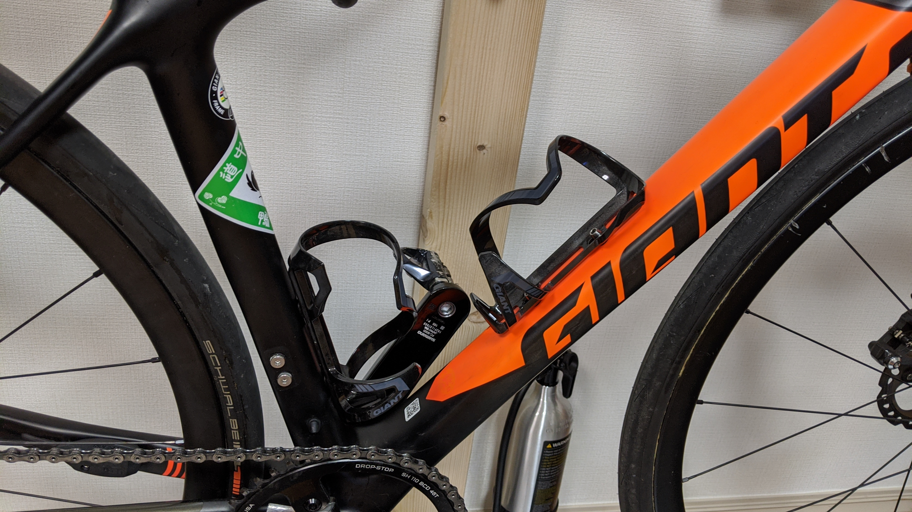

<LinkBox url="https://www.giant.co.jp/giant21/acc_datail.php?p_id=A0002134" />

本製品は、特に安いわけでもなく(2000 円)、軽いわけでもない(33g)。

もちろん、値段からしたらちょっと軽い方なのかもしれず、ビジュアルもほぼ主張してこないのでどのメーカーでも使える便利なサイドプルケージに見える。

## 圧倒的保持力

GIANT のボトルケージの中で唯一

> ● オフロード走行にも耐えうるホールド力をもつボディ

という注釈が付いている通り、圧倒的な保持力を持っている。

数時間のトレイルライドや、ゲレンデコースで遊び倒す場合でも全く心配にならないほどの圧倒的なボトル保持力がある。王滝や MTB 耐久ではボトルの落し物が風物詩になっているが、このボトルケージはズレすらしない。

その分、取り出しにはやや力が必要だが、サイドプルケージの正しい取り外し方、ちゃんとボトルケージの底を支点にして横に倒すように取り出せば凄く大きな力が必要というわけでもない。適当に取り外しすと抵抗が大きいが、それはトレードオフ。

## 下向きオフセット

GIANT 製らしく、スローピングの大きいフレームでもロングボトルを入れられるように配慮されている。

もちろん、マウント場所が配慮されているのもあるが、それを差し引いてもキッチリ可能な範囲で一番下側にボトルを配置できているのがわかると思う。[R250 の細いフレームバッグ](https://amzn.to/32tKWlI)であればショートボトルを組み合わせれば利用できるだろう。

<linkBox isAmazonLink url="https://www.amazon.co.jp/dp/B072Q5DXGW/?tag=gensobunya-22" />

## まとめ

GIANT 製品はあまり店頭に並んでいることがないイメージだが、GIANT ショップはそこら中にあるし、取り扱いしている販売店なら無理なく手に入ると思う。

通販はできないものの、供給がいいので簡単に手に入ると思うので、身長の低い人でボトルケージに悩んでいたらぜひ試してほしい。
