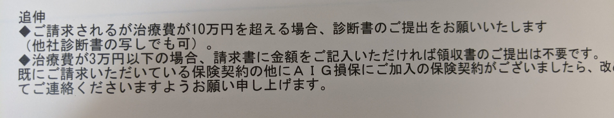

10 年近く加入しているモンベルの自動車保険（以前は野外活動保険）の保険金を、初めて請求する機会があったので、実際の保険金の支払いまでの流れをレビューする。

## 自転車保険の建て付け

自転車保険はここ数年、自治体単位で加入が義務付けられるなど、スポーツバイク愛好家だけでなく世間一般で加入が当たり前になろうとしている。

いわゆる個人賠償責任保険は、事故の加害者になってしまった際に発生する膨大な賠償金額を補償することで 2 者の生活を守るためのものであることは当たり前だが、それだけでは各社差別化できないので、特にスポーツバイクユーザーを想定した保険には色々なオプションサービスが付与されている。au 損保のロードサービスなど、使う場面が想像しやすいので魅力的に感じている人は多いと思う。あとは盗難保険などだろうか。

実は自転車保険は「賠償責任特約付き傷害保険」であることがほとんどで、通院などに対する保険がメインでそれに賠償責任特約を付加しているという建付けになっている。（なぜかは知らないが）

モンベル自転車保険のユニークな点は、上記の建付けを活かして？「怪我をした際に健康保険料の自己負担分をモンベルの保険が負担してくれる」障害医療用保険金という仕組みがあること。

これによって、交通乗用具に関連する偶発的な事故で怪我をした際に健康保険から 7 割・自転車保険から 3 割負担、つまり自己負担 0 円で治療することが可能になっている。詳細な条件に関してはこの記事を鵜吞みにせず[モンベル自転車保険のページ](https://hoken.montbell.jp/aigbicycle/)を参考にしてほしい。

## 医療用保険金の例外と利用ケース

話を聞くだけなら、かなりすごい保険なのだがもちろんレース中の怪我は対象外である。交通事故なら、被害者の場合自分で治療費を払うことはほぼない。加害事故の怪我か、自爆事故がメインの利用になると考えると、利用機会は多くないように思える。

ただ、気になるのはオフロード走行時の場合。

トレイルライドは転ぶことも多いし、担ぎをしている際は非常に不安定で、切り傷も深ければ医療機関を受診することもあるだろう。それとレース外では DH ゲレンデコースへ遊びに行った時のような怪我リスクの高い場面も対象になるか気になるところ。\
また、モンベルには自転車保険スタート以前から存在した野外活動保険（登山などを想定した保険）もあり、どちらを選ぶべきか非常に迷う。

公式ページを見てもどうにも判断がつかなかったので、問い合わせた結果がこちら。

> Q. 下記の状況での怪我について、保険負担分の治療費を補償できる（傷害医療費用保険金）プランは御社取り扱いのうち、どの保険を選択すればよいでしょうか？
>
> ・一般公道（またはそれに準じる公道扱い道路）上での自損・交通事故による怪我 \
> ・里山トレイル上（専用整備されておらず、入場料などを要する商業施設ではない）での転倒・他者/樹木など衝突などによる怪我 \
> ・ゲレンデコースなどでの転倒・他者/樹木など衝突などによる怪我 \
>
> A. マウンテンバイク活動時の保険ですが、モンベル野外活動保険、またはモンベル自転車保険にご加入下さい。 \
> こちらの保険が補償対象となっております。

自転車保険でトレイルもコースもコケて怪我しても治療費無料！！ということがわかった。ちなみに 1 年 2570 円、5 年でたった 10280 円である。レントゲン撮るレベルの怪我をしたら一発で元が取れてしまう。安すぎる。

## 怪我をしたので実際に保険金を申請してみた

大まかな流れは下記の通り

1. WEB フォームから申請
2. 治療完了後、送られてきた書類にかかった治療費を記載。必要な書類を添付して郵送申請
3. 保険金振り込み

まずは[WEB フォームからの申請](https://hoken.montbell.jp/injury/)が起点となる。加入者番号と、連絡先・事故詳細を記入する必要がある。\
加入者番号については、モンベル会員のマイページから参照できるので、加入時に届いている保険証書などは失くしていても問題ない。

引き受けの保険会社は AIG 保険。書類の送付までは 2 週間弱だった。

治療までに 3 回通院、自己負担金は 1 万円行かない程度だがこれが戻ってくる金額となる。領収書はもちろん必要になると思って保管しておいたのだが、少額（3 万円以下）の場合は領収書すら不要だった。10 万円を越えなければ診断書も不要という太っ腹。

もちろん治療情報提供同意書は同封されているので、虚偽の申請は即バレするが思い切って効率に振っている申請プロセスだった。金額を覚えておく意味で領収書はあったほうがよさそうだが…

保険金は、推定到着日の翌々営業日くらいにはもう振り込まれていた。こっちも爆速。

怪我をしないに越したことはないが、怪我しても安心のモンベル自転車保険。存在感は薄いがオフロードライダーには強くお勧めできる

<a href="https://www.amazon.co.jp/dp/B00UD39YII/?tag=gensobunya-22" name="amachazllink" rel="nofollow" target="_blank">モンベル(mont-bell) テント クロノスドーム1型 [1～2人用] ゴールデンオレンジ 1122490-GDOG</a>
posted with <a href="https://creazy.net/amazon_quick_affiliate/" title="モンベル(mont-bell) テント クロノスドーム1型 [1～2人用] ゴールデンオレンジ 1122490-GDOG" rel="nofollow" target="_blank">Amaquick</a> at 2020-09-03

<a href="https://www.amazon.co.jp/dp/B00UD39YII/?tag=gensobunya-22" name="amachazllink" rel="nofollow" target="_blank">Amazon.co.jpで詳細を見る</a>

