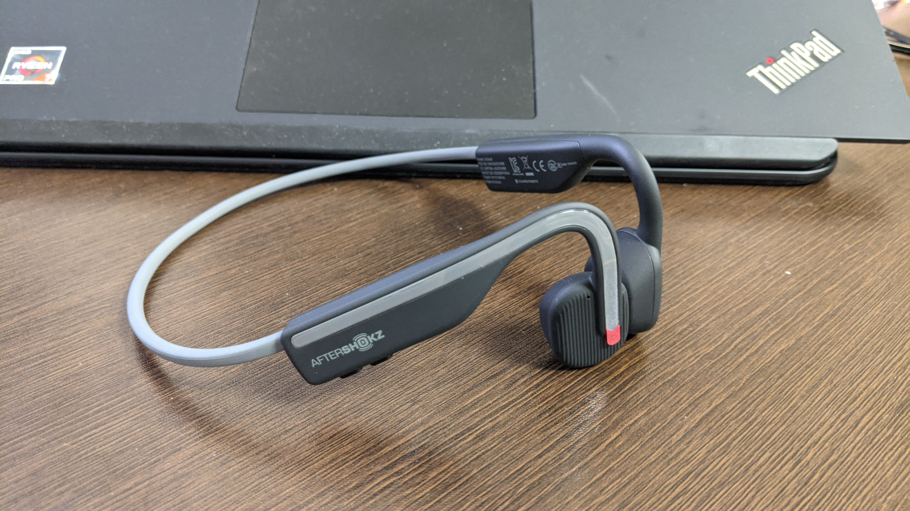

在宅時に使っていた BT イヤホンが調子悪くなってきたのと、耳をふさいで会話する違和感がいつまで経っても慣れないこともあり。骨伝導イヤホンを買ってみた。

主な利用用途は次の二つ。

- Zwift 中のイヤホン
- 在宅中の通話

よくあるやつだと思う。外ではランニングに使うかもしれないが、基本は屋内運用。

同社の [Aeropex](https://amzn.to/37BzKGN) は友人が複数人使っており、それにつられて中華の骨伝導イヤホンを使っていた時期があった。中華製品は大失敗で、ただのオープンスピーカーと大して変わらなかったが、Aeropex の骨伝導体験は非常にいいもので、隙あらばと狙っていた。

当時コロナ禍の序盤、Aeropex は何故か各地でセールされており 13000 円程度で買えたのだが、今となっては定価の 2 万円が当然の人気商品になってしまっていた。当時の価格を知っていると手が出しづらかったのだが…運よく？この OpenMove が発表されてくれたので思い切って買うことに。

ポイントが付くので家電量販店で買おうと思ったのだが、Amazon の公式セラーでもポイント還元をやっていたのでポチっと。

<a href="https://www.amazon.co.jp/dp/B08CKGR7NN/?tag=gensobunya-22" name="amachazllink" rel="nofollow" target="_blank">2020 OpenMove AfterShokz オープンムーブ ワイヤレスヘッドホン 骨伝導イヤホン 防水 Bluetoothイヤホン Zoomなどリモート会議 テレワーク 在宅勤務に使用可能 with Mic for Sport,Slate Grey</a>
posted with <a href="https://creazy.net/amazon_quick_affiliate/" title="2020 OpenMove AfterShokz オープンムーブ ワイヤレスヘッドホン 骨伝導イヤホン 防水 Bluetoothイヤホン Zoomなどリモート会議 テレワーク 在宅勤務に使用可能 with Mic for Sport,Slate Grey" rel="nofollow" target="_blank">Amaquick</a> at 2020-10-25

<a href="https://www.amazon.co.jp/dp/B08CKGR7NN/?tag=gensobunya-22" name="amachazllink" rel="nofollow" target="_blank">Amazon.co.jpで詳細を見る</a>

## 充電・防水

Aeropex が専用マグネット端子なのに対し、OpenMove は USB typeC 端子での充電となっている。カバーはよくある防水キャップなので、その分 IP67 だった防水性能が IP55 にランクダウンしている。自分の使い方では問題なさそうなレベルなのでここは妥協されても問題なかった。

むしろ、対汗を考えると金属端子が露出していない分有利かもしれない。キャップ防水にキャップ本体の劣化はつきものなのでトレードオフ。

## 音質・音漏れ

Aeropex では音楽のリスニングもそこそこできたが、OpenMove は音楽には全く向いていない…というよりも音声向けの味付けがされているといった方が正しい。ボーカルありの曲はボーカルが非常に前に出てくる味付けで、ドラムやベースの低音・シンバルの高音域はかなり小さい。

余談だが、この仕様のおかげでナビ的な利用はそこそこ快適だった。

音の出し方に関してはしっかり骨伝導！という感じで中華製品とは雲泥の差。もちろん漏れないわけではないが、単なるスピーカーではなくちゃんと本体の振動で音を伝えている感じがある。

マイク側は普通に違和感なく会話できる。カナル型イヤホンだとどうしても自分の声が聞こえなくなってしまう気持ち悪さがあったが、完全に解決。

## 屋外利用

一応、自転車乗車中も外の音が聞こえるので利用していいことになっている…と思う。Aeropex に比べて大振りなので、ヘルメットやサングラスと干渉しないか？と思ったが写真の通り全く問題なく利用できた。

音域の問題で、環境音の多い場所では人の声を聴くのが精いっぱいなのでナビに使うか、もしくは静かな道で音楽を聴く際には使える…といったところだろうか。

降車して施設に立ち寄る際に、ヘルメットとサングラスを外す → イヤホンを外す → マスクを着用、と停車時の手間が増えてしまうので、あまり普段のライドで常用するものでもないと思う。

## 総評

室内アクティビティ用とした自分の用途にはバッチリはまっていると思う。普通に買っても実質 9000 円というのは質を考えると非常にお得。

話題は逸れるが、今なら家電量販に GoTo クーポンを持ち込めば更に割引で買えるタイミングも期待できる。GoTo クーポンは意外と使える施設が少なくて困るので、こういったちょうどいい値段の家電に使っていくのがいい。

<a href="https://www.amazon.co.jp/dp/B08CKGR7NN/?tag=gensobunya-22" name="amachazllink" rel="nofollow" target="_blank">2020 OpenMove AfterShokz オープンムーブ ワイヤレスヘッドホン 骨伝導イヤホン 防水 Bluetoothイヤホン Zoomなどリモート会議 テレワーク 在宅勤務に使用可能 with Mic for Sport,Slate Grey</a>
posted with <a href="https://creazy.net/amazon_quick_affiliate/" title="2020 OpenMove AfterShokz オープンムーブ ワイヤレスヘッドホン 骨伝導イヤホン 防水 Bluetoothイヤホン Zoomなどリモート会議 テレワーク 在宅勤務に使用可能 with Mic for Sport,Slate Grey" rel="nofollow" target="_blank">Amaquick</a> at 2020-10-25

<a href="https://www.amazon.co.jp/dp/B08CKGR7NN/?tag=gensobunya-22" name="amachazllink" rel="nofollow" target="_blank">Amazon.co.jpで詳細を見る</a>

