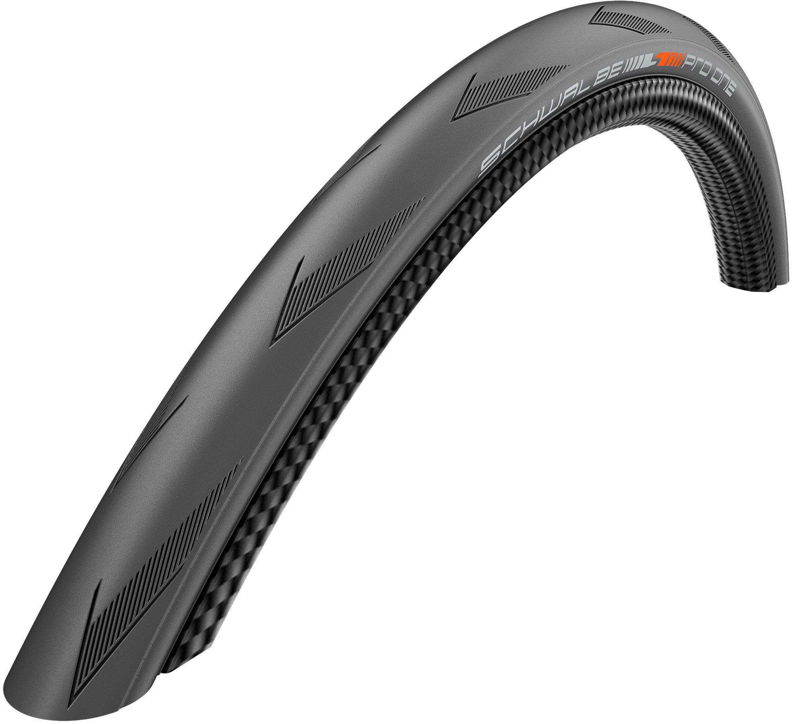
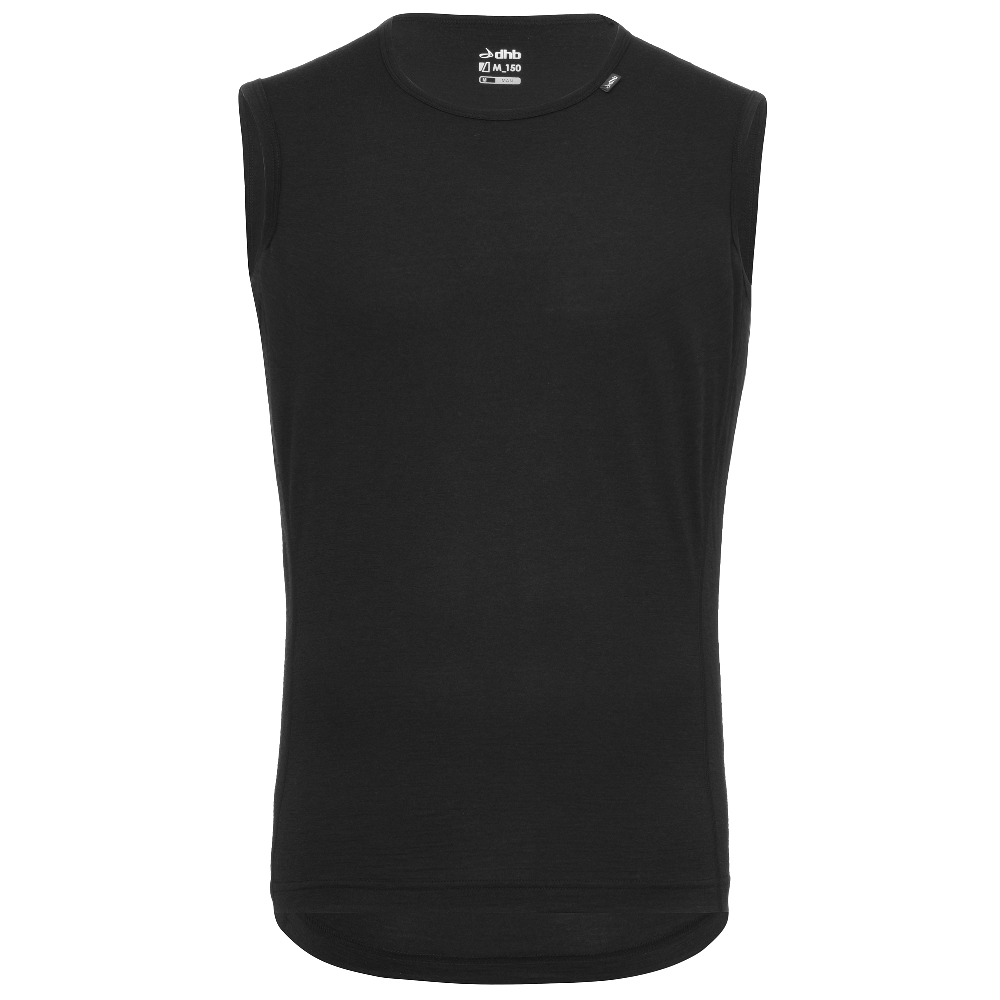
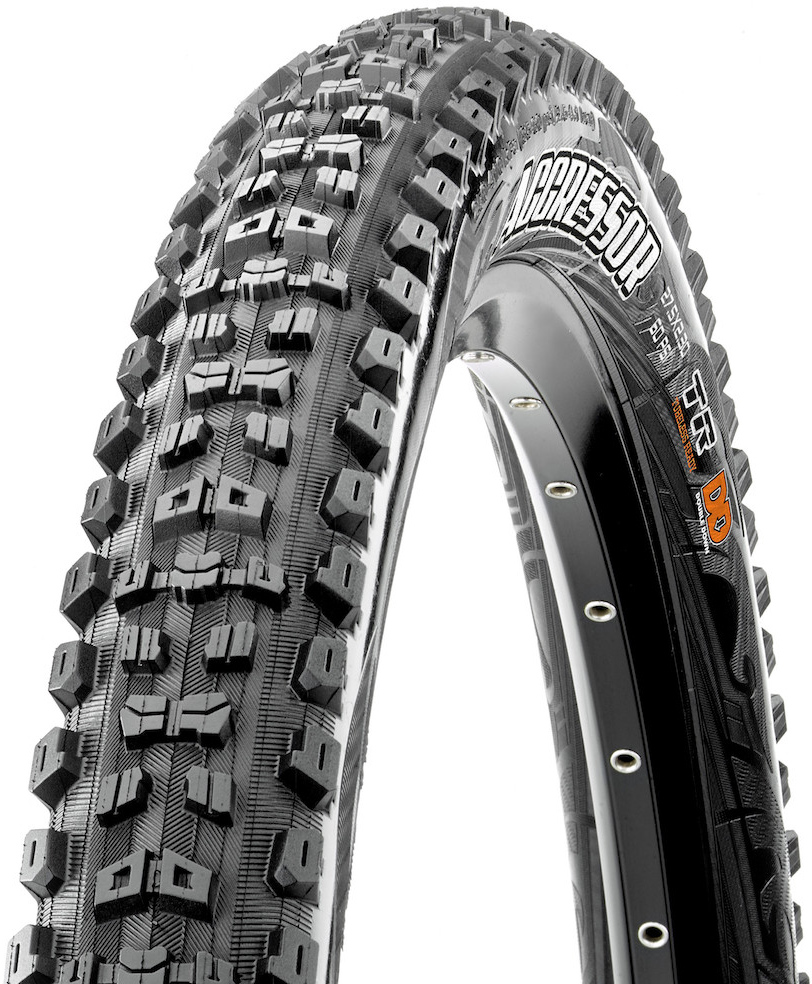
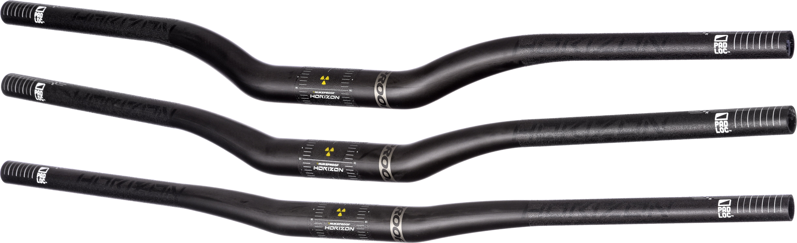
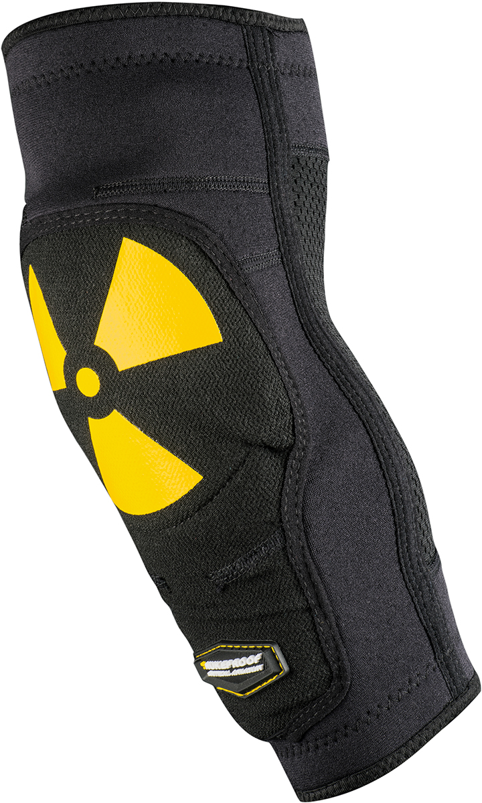
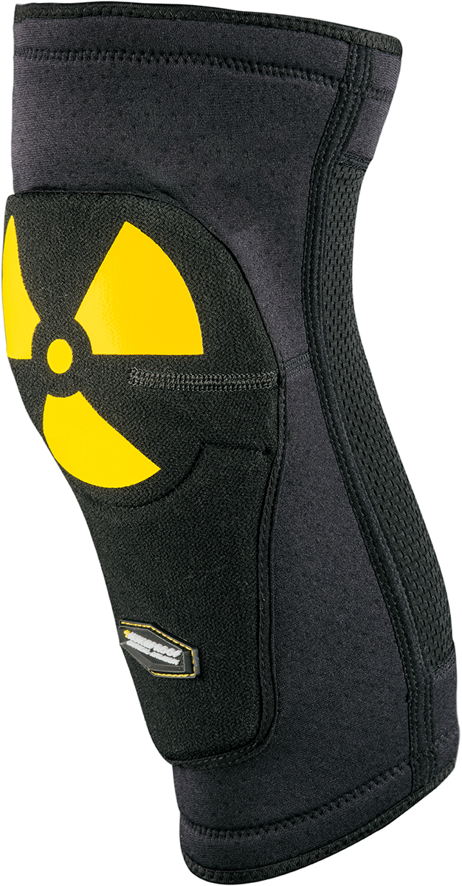

ブラックフライデー期間が始まりました。

セール品を列挙するのも芸がないので、過去に紹介したことのある・もしくは現在使っている製品で製品でブラックフライデー対象になっているものを紹介していきます。

## Pro One Evo Tubeless

[Schwalbe Pro One Evo Tubeless Folding Tyre](https://ck.jp.ap.valuecommerce.com/servlet/referral?sid=3171302&pid=886701002&vc_url=https%3A%2F%2Fwww.chainreactioncycles.com%2Fjp%2Fja%2Fschwalbe-pro-one-evo-tubeless-folding-tyre%2Frp-prod193327%3Futm_source%3Dvaluecommerce%26utm_medium%3Daffiliates)

TLR 界の超新星。28c ～ 30c であればデファクトスタンダードになりえるレベルのタイヤ。

チューブラー並みのしなやかさがウリで、もっちりしたグリップながらすごくよく転がる。インプレは下記の記事にて。

## dhb メリノ袖なしベースレイヤー

[dhb メリノ袖なしベースレイヤー](https://ck.jp.ap.valuecommerce.com/servlet/referral?sid=3171302&pid=886701002&vc_url=https%3A%2F%2Fwww.chainreactioncycles.com%2Fjp%2Fja%2Fdhb-%25E3%2583%25A1%25E3%2583%25AA%25E3%2583%258E%25E8%25A2%2596%25E3%2581%25AA%25E3%2581%2597%25E3%2583%2599%25E3%2583%25BC%25E3%2582%25B9%25E3%2583%25AC%25E3%2582%25A4%25E3%2583%25A4%25E3%2583%25BC-m-150-%2Frp-prod156765%3Futm_source%3Dvaluecommerce%26utm_medium%3Daffiliates)

袖なしの冬用インナー。珍しい組み合わせだが、特定の用途で非常に便利。具体的にはめちゃくちゃピチピチの Bioracer スキンスーツと組み合わせている。\
袖なし以外のインナーが着られないほどピチピチなので、たいていの冬インナーが使えないところだったがこれに救われた。

## Maxxis Agressor TR EXO

[Maxxis Aggressor MTB タイヤ (EXO - TR)](https://ck.jp.ap.valuecommerce.com/servlet/referral?sid=3171302&pid=886701002&vc_url=https%3A%2F%2Fwww.chainreactioncycles.com%2Fjp%2Fja%2Fmaxxis-aggressor-mtb-%25E3%2582%25BF%25E3%2582%25A4%25E3%2583%25A4-exo-tr-%2Frp-prod150233%3Futm_source%3Dvaluecommerce%26utm_medium%3Daffiliates)

ウェットもドライも行けるトレイルタイヤ。ふじてんなどの DH コースから、日常トレイルまで幅広く対応してくれます。

DD バージョンのレビューを以前しましたが、流石にオンロードやアプローチの登りでかなり重さによる辛さがあったので、EXO モデルの方がよいでしょう…

## Nukeproof Horizon カーボンライザーバー

[Nukeproof Horizon カーボンライザーバー](https://ck.jp.ap.valuecommerce.com/servlet/referral?sid=3171302&pid=886701002&vc_url=https%3A%2F%2Fwww.chainreactioncycles.com%2Fjp%2Fja%2Fnukeproof-horizon-%25E3%2582%25AB%25E3%2583%25BC%25E3%2583%259C%25E3%2583%25B3%25E3%2583%25A9%25E3%2582%25A4%25E3%2582%25B6%25E3%2583%25BC%25E3%2583%2590%25E3%2583%25BC%2Frp-prod158768%3Futm_source%3Dvaluecommerce%26utm_medium%3Daffiliates)

今の MTB で現役稼働しています。

[ESI グリップ](https://amzn.to/38mSZ77)とカーボンハンドルの組み合わせで、DH コースをひたすらピストンしても、手「だけ」がしびれるということはなくなりました！。岩岳で 10 本下ったらしびれとは無関係に疲れ果てましたが、握力だけが抜けることはなかったくらい優秀！

## NukeProof Enduro シリーズプロテクター

[Nukeproof Critical Enduro 肘スリーブ](https://ck.jp.ap.valuecommerce.com/servlet/referral?sid=3171302&pid=886701002&vc_url=https%3A%2F%2Fwww.chainreactioncycles.com%2Fjp%2Fja%2Fnukeproof-critical-enduro-%25E8%2582%2598%25E3%2582%25B9%25E3%2583%25AA%25E3%2583%25BC%25E3%2583%2596%2Frp-prod132014%3Futm_source%3Dvaluecommerce%26utm_medium%3Daffiliates)

[Nukeproof Critical Enduro 膝スリーブ](https://ck.jp.ap.valuecommerce.com/servlet/referral?sid=3171302&pid=886701002&vc_url=https%3A%2F%2Fwww.chainreactioncycles.com%2Fjp%2Fja%2Fnukeproof-critical-enduro-%25E8%2586%259D%25E3%2582%25B9%25E3%2583%25AA%25E3%2583%25BC%25E3%2583%2596%2Frp-prod132015%3Futm_source%3Dvaluecommerce%26utm_medium%3Daffiliates)

DH コースや、岩だらけのトレイルで使ってるやつ。4000 円の割に出来が良い。

サイズは表記よりやや小さめで、ベルクロ止めではなくウォーマーみたいに装着するタイプ。D3O ではないがしなやかな素材でできているので、ある程度ならペダリングもできる。

ひとまず 1 週目は以上。2 週目も気分次第でやっていく予定。
