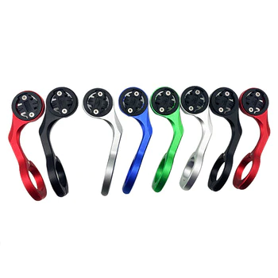
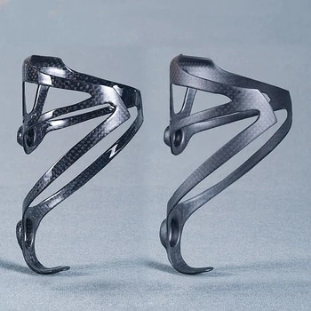
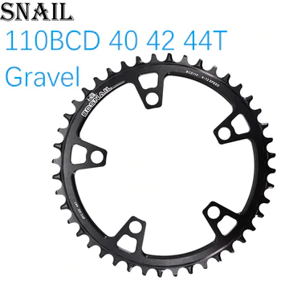
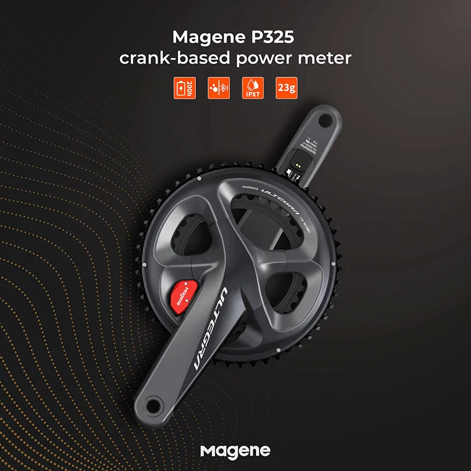

11/11 は中国で言う独身の日で、AliExpress が盛大なセールを行う。

知っての通り、安いが玉石混交で石が 8 といった具合のマーケットなのだが、信頼性の低くても最悪問題がない（命にかかわる可能性が低い）パーツも自転車生活においては存在しているので、そういった部分では AliExpress で購入した製品もそこそこ利用している。

元から安い製品ばかりの市場が更にお得なセールになるので、購入した製品の中で「まぁ使える」というセール対象品を紹介していく。

## GARMIN マウント

[Left / Right Bicycle Computer Holder handlebar GARMIN Edge 1000 GoPro support Bike Computer GoPro Mount Road Clock extended seat](https://s.click.aliexpress.com/e/_Adpju7)

折れても死なないのでセーフ。カラーバリエーションが多いのが中華製品の特長で、フレームに合う一般的なブランドの製品がなかった人にはおすすめ。

## カーボンボトルケージ

[Super Light 18g XXX Lite Full 3K Carbon Road/Mountian Bike Water Bottle Holder Cycling Bicycle Bottle Cage Matte Glossy](https://s.click.aliexpress.com/e/_9RgTTt)

折れても死なないのでセーフ。ボトルケージに外れとかあるのか？と思われるかもしれないが、左右対称じゃなかったりやたら保持力が低かったりする。自分が使っていたころは 3 つ買って、当たりの 2 つを使うというテニス選手みたいなことをしていた。現在はもう使っておらず GIANT のサイドプルボトルケージを使っている…

## ナローワイドチェーンリング

[Snail Chainring Round 110 BCD for force red rival s350 s900 40 42 44T Tooth Road Bike for sram cx gravel q](https://s.click.aliexpress.com/e/_9yqXVz)

同じメーカーのものではないが、以前インプレしたこともある類の製品。現在ではウルフトゥースのチェーンリングを使っていることから察してほしい。

ウルフトゥースのチェーンリングより 5 倍くらい速く摩耗して値段は 1/5 程度で、ちょっとチェーンも落ちやすい。

## 当たりを引けば儲けもの、パワーメーター

書きたいことはおおよそ以前の記事に記載しているので、そちらを確認してほしい。

パワーメーターで最も重要なソフトウェア部分がやや怪しいが、パワー値は取ることができる。

[AXO SRM Power Meter Spider powermeter bicycle Crank spider Cadence for road mtb mountain bike SRAM ROTOR crankset power meter](https://s.click.aliexpress.com/e/_A8c2uT)

[Magene P325 Lite Dual Side Crank Rechargeable waterproof Power Meter Ultegra R8000 Road Bike Power Meter Crankset Bike Computer](https://s.click.aliexpress.com/e/_AnXNs3)

スパイダー式・両足に加えて、よくある左側パワーメーターやペダル型パワーメーターもある。ただ、左クランクの PM はあまり 4iiii のセールと価格差がないので、ちゃんとしたものを買った方がリスク管理の意味でも得策。
