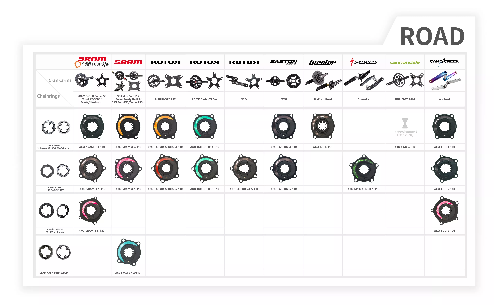
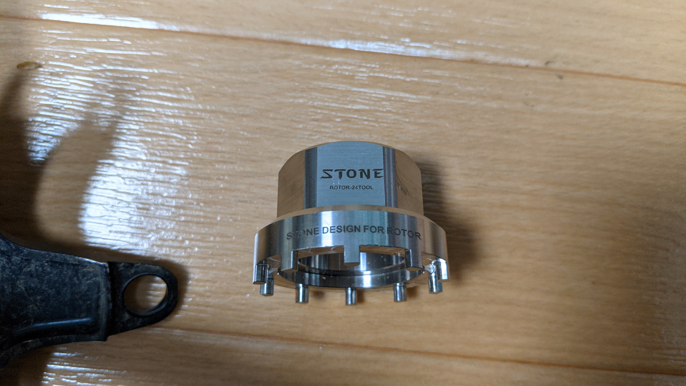
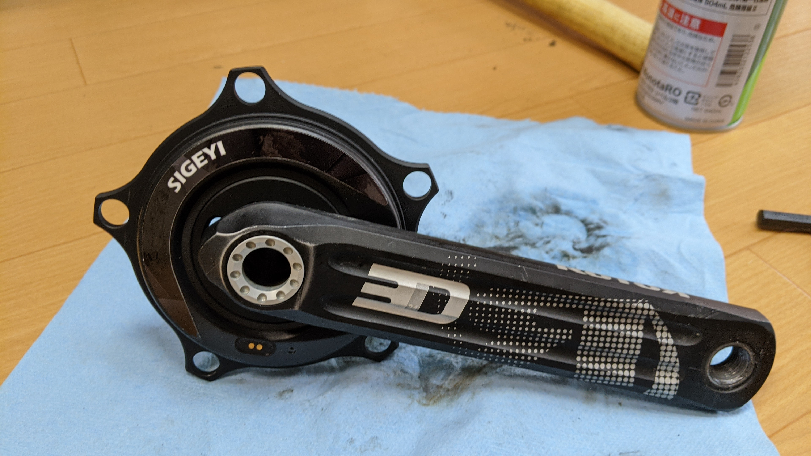
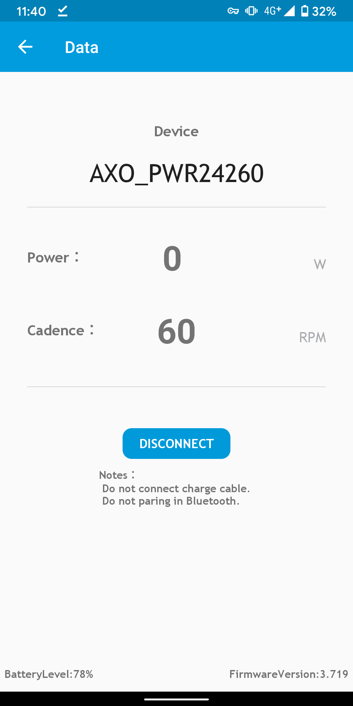
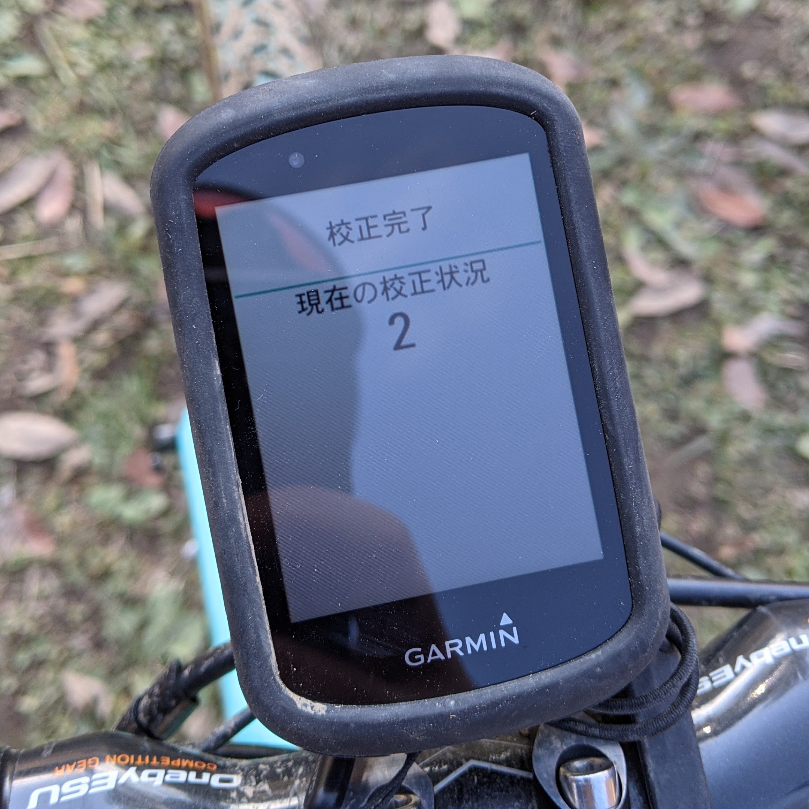

[独身の日特集](https://blog.gensobunya.net/post/2020/11/2020_singleday/)で挙げていた中から自分でポチったパワーメーター。

<LinkBox url="https://s.click.aliexpress.com/e/_9JzEFV" />

スパイダー式のクランクに対して、MTB からロードまで非常に幅広いラインナップに対応するスパイダー式パワーメーターを製造している。ROTOR 3D24 クランクでパワーメーターを新規で購入する場合はこの AXO か、Power2Max になるのが現在の状況だ。

その互換表たるや、壮観の一言だ。

## SIGEYI AXO スペック

- 精度 ±1%
- 300h バッテリーライフ
- ANT+BLE 対応
- 自動気温校正
- IP6/7 防水

なるほど、スペックは立派である。特に自動気温校正に関しては非常にありがたい機能だ。

バッテリー持ちに関しても、公称から大きく外れてはいないと思う。購入後にバッテリー残量の警告が Edge530 に出てきたのはほぼ 2 カ月後だった。

## 開封

内容物は本体と説明書・カラー変更用のステッカー・充電用ケーブルだ。

ケーブルは USB-A to オリジナルマグネット端子。XCADEY の XPOWER と同じコネクタで、どちらのケーブルでも充電することができた。

カラーステッカーはやたらパステルカラーが多く、あまり使いどころはなさそうだ…

## 取り付け・動作

取り付けのためには、3D24 クランクについているスパイダーアームを取り外す必要があり、これは外すのに専用工具が必要。

純正工具は高いので、こちらも AliExpress で同時に購入した。チェーンリングでもお世話になっていた STONE 製だ。

<LinkBox url="https://www.aliexpress.com/item/4000393507091.html" />

クランクアームに通して、モンキーレンチなどを使って正ネジを緩める方向（つまり普通のネジ）で取り外す。

流石、古いクランクは固着が強く自転車向けのサイズのモンキーでは外れず…ひとまず手持ちの新グラフィッククランクに取り付けた（後日大きめのパイプレンチで取り外して事なきを得た）

充電中は赤ランプが点灯し、満充電になると消灯する仕様。公式アプリからもケイデンスやパワーが取れていることを確認し、ドキドキしながらファームウェアをアップデートしてみる。

画面を見ると分かる通り、アップデート中は充電状態でないとアップデート作業が行えず、アプリ側でもペアリングが切れるようになっている。意外と安全側に倒しており、XCADEY との差を感じた。

最新ファームウェアでも問題なく GARMIN Edge530 とペアリング完了し、パワー値とケイデンス値を送信してくれた。マグネットレスなのでフレーム側に何も加工がいらず、スパイダー式ならではのメリットとしてクリアランス問題も発生しないのがうれしい。

## そして、故障

結論から言うと、水洗い(高圧)したら 1 回壊れて保証請求することになった。一応、直撃は避けて洗浄していたしケイデンス計測機能は壊れず、無線回りも故障はなく、ただパワー計測値が 0W から動かなくなった。

公式サポートに問い合わせると、サイコンのキャリブレーション値を見せろとのこと。レスポンスは休日にもかかわらず数時間で返信が返ってきた。素晴らしい。

校正結果が 2 になるのは、ハードウェアエラーらしい。（非常に稀な事例とのこと、ほんとか？）

水没なら電装系が全部やられて無線通信もできないと思うが、都合よくひずみゲージだけが洗浄で壊れたのだろうか…とにかく、保証交換することになった。故障当日はセラーと連絡が取れなかったので、公式ショップの 100%オフクーポンをもらい、それで新品を発注するフローとなった。

交換品が来るまで 1 カ月ちょっと、交換はすぐに終わり、通信も確認…だが、洗車でどうなるかは未知数。ROTOR クランクにこだわらず、[4iiii](https://amzn.to/3pxgjo2) がコスト的にも良いのではないだろうか…

<LinkBox
  isAmazonLink
  url="https://www.amazon.co.jp/dp/B07ZMF12T9/?tag=gensobunya-22"
/>

元々の製品は返送しろとのことだったので、e パケット ではなく[小型包装物](https://www.post.japanpost.jp/int/service/small_packing.html)として送り返した。追跡できないのだが、あまり高い送料を払う義理もない。

SAL 便や e パケットライトは現在は国際情勢上使えないらしいので、正規の航空便料金が必要となった（それでも広州までは 500 円ほどだが）。

### 国際返品豆知識

国際郵便（メールではない）を出す際は[WEB ポータル](https://www.int-mypage.post.japanpost.jp/mypage/M010000.do)から事前入力することで、ゆうプリタッチから必要な書類が全て出力できるようになるらしい。必要な局面は少ないが、知っているとだいぶ便利になりそう。そもそも、2021 年からアメリカ行き荷物は手書きラベルは不可になるそうだ。

また、返品時は、箱に大きく"Returned Goods"と書くことで返品扱いとなり関税がかからないようにするのがマナー。そもそも「課税通知書(CN22)にこの金額を書け！」
指示されるが深くはつっこまないほうが身のため。
