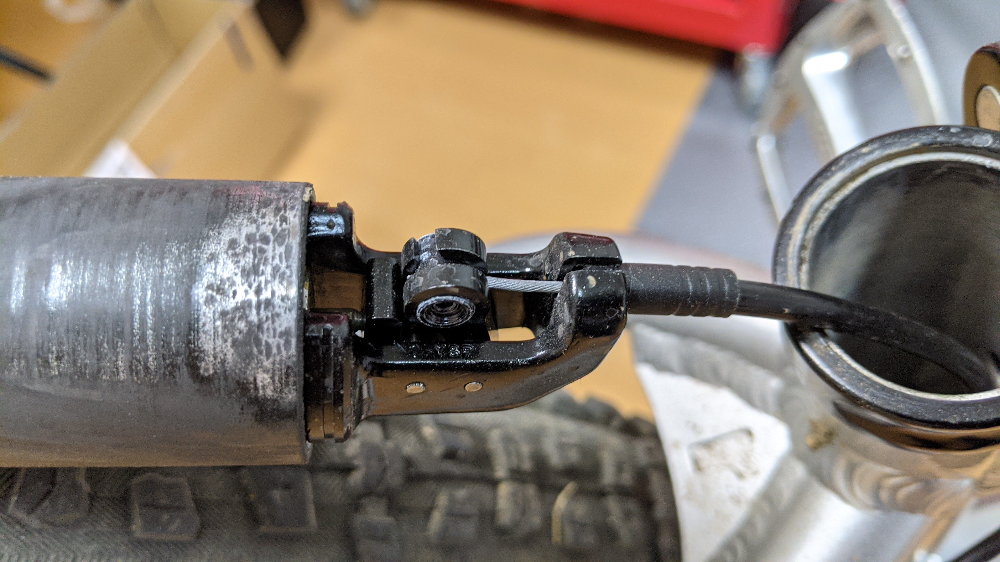
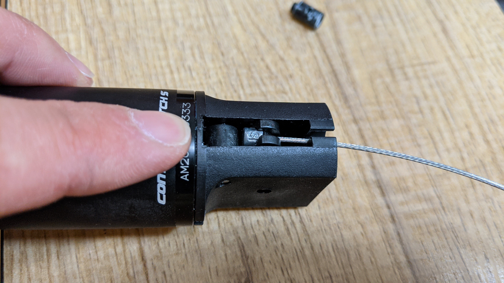
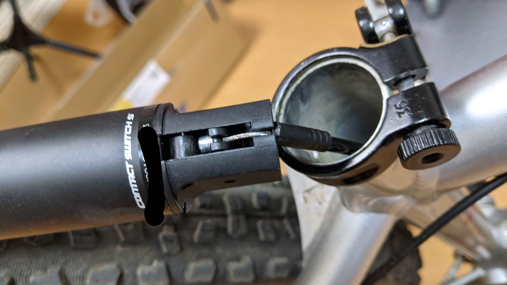
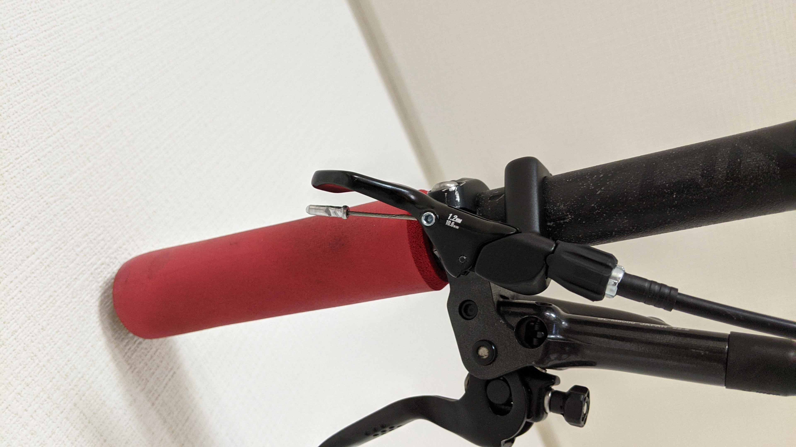
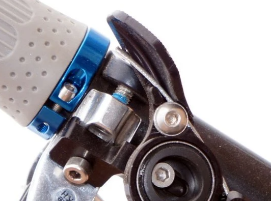

以前紹介したBrand-X ASCENDドロッパーポストの動きが悪くなった（上昇した状態でロックされない）ので、新しいドロッパーポストを探すことにした。

<LinkBox url="https://blog.gensobunya.net/post/2017/04/goodmtbgears/" />

今では後継品の[ASCEND II](https://www.chainreactioncycles.com/jp/ja/brand-x-ascend-%E3%83%89%E3%83%AD%E3%83%83%E3%83%91%E3%83%BC%E3%82%B7%E3%83%BC%E3%83%88%E3%83%9D%E3%82%B9%E3%83%88-125-150mm-/rp-prod149024) が発売されているが、100mmモデルがなくなってしまった…

そのうえ、割引がほぼなくなっており2万円程度に実質値上がり。そのため、同価格帯の信頼あるメーカー…GIANTのドロッパーポストを使ってみることにした。

## GIANT CONTACT S SWITCH

<LinkBox url="https://www.giant.co.jp/giant21/acc_datail.php?p_id=A0002410" />

購入したのは30.9×345×100mmのモデル。シートポスト系が自分のMTBとは違うが、シムで φ31.6にコンパチ可能。

ドロッパーポストの組付けにはトラウマがあったが、今回も工賃をケチって自分で装着することにした。ちなみにGIANTパーツのインストールマニュアルはグローバルサイトでDL可能だ。

<LinkBox url="https://www.giant-bicycles.com/global/manuals" />

### ASCEND との構造比較

CONTACT S SWITCHの方が若干ユニット部分が短くできている。それ以外には特筆すべきメトリクスの差はない（どちらも100mmストロークだし…）

大きな違いは、ワイヤーの挿入方向。ASCENDはレバー側にタイコを固定する構造になっているのに対し、GIANTはドロッパーポスト側にタイコを固定する構造になっている。

#### ASCEND の装着方法

ASCENDは、ちょうどいい張り具合になるインナーワイヤー長を決め、それからワイヤーをカットしてイモネジでシートポストにワイヤーを固定する。

これが装着に関するトラウマの原因で、「いい張り具合」を確認するために仮固定・アウターワイヤーを送り出しながらシートポストを挿入して、レバーを引いて確認…とこの過程を何度も踏む必要がある。しかもシートポスト側はワイヤーは構造上数mmしか余らせることができず、引き直すたびにワイヤーをカットする必要があり大変に手間だった。

しかもアウターを送りだす際にシートポストからキャップが外れてはいけないというおまけつき。（これはCONTACT S SWITCHも変わらなかったが）

#### CONTACT S SWITCH の装着方法

GIANTはレバー側でインナーワイヤーの張り具合を調整するため、まずはインナーワイヤーを通しきってアウターワイヤーが外れないようにシートポストを装着し、レバーを固定してから思う存分インナーワイヤーの張りと長さを決められる。

レバー側ではワイヤーが張りだしてしまうが、レバーの向こう側になっているので、気になることはほぼないと思われる。

### レバーの互換性について

自分はこれまでドロッパーポストのレバーは自由に変えられると思っていた。（[Wolftooth](https://www.chainreactioncycles.com/jp/ja/wolf-tooth-remote-light-action-dropper-lever/rp-prod192985)など、単品で出しているメーカーがある…）

しかし、今回比較した2メーカーの間では明らかにレバーの互換性がない。ワイヤーを通す方向が逆なのだから交換しようがない。どっちが一般的な方式なんだ？ということで調べてみた。

Wolftoothの製品は、レバー側はタイコではなくワイヤー固定だ。

<LinkBox url="https://www.chainreactioncycles.com/jp/ja/wolf-tooth-remote-light-action-dropper-lever/rp-prod192985" 
linkurl="https://ck.jp.ap.valuecommerce.com/servlet/referral?sid=3171302&pid=886701002&vc_url=https%3A%2F%2Fwww.chainreactioncycles.com%2Fjp%2Fja%2Fwolf-tooth-remote-light-action-%25E3%2583%2589%25E3%2583%25AD%25E3%2583%2583%25E3%2583%2591%25E3%2583%25BC%25E3%2583%25AC%25E3%2583%2590%25E3%2583%25BC%2Frp-prod192985%3Futm_source%3Dvaluecommerce%26utm_medium%3Daffiliates" />

Brand-Xにはアップグレード用レバーがあるが、これは当然レバー側にタイコ。

<LinkBox url="https://www.chainreactioncycles.com/jp/ja/brand-x-ascend-%E3%83%AC%E3%83%90%E3%83%BC%E3%82%AD%E3%83%83%E3%83%88-v2-%E3%82%AE%E3%82%A2-x1-/rp-prod176215" 
linkurl="https://ck.jp.ap.valuecommerce.com/servlet/referral?sid=3171302&pid=886701002&vc_url=https%3A%2F%2Fwww.chainreactioncycles.com%2Fjp%2Fja%2Fbrand-x-ascend-%25E3%2583%25AC%25E3%2583%2590%25E3%2583%25BC%25E3%2582%25AD%25E3%2583%2583%25E3%2583%2588-v2-%25E3%2582%25AE%25E3%2582%25A2-x1-%2Frp-prod176215%3Futm_source%3Dvaluecommerce%26utm_medium%3Daffiliates" />

そのほか、RACEFACEもシートポストにタイコ前提に見えた。FOXは確信の持てる画像がなかったが、シートポスト側の固定部はASCENDと同様の構造をしているように見える。

どうやらこの部分はメーカーによってまちまちのようなので、ドロッパーポストのレバーだけ交換する際はタイコの位置に気を付ける必要がありそうだ。

## 動作

それなりに速くてスムーズ（当社感覚比）

<blockquote class="twitter-tweet" data-partner="tweetdeck">
GIANTのドロッパー、動作が速い！（当社比 <a href="https://t.co/SXaAe4d3MM">pic.twitter.com/SXaAe4d3MM</a>
&mdash; ゲン (@gen_sobunya) <a href="https://twitter.com/gen_sobunya/status/1350366314703933442?ref_src=twsrc%5Etfw">January 16, 2021</a></blockquote>
