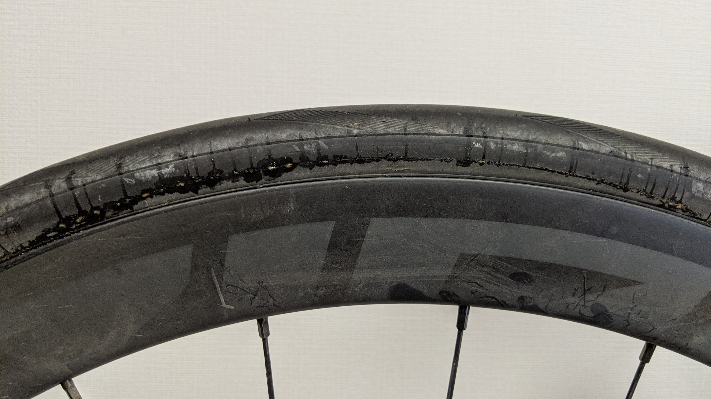

今まで、チューブレスレディタイヤの初期空気漏れのカバーやビード上げ時の浸透力では [Caffelatex](https://www.chainreactioncycles.com/jp/ja/effetto-caffelatex-tubeless-fluid/rp-prod150131)が最も良いと信じて疑わなかったが、今回別の製品に手を出してみた。

## Orangeseal Sealant

<LinkBox url="https://www.chainreactioncycles.com/jp/ja/orange-seal-endurance-sealant-refill/rp-prod179168"
linkurl="https://ck.jp.ap.valuecommerce.com/servlet/referral?sid=3171302&pid=886701002&vc_url=https%3A%2F%2Fwww.chainreactioncycles.com%2Fjp%2Fja%2Forange-seal-endurance-%25E3%2582%25B7%25E3%2583%25BC%25E3%2583%25A9%25E3%2583%25B3%25E3%2583%2588%25E3%2583%25AC%25E3%2583%2595%25E3%2582%25A3%25E3%2583%25AB%2Frp-prod179168%3Futm_source%3Dvaluecommerce%26utm_medium%3Daffiliates" />

Orange Seal(オレンジシール)は新興シーラントメーカーで、英語メディアのインプレッションで毎回高い評価を得ていたので気にはなっていた。

今回、ZIPP303S に履かせていたタイヤがパンクしたので、修理のために利用。

[TIPTOP のタイヤ用パッチ](https://amzn.to/36eW2g7)を内側から貼り、張り付いたところでビードを上げ、このシーラントを注入した。[前回](https://blog.gensobunya.net/post/2020/10/zip303s/)と違い、PRIME のチューブレステープを追加で巻いたのでビード上げはすぐに上手くいきました。

その後、慣らしのために 1 時間ほど走行して放置していました。ちなみに修理したのは後輪側です。

### 圧倒的なシーリング力

翌々週、ライドのために空気圧を確認したのですが、なんと、元々の 4 気圧からほぼ低下無し！

前輪はカフェラテックスで処理しており、一週間したら再度空気入れが必須なほどの空気入れなのですが、こんなに差が出るのかと思うくらいシール力の差があります。

MTB やグラベルバイクでオレンジシールを使っている友人曰く「ほぼボンド」との談でしたがあながち誇張というわけでもなさそうです。

### 低圧でも効果あり

パンクに加えてタイヤのサイドもボロボロになっていたのですが、こちらにも効果がありました。

通常、このような穴は開いていないが空気は漏れるような損傷の場合はシーラントが噴き出すための圧力が足りず、固まらない＝傷を塞げないことが多かったのですが、このシーラントはどういうことか、こんな場所も修復してくれました。

修復してすぐなので、見た目は汚れていますがこの後水洗いした後はシーラントはもう出てきていません。タイヤ幅の拡大であまり高圧にしない昨今、この特性は非常にありがたいものです。

### 長寿命

自分の使ったバージョンはいわゆる初期型の無印バージョンですが、現在は Endurance というより長寿命のモデルが出ています。

シーラントが長持ちするに越したことはないので、現在はこちらの購入をお勧めします。

<LinkBox url="https://www.chainreactioncycles.com/jp/ja/orange-seal-endurance-sealant-refill/rp-prod179168"
linkurl="https://ck.jp.ap.valuecommerce.com/servlet/referral?sid=3171302&pid=886701002&vc_url=https%3A%2F%2Fwww.chainreactioncycles.com%2Fjp%2Fja%2Forange-seal-endurance-%25E3%2582%25B7%25E3%2583%25BC%25E3%2583%25A9%25E3%2583%25B3%25E3%2583%2588%25E3%2583%25AC%25E3%2583%2595%25E3%2582%25A3%25E3%2583%25AB%2Frp-prod179168%3Futm_source%3Dvaluecommerce%26utm_medium%3Daffiliates" />
