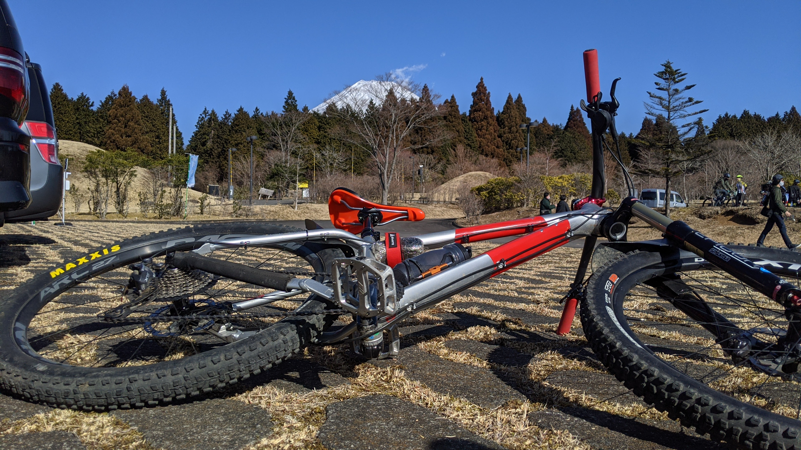
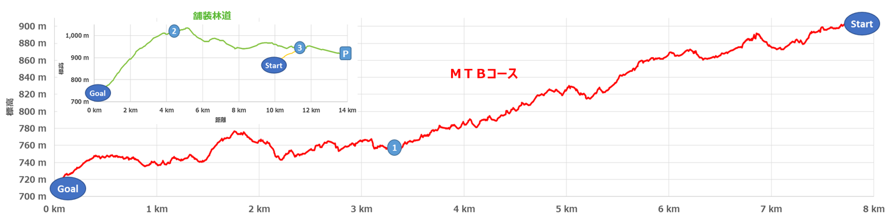

## Fujiyama Power-line Trail とは

東京電力パワーグリッドが管理している送電線メンテナンス用の道路を MTB コースとして整備した、最大 7km の MTB 専用トレイルです。

ひっそりと始まったコースですが、eBike の貸出や搬送の設定、有料のドローン撮影サービスなど、地味にサービスが充実しています。

<LinkBox url="https://www.tepco.co.jp/pg/company/summary/office/shizuoka/MTB/index-j.html" />

通常は 4000 円/日で、2 名様から 10 日以上前に予約が必要という設定ですが、2/23（富士山の日）にちなんで、1 日 1000 円で搬送付き走り放題というイベントが開催されていたので、参加してきました！

申し込みは上記ページよりメールか、サポート契約店経由で行う必要があります。いつでも解放しているわけではないのでご注意。

## アクセス

裾野市にある[富士山こどもの国駐車場](https://goo.gl/maps/mZF28hixrq9QBbsr9)が中上級コースの入り口です。この日はコースに途中から侵入する初級者コースが設定されていましたが、普段は使えない模様。

東京方面からは裾野 IC, 名古屋方面からは新富士 IC が最寄りです。

この日は天気に恵まれ、駐車場から富士山がくっきり見えました！

## コースレビュー

コースはアップダウンしながらの下り基調。

総評としては、スマイルバイクパーク以上ふじてん以下の難易度で、MTB 初心者が脱初心者するためのコースとして非常に適切な難易度です。難易度が低すぎるわけでもなく、きっちり刺激的なセクションも備えています。押し上げも必要です。

大きなドロップオフはありませんが、フカフカの土やツルツルの湿った路面もありグリップを失いやすいセクションもあるので下りは油断禁物です。先日買った[Zefal DEFLECTOR LIGHT](https://amzn.to/3rYIqO9)が見事に役立ちました。

<LinkBox url="https://www.amazon.co.jp/dp/B00XMPQQ1W" isAmazonLink />

<LinkBox url="https://blog.gensobunya.net/post/2021/02/compact_rear_mudgurad/" />

1 本目の全編に渡って、[GoPro Hero8](https://amzn.to/3qPOett) で撮影した動画を Youtube にアップロードしましたので、詳細はこちらで感じていただければ…

<LinkBox url="https://youtu.be/mWl6x8iVLOc" />

グロスタイムで本コース 40 分、スタート地点に戻るまで 30 分といったところでした。脚のある 2 名だったのでペースは速めですが、明らかに XC の練習で来ていた人はこれより遥かに速いペースを刻んでいました。

コース説明にもある通り、2 時間あれば複数名グループでちょくちょく休憩しても回り切れるかと思います。

### 中上級コース自走周回編

ゴール後、林道を下って搬送開始場所まで向かうか、舗装路を登って下ってスタート地点まで戻るか選択できます。

1 本目は自走での周回をしてみました。ふじ山夢ロードなる大通りに出るまで緩やかなヒルクライムが続き、その後は富士山裾野の気持ちいい下り基調アップダウンで戻ります。

この道はとにかく開けており、富士山のビュースポットもあるので 1 回だけは通ってよいと思います。

### 搬送編

2 本目を走って今度は搬送場所まで向かいました。普段は下ることなくゴール場所で回収してくれるようです。

この日はダートを数キロ下って舗装路に出てから回収となりました。30 分周期で迎えに来てくれていましたが、普段がどういったシステムなのかは不明。最大で一度に 5 名程度が搬送の限界なので、1 グループも 5 人以下に抑えれば周回が楽になると思われます。

### 設備編

この日は一部タイヤがマッドガードに擦るほど粘着質の土ができていましたが、洗車道具もキッチリ準備されていたので綺麗にして帰ることができました。

## まとめ

この日は 1000 円なのでお得な気分でしたが、4000 円と考えると搬送を使い倒して 3~4 周したいところです。

とはいえ、スピード次第では 2 周で丸一日楽しめる上に比較的安全なコースなので、経験の少ないメンバーがいる中でいきなりふじてんの DH コースにご招待するよりは遥かにいい選択になります。

ソロ不可で予約が必要になるシステム上、グループライドの計画が必須ですが、景色は抜群に良くて開放的な気分になれること請け合いですので、MTB 沼に人を引き入れる際に利用していただくのに最適！
