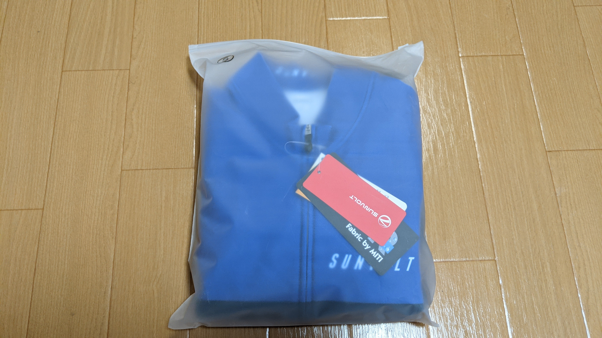
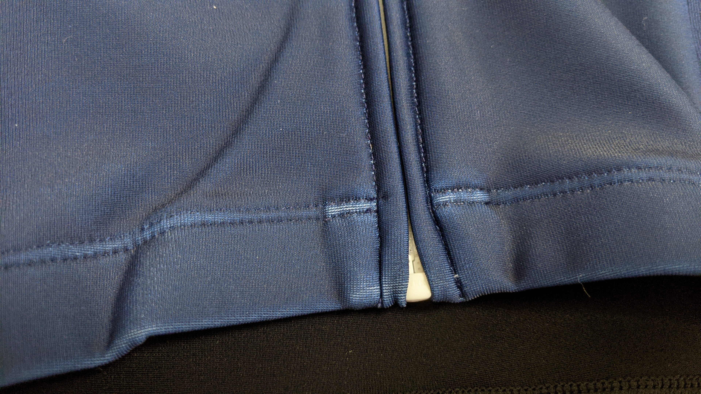

ウェアは中々消耗しないので、せっかく進化した素材が出ても中々導入できないもの。最近ようやく n 年もののウェアがヘタってくるようになったので、買い替えを進めています。

2 月から徐々に暖かくなってくるとはいえ、三寒四温の寒の方が週末に当たるとウィンターウェアの出番です。というわけで、サンボルトさんのセールにのっかって、セパレートワンピース型のウィンターウェアである[サーモスーツ](http://sunvolt.co.jp/item/s-ride_tseo.html)をポチってみました。

<LinkBox url="https://store.shopping.yahoo.co.jp/sunvolt-store/fma2017s2f.html"
linkurl="https://ck.jp.ap.valuecommerce.com/servlet/referral?sid=3171302&pid=887657037&vc_url=https%3A%2F%2Fstore.shopping.yahoo.co.jp%2Fsunvolt-store%2Ffma2017s2f.html"
/>

ヤフーショッピング店ではセールエリアがあるので、そこばっかり見ています。

## なぜワンピース型？

ワンピース型ウェアを練習で使う意味は色々ありますが、自分の考えている利点は以下の通りです。

- 組み合わせを悩まないで済む
- 上半身の締め付けが緩やか
- ビブショーツより用を足しやすい
  最後の点は、特に解説する部分もないので前の 2 点だけ説明します。

### 組み合わせ

これはいわゆる「決断力を無駄遣いしない」というやつです。

IT 業界やバリバリのビジネスマンでは 1 日に行使できる決断力が一定であることが知られています。

冬場のライドは朝のやる気が全てです。面倒なことはなるべく無くして、「行くぞ！」という決意が鈍らないうちに準備を済ませたいので、余計なことを考えないという点でワンピース型には利点があります。

また、サイクルウェアはボトムスが先に劣化する運命にあり、セット買いしても上だけ残ります。ワンピース型ならそんなことは起こりません。洗濯してたたむ際も、セットを探して洗濯物の山から探し出す労力がなくなります。

### 上半身の締め付け

ビブショーツは、その構造上肩紐があるため、どうにも上半身に異物がある感覚になります。そもそもビブショーツが当たり前だった自分には、スーツをメインで着るようになるまでこの感覚を忘れていたのですが…そこには確かに紐があるのです。

ワンピースの上半身はシンプルで、インナーウェアとスーツ、レイヤリングするならその上のジャケットとなるので極めて自然な感覚です。

エアロスーツのような完全な 1 枚型ワンピースは前傾姿勢を取ることが前提のカッティングになっていますが、セパレートタイプの場合は前半身の押さえつけが少ないので、直立歩行も苦になりません。（特にこのサーモスーツの場合）

また、昨今のウェアは薄型化が進んでいるので、夏は特に肩紐がジャージの上から透けてしまうのですが、スーツだとこれがなくなるのもシュッとした見た目に貢献します。

## サーモスーツ インプレッション

使い勝手のよさそうな袋に入って届きました。まずは外観検査をします。

チャンピオンシステムのインターミディエイトジャケットより厚手の生地を使っています。その分、やや固さを感じますが保温性に加え、撥水性もあるそうです。

> 上半身部分には、ウェア表面についた水分を水滴にして分散させる DWR(耐久撥水加工)を施し伸縮性に優れたイタリア製の高機能なファブリックを採用、急な雨や雪などの天候変化にも対応します。

自分が最も重要視している裾の部分。切りっぱなしかつ薄くしなやかなグリッパーで処理されています。

ここが固いと、太腿が締め付けられる感覚がして、血流が妨げられる気がしてしまうので、高級感のあるこのタイプの仕上げは完全に自分好みのもの。

素材の厚み上仕方ないのですが、ジッパー周りは本来の記事の色が出ています。

### 実走インプレッション

- 気候：曇り
- 気温：10 度～ 14 度
- 時間：午前中

[MILLET のインナー](https://amzn.to/3pqy0W5)に、このサーモスーツだけを着て上記の条件で走ってみました。アクセサリーはネックバフと薄手のフルフィンガーグローブのみの生足スタイルです。

着て最初に感じたことが「直立の楽さ」、ビオレーサーやチャンピオンシステムの旧ワンピースは完全なレース向けで、着た瞬間から前傾姿勢を強要されるレベルのカッティングでしたが、このスーツは直立姿勢でも違和感がありません。

走行中に関しては、走り始めこそやや肌寒さがあるものの、体が温まってくると完全にちょうどいい暖かさに体が包まれます。

完全防風とまではいきませんが、裏起毛の薄手長袖ジャージに比べると防風力が段違いにいいので、1 枚でかなりの気温まで耐えることができそうです。

気温が上がってくると、汗を中でかくようになったのですが汗抜けはそこまでよくないようです。撥水性もある生地なので、通気性はトレードオフになっていそうです。この日は前のファスナーをやや開けて対応しました。

これ 1 枚で寒い日の様々なライドに対応できそうです。関東の真冬もこれにジャケットを加えれば対応可能と判断したので、目論見通り 1 枚でかなり長い期間活躍してくれそうなウェアとなりました。

この調子で夏ウェアもセパレートワンピースにしたいのですが、まだまだジャージとビブが残っているのでローラーで使いつぶしていかなければ…

<PositiveBox>

- 厚めの記事による保温性
- ワンピース特有の取り回しやすさ
- 太腿グリッパーの質
- 価格

</PositiveBox>

<NegativeBox>

- ジッパーの固定力
- インナーとの相性は要考慮

</NegativeBox>

<LinkBox url="https://store.shopping.yahoo.co.jp/sunvolt-store/fma2017s2f.html" />
