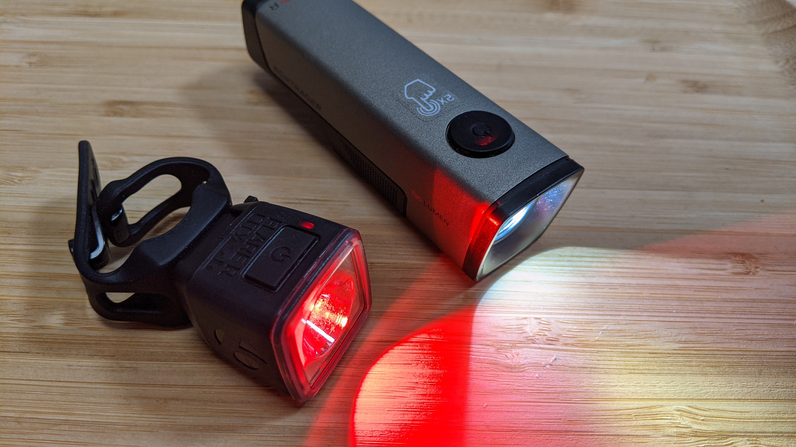
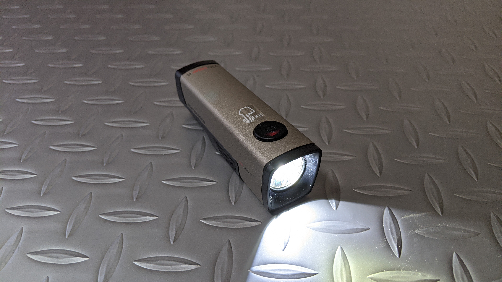
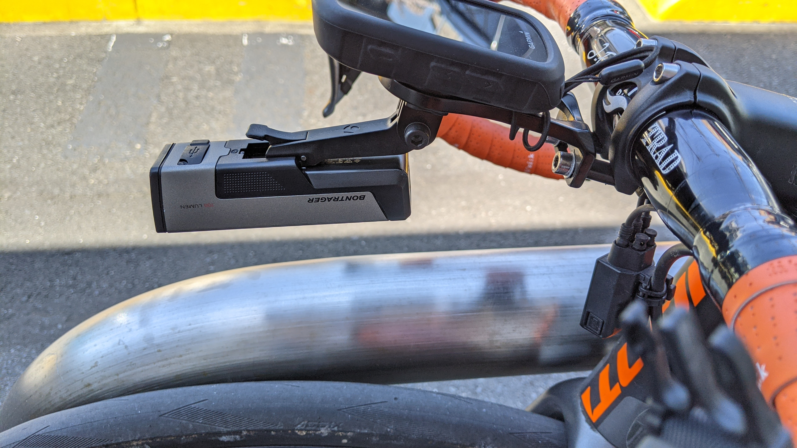
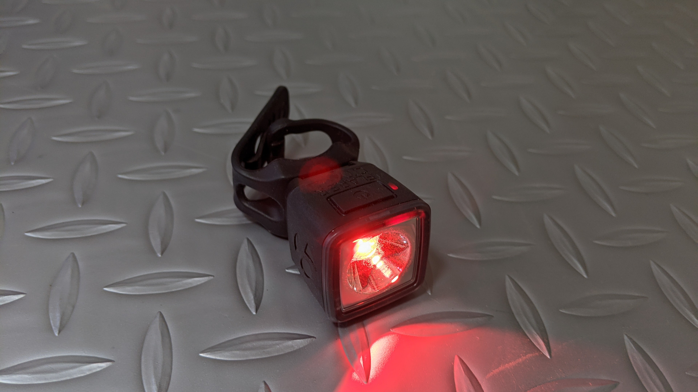

TREK の[デイライトアンバサダー](https://blog.trekbikes.com/ja/2021/02/24/daylight-ambassador/)として認定頂いた際に支給されたものです。

<LinkBox url="https://blog.trekbikes.com/ja/2021/02/24/daylight-ambassador/" />

## Bontrager Ion Comp R

Bontrager のフロントライトのメインモデルである ION シリーズの末弟。なんと定価 12100 円、支給品としては破格の太っ腹ぶりである。

充電は MicroUSB、駆動時間は下記の通り。

- 700LM---1.5 時間
- 500LM---3 時間
- 300LM---6 時間
- 300LM デイフラッシュ---19 時間
- 200LM ナイトフラッシュ---9 時間

全体的な稼働時間は[VOLT800](https://store.shopping.yahoo.co.jp/worldcycle/CAT-J-108LEREL471RC.html)より若干短め。

パターンの切り替え操作は起動後にクリック 1 回となっている。ON/OFF の際、前回のパターンは記憶している。

- ON: 2 クリック
- 切り替え: クリック
  - 700lm -> 500lm -> 300lm -> 300lm day flash -> 200lm night flash
- OFF: 長押し

若干の差とはいえ、ナイトライドには 800lm が 2 時間持つことになっている [VOLT800](https://store.shopping.yahoo.co.jp/worldcycle/CAT-J-108LEREL471RC.html) を持っていくことになるだろう。

事実上、このライトは day flash モード固定で利用することになりそう。（そしてナイトライドはほぼしないのでつけっぱなしの可能性が高い）

ボントレガーのデイライトの特徴は、デイライト専用のパターンに設計されている点。VOLT800 は、集光パターンの都合で光害になりやすく、[防眩シェード](https://amzn.to/2PSMMZY)が出るほどだったが、こちらは考慮…されているはず。

### マウント方法

付属のシリコンバンドによる固定のほか、[Blendr システム](https://www.trekbikes.com/jp/ja_JP/bontrager_blendr_how_to/)によるマウントができる。

これはアクセサリー側のマウントに GoPro マウントとの互換性があるので、専用のマウントパーツを使うことで GoPro マウントへの取り付けが可能。

元々、Blendr システムはステムプレートへのマウントを前提としているからか、ライトがかなり前に装着される。

アウトフロントマウントにライトを取り付ける場合、ずり下がりに注意する必要がありそうだ。

<LinkBox url="https://www.trekbikes.com/jp/ja_JP/%E3%82%A2%E3%82%AF%E3%82%BB%E3%82%B5%E3%83%AA%E3%83%BC/%E3%83%90%E3%82%A4%E3%82%AF%E3%82%A2%E3%82%AF%E3%82%BB%E3%82%B5%E3%83%AA%E3%83%BC/%E8%87%AA%E8%BB%A2%E8%BB%8A%E7%94%A8%E3%83%A9%E3%82%A4%E3%83%88/%E3%83%95%E3%83%AD%E3%83%B3%E3%83%88%E3%83%A9%E3%82%A4%E3%83%88/bontrager-ion-comp-r-front-bike-light/p/30762/?colorCode=grey" />

## Bontrager Flare R City

こちらのリアライトもデイライトとしての機能を明示的に持たせている。

デイフラッシュモード(35 ルーメン)は 8 時間と、持続時間は短め。カタログスペック通りなら週末ごとに充電するイメージだろうか。

本体が小さい分、バッテリーも小さくなってしまうので持続時間が短くなる点は仕方がない。リフレクターを併用して常時視認性を上げておきたいところ。

<LinkBox url="https://blog.gensobunya.net/post/2021/03/barend_reflection/" />

このライトの一番の特徴は、照度センサーでナイトモードとデイモードが切り替わる点。フラッシュか点灯を選択するだけで 4 パターンを利用できる。

> 内蔵ライトセンサーが輝度を自動でコントロール

<LinkBox url="https://www.trekbikes.com/jp/ja_JP/%E3%82%A2%E3%82%AF%E3%82%BB%E3%82%B5%E3%83%AA%E3%83%BC/%E3%83%90%E3%82%A4%E3%82%AF%E3%82%A2%E3%82%AF%E3%82%BB%E3%82%B5%E3%83%AA%E3%83%BC/%E8%87%AA%E8%BB%A2%E8%BB%8A%E7%94%A8%E3%83%A9%E3%82%A4%E3%83%88/%E3%83%AA%E3%82%A2%E3%83%A9%E3%82%A4%E3%83%88/bontrager-flare-r-city-rear-bike-light/p/14241/?colorCode=black" />

流石にメインで乗っている TCR の専用シートポストには適合しないため、街乗り用の TCX SS に装着している

どちらのライトにも言えることだが、自宅内のガジェットが全て USB typeC 充電に統一されつつあるなか、自転車ガジェットだけが MicroUSB を頑なに採用しているので、充電が面倒になってきている。制御チップの価格問題があるのだろうが、どうにかならないものか…
