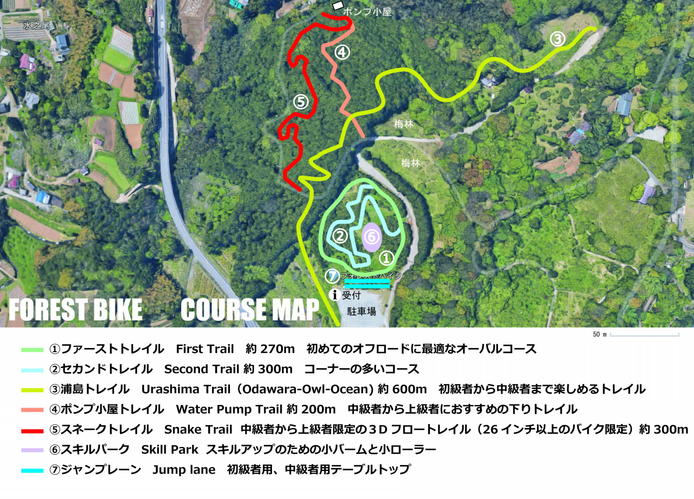

## フォレストバイク

<LinkBox url="https://www.forestbike.jp/" />

フォレストバイクは小田原にある MTB パークで、整備されたトレイルコース・ジャンプレーン・パンプトラックがひとまとめになった施設。

一部のコース設計は修善寺 CSC の東京オリンピック用 XC コースをデザインした浦島悠太さんが行っており、実感としても短いながら楽しめるコースとなっている。専門のダートジャンプパークやゲレンデの DH コースにはかなわないが、MTB の楽しいところをひとまとめに楽しめる施設だった。

小田原厚木道路の荻窪インターからすぐという立地の良さも〇。カバー写真にもある通り、海が見渡せる MTB パークは中々ないのでは？

## 施設

まず、フォレストバイク初回利用時は講習が必須になっており、基本的な動きを練習することとなります。

2 時間ほどの講習の後、フォレストバイクコースが利用可能になります（講習の場合、余った午前/午後の時間はフリーライドとなります）。各コースの特徴は以下の通り。

### ファースト・セカンドトレイル

スキルパーク内の比較的フラットなトレイル。入門者の練習向け

### ジャンプレーン

https://www.youtube.com/watch?v=myTedr0p4nY&t=284s

三連(実質 2 連)ジャンプレーン。

3 つ目のバック側のみ、コース保護のため簡易舗装されている。助走も短いため、バック側がかなり近い…つまりジャンプ初心者に優しい設計。

ダートジャンプは全く持って得意ではないのだが、自分でも 15 回ほど練習したら綺麗に飛べるようになった。グルグル回って気が済むまで練習できるため、上達が分かりやすい。

### パンプトラック

https://www.youtube.com/watch?v=myTedr0p4nY&t=223s

練習用パンプトラック（スキルパーク内）

最後の登りパンプをクリアするために、中盤のコーナーを上手く回る必要がある。しかし、このコーナー出口に小さいパンプとラダーがあるので上手くクリアしないと外側にコースアウトしやすいという罠。

### デュアルパンプトラック

https://www.youtube.com/watch?v=myTedr0p4nY&t=30s

とにかくでかいパンプトラック。左右周り 1 コースづつあるので、苦手意識のある側を回ると有意義。

スタート位置が高く、勢いがつくので惰性でスタートするとかなり忙しい。気持ちよく回れる代わり、体力が続く限り永久に回ることができる。

### ウラシマトレイル

https://www.youtube.com/watch?v=myTedr0p4nY&t=439s

いわゆるフロートレイル。フォレストバイクのメインコース（だと思う）

初中級コースは非常に簡単だが、大きなバームを必ず通る設計になっている。

ポンプ小屋トレイル・スネークトレイルという中上級者向けコースに分岐しており、この部分だけでもピストン可能。

全体的に根っこが少なく滑らかな路面なので、非常に気持ちよく走ることができる。ものの 1 ～ 3 分で走り終わってしまい、自走で登るトレイルなので、脚がある人はグルグル回って反復練習できる。コース撮影前に走り倒したらかなり疲労したのはここだけの話…

### アネックスコース

https://www.youtube.com/watch?v=myTedr0p4nY&t=840s

忍者トレイル・きつつきトレイルという 2 コースをフォレストアドベンチャー内の別区画にオープンしている（要追加料金）

大きなバームやジャンプへの分岐もあるコースで、上手い人はスピードに乗せて楽しめる。トレイルヘッドまでは、フォレストバイクのメイン駐車場から 200m ほどで、登りも短いのでアプローチの負担はそこまで大きくはない。

一方で、途中に登りが現れたり、ピストンするのに使う舗装路がややきつめなので、ガッツリ遊ぶには体力が必要。

北側斜面なのでウェット気味の日が多いこともあってか、中上級コースにランク付けされている。

## 走ってみて…

全コース 1 日で 4000 円（講習除く）と、ふじてんと全く同じ料金だったこともあり、コストパフォーマンスはどうか？と思っていたのですが、杞憂に終わった。

大型のパンプトラックや（自分のスキル的には）適切なジャンプレーンでひたすら練習に打ち込めるので、実力がアップしたという満足感が高い。MTB は反復練習のスポーツなので、そういった意味では持ってこいの場所。

トレイルコースも綺麗に整備されている（嫌らしい根っこがほぼ無い！）ので気持ちよく走ることができた。

コロナ禍の中では今回のようなソロ、もしくは近しい人のみになるが、本来は 1 日中と仲間でワイワイやるくらいが体力的にもちょうどよさそう。

ゲレンデコースでは元を取ろうとししまう性分なので、パンプトラックやジャンプ等、否が応でも疲労して休憩する仕組みの方がワイワイできていいかも。

## 動画

https://youtu.be/myTedr0p4nY

<LinkBox url="https://www.amazon.co.jp/dp/B08ZK5VPBQ" isAmazonLink />
