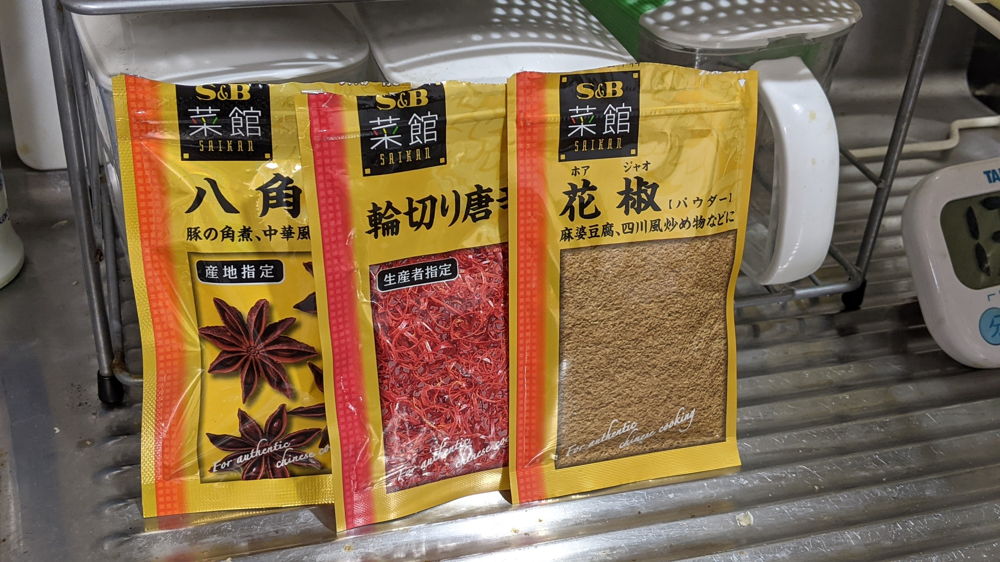

## おさらい

マグマ生活やってみたけど、味付け 1 種類は辛いので中華風アレンジした。

前記事

### レシピ

調理手順は全く同じなので割愛。

- 白米：0.5 合(269kcal)
- 皮無し鶏むね肉：350g(424kcal)
- カットトマト缶：1 缶 400g(120kcal)
- たまねぎ：小 1 個(56kcal)
- 冷凍オクラ：50g(15kcal)
- 干しシイタケ：おもむろ(27kcal)
- ニンニク：一片

ここまではマグマと共通。

- 鶏がらスープ顆粒：適量
- 輪切り唐辛子：適量
- 八角：一片
- 胡椒：適量
- 塩：小さじ 1 杯

材料はそのままに、旨味の補強をコンソメから鶏ガラスープへ変更し、八角と唐辛子で風味付けをしたもの。

輪切り唐辛子は通常のマグマに入れても美味しい。花椒は味変でもいいし、最初から振りかけてもいい。ただし調理後に投入する。

### 味変紹介

中華・和風な調味料で味変している。

#### 花椒

<LinkBox url="https://www.amazon.co.jp/dp/B0074Z86SW/" isAmazonLink />

言わずと知れた「麻」の調味料。いわゆる痺れのヤツ。味変というよりは中華風にするための必須調味料に近いが、好みが分かれるので味変に分類。

八角の香りと花椒の香りがすれば家庭中華としては十分ですよね…？

鶏胸肉やトマトも中華料理に取り入れられてる素材だし相性上は問題なし！

#### 七味唐辛子

<LinkBox url="https://www.amazon.co.jp/dp/B00BTWDBH2/" isAmazonLink />

我が家に常備されているのは[八幡屋磯五郎](https://www.yawataya.co.jp/)の七味唐辛子。

「七味唐辛子」という一つの調味料というよりも、含まれている香辛料それぞれの風味が主張しながらも調和している強さが大好き。

イタリアンな状態だとガチャガチャしてしまい合わなかったが、中華風味にしたことでうまくマッチするようになった。
