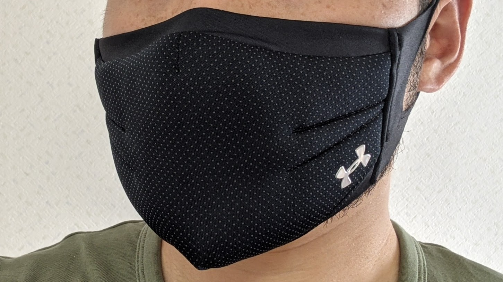
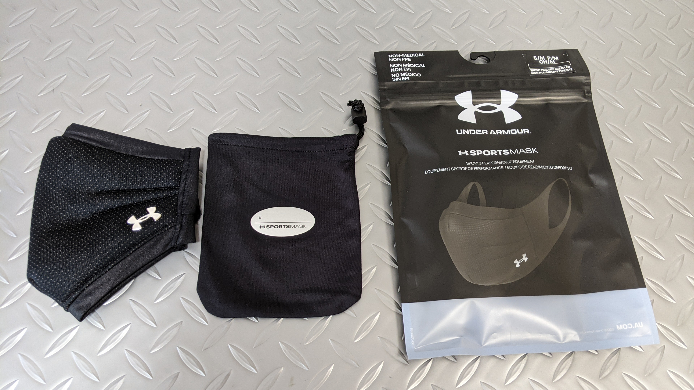

コロナ禍の中、スポーツ用を謳ったマスクが数多く出てきたが、どれもこれも高価だったため手を出していなかったが、株主優待券を使うためにゼビオに寄ったところセールしていたので物は試しと購入してみた。

ライドでは大抵ジップロックに不織布マスクを入れて対応しているが、自転車を降りてマスクをするときどうしても汗で蒸れるので解消されればもうけものという気持ち。

なお、ゼビオでは 2200 円+優待 1 割引きで買ったものの、Amazon でもほぼ同じ価格で出ていた…公式でもセールをしている模様…

<LinkBox url="https://www.amazon.co.jp/dp/B08JZDYF9F" isAmazonLink />

## 開封の儀

説明書に加え、保管袋が付いてきたが、防水ではないのでライド中は使うことはなさそう。鼻から耳までの距離に応じてサイズが 5 種類あるのでフィットするものを選ぶのが重要とのこと。

質感は見た目の通りかなりモフモフしている。呼吸がしやすいと謳っているが本当かと疑うレベルで分厚い。

一方で、内側と耳掛けの部分は UA のヒートギアを利用しているとのこと。確かにサラサラしていて肌触りがいい。布マスクながら鼻の部分にはワイヤーも通っているので、フィット感は調節できる。

## インプレッション

結論から言うと、休憩中に使う分には不織布マスクより快適。確かに呼吸はしやすいがスポーツ中に使えるかというとかなり疑問符が付く。

呼吸のしやすさは、通気性の良さもあるのだが、口の周りにある程度空間を確保していることが大きいと思える。

下の図の通り、一般的な布マスクだと口にかなり近いところにマスクが来るが、このマスクは口の周りに空間を作って空気を取り込みやすくしている。いわゆるエアボリュームが多い状態を確保している。

ただ、呼吸には酸素の取り込み以外にも放熱という役割がある。

このマスクを付けて気温 20 度程度の夜にジョギングをしたところ、暑くて運動どころではなくなってしまったので、運動中に使えるかといわれると全然そんなことはない。

立ち止まった際に付ける分には、汗で蒸れにくいという特性と、内部のエアボリュームがあるおかげで息が整うまでも不織布マスクに比べるとかなり楽に感じる。

## 運動中のマスクについて

運動中は WHO の提言通り、熱中症・呼吸不全のリスクを鑑みてマスクを使わず人と距離を取ることの方が重要とされています。

https://twitter.com/whokobe/status/1278161413144555520

ただ、サイクリングでは休憩などで施設内に入ることもあるので、その際は当然マスクが必要になるのでライドへの持ち歩きは現時点ではマストでしょう。

<LinkBox url="https://www.amazon.co.jp/dp/B08JZDYF9F" isAmazonLink />
