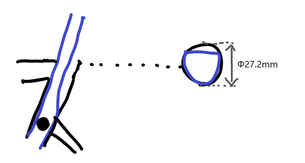

シクロクロスレースで、昨年は Bianchi Zolder をメインバイクとしていましたが 2021-22 シーズンは GIANT TCX ADVANCED PRO をメインバイクとして参戦していきます。

<LinkBox url="https://www.giant.co.jp/giant21/bike_datail.php?p_id=00000047" />

組み上げとシェイクダウンを行ったのでファーストインプレッションを行っていく。Zolder のインプレは下記参照。

<LinkBox url="https://blog.gensobunya.net/post/2020/04/zolderpro/" />

## TCX の特徴

TCX に乗ってレースに参戦するのは初めてではなく、Zolder に乗る前は年季の入ったアルミフレームモデルである TCX SLR に長年乗っていた。

TCX SLR はロード系の自転車にスルーアクスル・ディスクブレーキが採用され始めた黎明期のフレームで、丁度 GIANT の PERFORMANCE ROAD/CX ラインで最初にディスクブレーキが採用された年式のものを利用していた。

フロント 15mm スルーアクスルにリア QR、ポストマウントながら 140mm ローター装着可能という意欲的なモデルだった。それから前後 12mm スルーアクスルやフラットマウントブレーキが標準となり、1 度のマイナーチェンジと 1 度のフルモデルチェンジを経たものが 2021 年モデルの TCX だ。

規格は変わったものの、TCX としてのジオメトリは当時からほぼ変わりなく、一貫して BB ハイトが高いトラディショナルなシクロクロスジオメトリを採用している。2021 年モデルからカーボンモデルにも XS サイズがラインナップされ低身長でも乗りやすくなった。

そのジオメトリの特徴は**圧倒的にクイックなハンドリング**。セルフステアが強く、少し倒しこむだけでハンドルがカクンと切れて鋭くコーナーを曲がることができる。

タイヤのグリップを稼ぐためになるべく車体を立てておきたいシクロクロスにおいて、立てたまま曲がりやすいことは明らかなメリットであり、代わりに倒しこみ角の調整には慎重になりシビアなコントロールを要求される。

### 担ぎスペース

ダウンチューブのヘッドチューブ側にやたらスペースが取られている場所、ここは担ぎの際に腕を入れるスペース。

担ぐ際はハンドルが切れる分、そこまでここにスペースを作らなくても手を入れることはできるだが、スタート直後の混乱しているときなどはバイクの角度が綺麗に揃えられずタイヤに手が当たったりもする。

少しでもストレスを低減するために考え抜かれていることがうかがえる。

### シートポスト構造

このフレームはシートポストの固定部が低い他、専用シートポストの上部分が細く加工されており固定部より上はしなりやすく、衝撃吸収するように作られている。

また、自分のように身長の低いライダーでも動かす部分を確保できるようにシートポストの差し込み部分そのものは真円になっている。そのため、通常の丸ポストを使うことも可能。

青がシートポスト部分、黒がフレーム側の形状で図に表してみた。

かなり強調して書いているが、先代の D-Fuse シートポストより遥かに快適性が増していることは乗って分かる。

上部の隙間から泥が入ることを防ぐためにビニールテープなどで養生しているが、十分動いてくれているようだ。

### ジャンクション内蔵

各種ワイヤーはダウンチューブから内装される。Di2 の際はその場所が[EW-RS910](https://amzn.to/2X0Mq6C)の取り付け場所として利用できる。

<LinkBox url="https://www.amazon.co.jp/dp/B01MXTE6GL/" isAmazonLink />

## ライドインプレッション

シェイクダウンは山中湖交流プラザきららの[シクロクロスコース](http://www.kirarayamanakako.jp/news_detail.php?id=65)で行った。

[Tom Bossis](https://twitter.com/tomsisbos)が主導して造成された練習コースで、1 日 500 円で利用できる。コースはテクニカルめだが、シケインも設置されているなどテクニックを磨くには中々いい感じだ。ただ、除草をしておらずススキが生い茂っているために夏場でもタイツが必要だ…

TCX はそのクイックなハンドリングを活かして、切り返しの多いセクションで真価を発揮する。アルミモデルや前モデルからかなり軽量化されているということもあり、加速にももっさり感はなく、実に「やりたいように動いてくれるバイク」というのが第一印象。

総じて、競技時間の短いシクロクロスバイクはロードバイクより剛性感が高い。剛性からくる加速力と引き換えに巡行力や快適性を犠牲にすることが常なのだが、2021 年からの TCX は前述のシートポスト構造の工夫により快適性が高い。

荒れ地コースでありがちなレース終盤の腰痛に効いてくれそう。

GIANT のバイクは総じて「ライダーの思った通りに動いてくれる」という感覚があり、様々なジャンルで愛用しているのだが TCX もそれに漏れず扱いやすい。

初めて本格的に乗ったにも関わらず、バニーホップやジャックナイフターンなど、バイクへの慣れが必要な技術も難なく実行できた。

また、エンド金具が複数モデル複数年で統一されており入手性がよく、かつ 1000 円台前半で出に入るという点も非常に強い。

的確に前モデルの欠点をつぶし、サイズ展開も豊富になり、供給も他社比でマシなほうなので万人におすすめできるシクロクロスバイクだと言える。

<LinkBox url="https://www.giant.co.jp/giant21/showcase/tcx-2021/" />

2022 年モデルも先行して発表されている。例年 CX バイクはそこまで入荷数が多くないので今の時期にはもう注文を入れたいところ。

<LinkBox url="https://www.giant.co.jp/news/bike/5290" />
