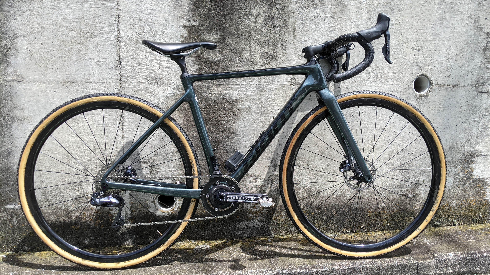

シクロクロスレースで、昨年は Bianchi Zolder をメインバイクとしていましたが 2021-22 シーズンは GIANT TCX ADVANCED PRO をメインバイクとして参戦していきます。

組み上げとシェイクダウンを行ったのでファーストインプレッションを行っていく。Zolder のインプレは下記参照。

## TCX の特徴

TCX に乗ってレースに参戦するのは初めてではなく、Zolder に乗る前は年季の入ったアルミフレームモデルである TCX SLR に長年乗っていた。

TCX SLR はロード系の自転車にスルーアクスル・ディスクブレーキが採用され始めた黎明期のフレームで、丁度 GIANT の PERFORMANCE ROAD/CX ラインで最初にディスクブレーキが採用された年式のものを利用していた。

フロント 15mm スルーアクスルにリア QR、ポストマウントながら 140mm ローター装着可能という意欲的なモデルだった。それから前後 12mm スルーアクスルやフラットマウントブレーキが標準となり、1 度のマイナーチェンジと 1 度のフルモデルチェンジを経たものが 2021 年モデルの TCX だ。

規格は変わったものの、TCX としてのジオメトリは当時からほぼ変わりなく、一貫して BB ハイトが高いトラディショナルなシクロクロスジオメトリを採用している。2021 年モデルからカーボンモデルにも XS サイズがラインナップされ低身長でも乗りやすくなった。

そのジオメトリの特徴は**圧倒的にクイックなハンドリング**。セルフステアが強く、少し倒しこむだけでハンドルがカクンと切れて鋭くコーナーを曲がることができる。

タイヤのグリップを稼ぐためになるべく車体を立てておきたいシクロクロスにおいて、立てたまま曲がりやすいことは明らかなメリットであり、代わりに倒しこみ角の調整には慎重になりシビアなコントロールを要求される。

## その他の特筆すべき点

### 担ぎスペース

### 乗り心地の改善

### ジャンクション内蔵

## ライドインプレッション
