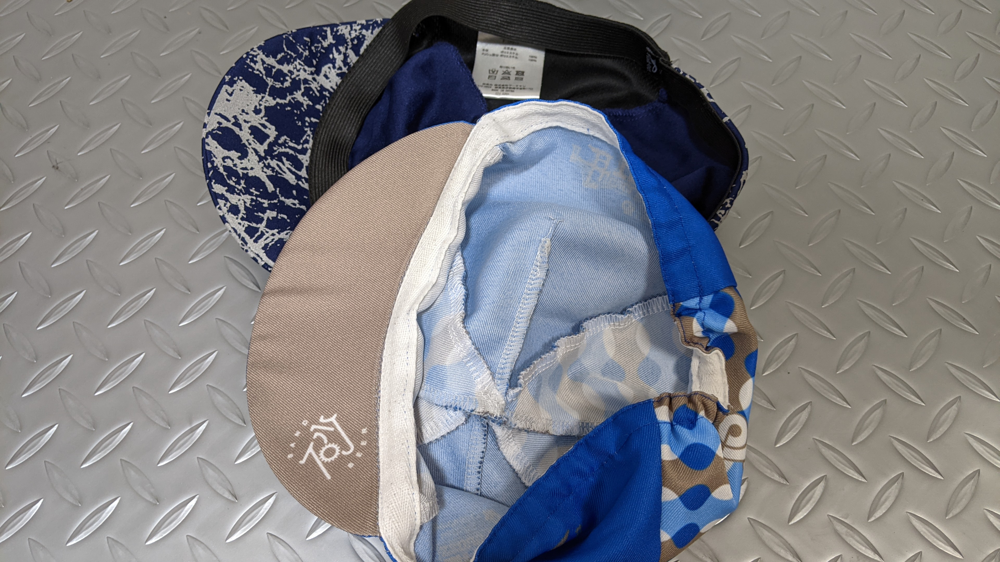
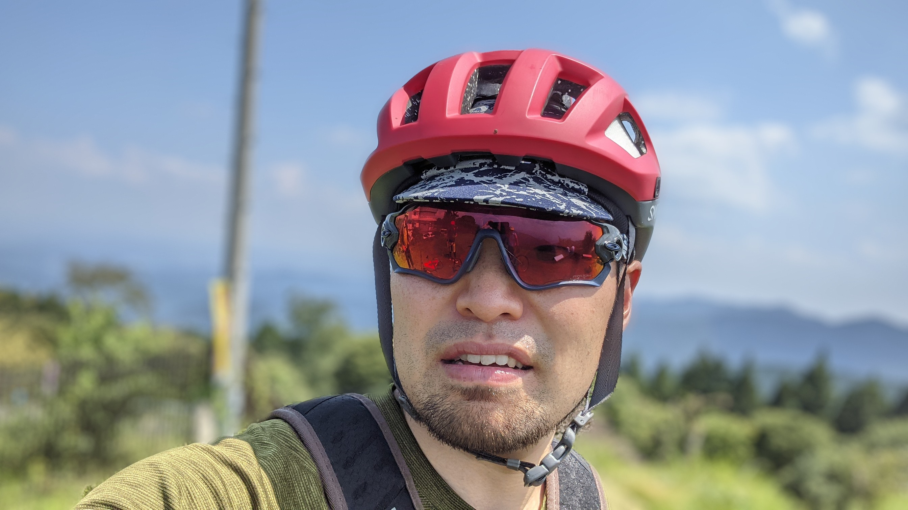
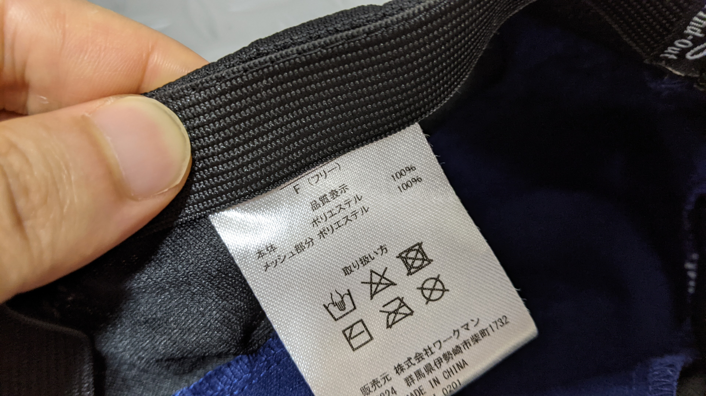

## 激安サイクルキャップ、機能はそこそこ

何と言ってもこの製品のポイントはたった 780 円であることだ。

製品名からして昨年からマイナーチェンジしているようだ。後頭部の Find-out ロゴがなくなっている（ヘルメットをかぶると見えないので意味はないが…）

<LinkBox url="https://skmzlog.com/workman-find-out-cap/" />

結論から言うと、値段なりのつくりではあるのだが、汗止めとしては中々使える一品だ。

## チャンピオンシステムのユーロキャップと比較

サイクルキャップはヘルメットの下に付けることで、汗止めとして働いてくれることや、ヘルメットを取った際にアホ毛ができることを防いでくれる。

特に自分の髪の長さでは、ヘルメットは取った後に『山』の形に大きな 3 本のアホ毛が出来上がってしまうので、サイクルキャップがあるとそういった外見上の問題の防止にもなることが大きい。

手元に同じ目的で利用していたチャンピオンシステムの[ユーロキャップ](https://champ-sys.jp/products/euro-cap)があったので、これと比較するかたちでインプレしてみる。

### フィット感

被りは一般的なサイクルキャップとにたフィット感に合わせてある。つまりカジュアルキャップに比べて浅めの被りだ。

自分が頭が大きく、ユーロキャップはかなり深く作ってある分が好みだったがワークマンもフリーサイズを謳うだけあってかなり伸びてくれた。

一方で、伸縮の調整が後頭部ではなく全周に渡ってついているゴム紐で行われているが、これがちょっと安っぽくゴワゴワしている。つばの小ささも相まって撥ね上げたときにゴム紐が一緒に捲れてきてしまう上、戻ろうとする力が働くのでつばが落ちてしまう。

アップライトな MTB などでは使えるが、ロードでは逆向きに被るしかないかなと思っていた（これに関しては後述）

### 素材・生地・通気性

素材はユーロキャップと同じポリエステル 100%だが、ワークマンの方はいかにも速乾でございますとばかりの薄さと肌触りだ。それでいて風を通さない反射材をゴテゴテと付けるのは矛盾しているような気もする。

サイドはメッシュになっており、非常に良く風を通すようになっている。

30 度を優に超す灼熱ライドの中で利用したが、ヘルメットの中を通り抜ける風が心地よいくらい通気性がよく、且つ汗も吸い上げてくれる。ユーロキャップは汗がたまってしまっていたのでここは明確にワークマンのほうに軍配が上がる。

## 一度使ってみて

なんせ安いので、洗濯乾燥機に入れて荒く扱ってみた。

全く縮むことなく、むしろ固さが取れたのかゴムがいい具合にへたったのか、撥ね上げづらかったつばが上げやすくなり、ロードに乗るときでも使えそうな具合になってくれた。

デザインもワークマン製品にしては悪くはないし（そもそもヘルメットに隠れて目立たない）反射材もトンネルなどで役に立つだろう…たぶん。

ワークマンオンラインで扱っていないことがネックだが、店舗で見つけたらとりあえず買ってみてもよい一品だ。
