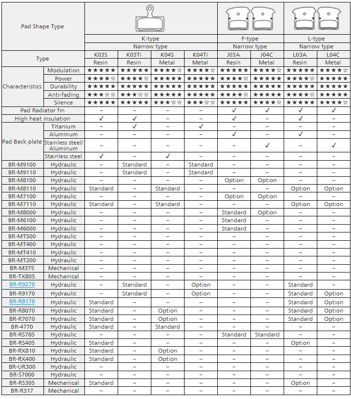
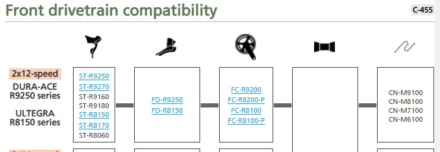
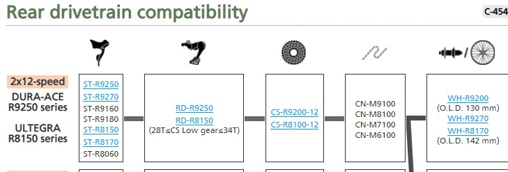
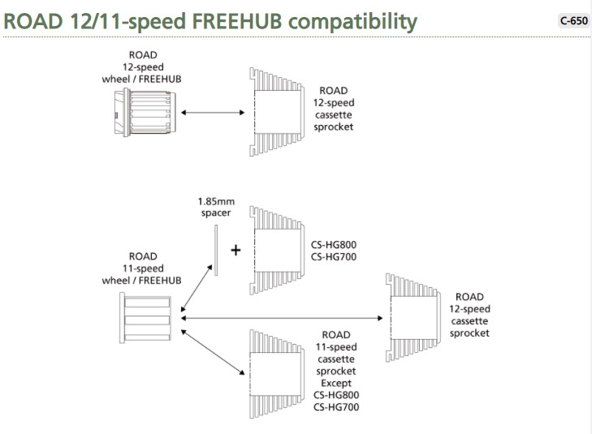
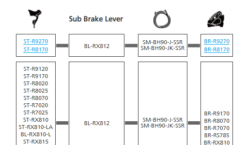
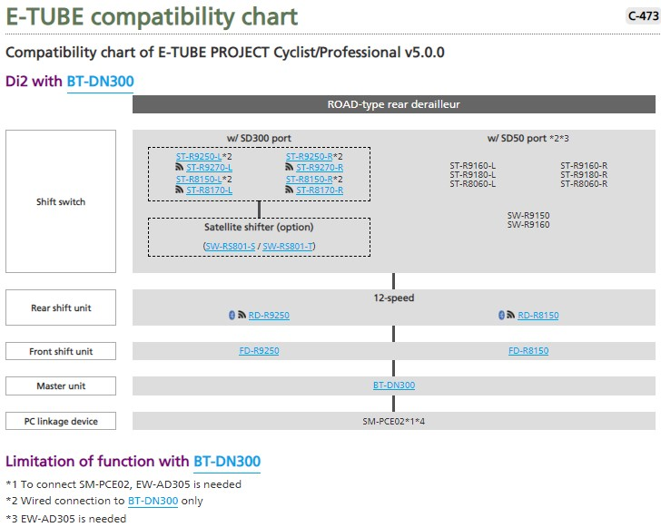
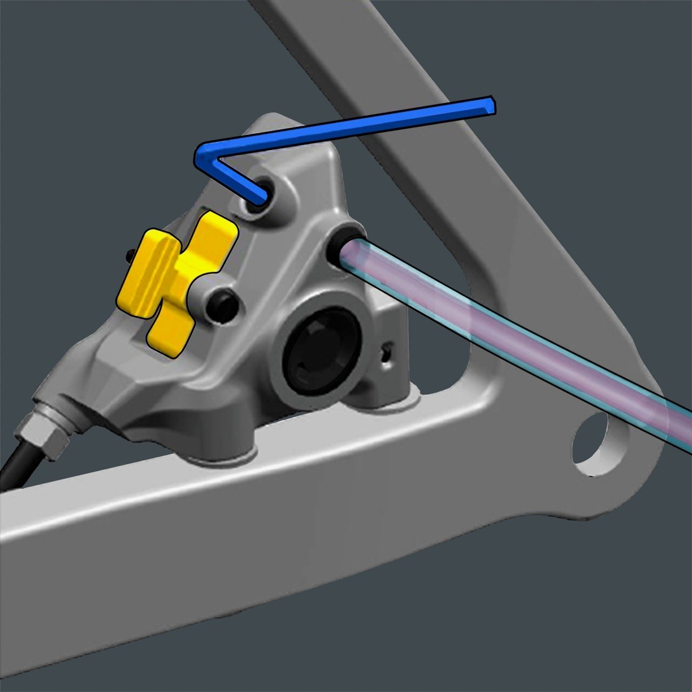

## まずは si.shimano を見ろ

まず皆さんは si.shimano をご存じだろうか。

ご存じないシマノユーザーは、今すぐアクセスしてブックマークしてほしい。それだけでこの記事の意義は半分終了だ。

<LinkBox url="https://si.shimano.com/#/" />

このサイトでは、ディーラーマニュアル・ユーザーマニュアル・展開パーツ図・互換性などシマノパーツの整備や購入に使えるドキュメントが利用できる。

販売店向けに販売代理店が配っている資料はないが、一般ユーザーが欲しい情報はほぼ詰まっていると言って良いだろう。スモールパーツの型番もここから確認できる。

新型デュラエース・新型アルテグラ（以下新コンポ）の発表にともない、si.shimano 上でも一部情報が更新された。

一通りの情報は各メディアやブログに任せて整備や運用に関連するこれらのドキュメントをこの記事では見ていきたい。

## 各互換性の確認

今回更新されたのは、新型コンポ関連の互換性ドキュメントだ。

現行世代のパーツとの組み合わせ、メンテナンス用スモールパーツを軸に見ていきたい。

### ブレーキパッド互換性

ブレーキキャリパーそのものには大きく変更が入ったが、ブレーキパッドは現行のロードディスクブレーキと同じモデルが利用できるとみてよさそうだ。

標準搭載されるパッドが、K03Ti または L03A になっており、K03S, L03A だった旧世代と微妙に違いがあるが、数字の後のアルファベットはあくまでベースプレートの素材であり、規格上はこれまでのロードディスク用パッドと違いはない。

### ドライブトレイン互換性

新型コンポの FD/RD/クランクセットは過去のそれらと互換性が無い。

10s と 11s の Di2 コンポーネントで互換性がなかったことと、今回から Di2 システムが無線化したことを考えるとこれは妥当だろう。

一方でチェーンは MTB 用の 12 速チェーンと共通化された。ローターもそうだが、MTB とロードで共通化できるパーツは共通化している傾向がみられる。

### フリーハブ互換性

**新型コンポのカセット**は旧型のフリーハブに適合する。ここ大事。

**つまり、これまでの 11 速ホイールはそのままに新型コンポを利用できる。**

新型コンポのフリーハブには、新型のロード 12 速カセットしか適合しない。

ちなみに新型アルテグラのホイールには今までと同じフリーハブボディが搭載されるので、実質デュラエースのみ新型フリーハブとなる。

### ブレーキキャリパー・ブレーキホース互換性

新型コンポのレバーとキャリパーは、旧世代との互換性が無い。パッドクリアランス拡大の影響か？

一方で、サブブレーキレバーやブレーキホースは過去と同じものが利用できる。

### e-tube 互換性

e-tube 含め、新型コンポの Di2 システムは、旧式コンポと現在の時点で互換性はほぼない。

一部スイッチのみ変換アダプタ（EW-AD305）を使うことで転用できるようだ。

## まとめ・余談

R9200 及び R8100 シリーズは、12s 化と共に機能面で進化した部分はほぼ旧世代との互換性がなく、完全な「12s 新世代コンポ」となっているように見える。

Q ファクターやチェーンラインの変更からも、ディスクブレーキ・ワイドタイヤワイドリムへの更なる最適化を感じるうえ、この記事ではほぼ触れていないホイール群は非常に挑戦的なスペックとなっている。

一方で、ブレーキパッドやチェーンは規格の変更がなく、フリーボディにおいても旧フリーに新スプロケットが利用できるなど、旧ユーザーの移行に可能な限り配慮されているように感じる。今まで無意味に互換性を切りまくってきた過去からするとかなりユーザーフレンドリーだ。

個人的には、ブリーディングしやすくなったであろう新型ブレーキキャリパーとフリーハブの互換性維持の工夫について賞賛したい。

あとホイールは、スペックを見るとかなり軽量化が図られている上に、スターラチェットもどきも採用しており非常に挑戦的。それでいてカップアンドコーンは維持しているので実はすごい可能性があるとみている。

10T トップが採用されなかったという懸念はあるが、オールロードやグラベルロードは日本で使うとかなりの速度域をカバーする以上フロントダブルが必須になるので、個人的には特に問題なし。

世界市場だとどう出るかはわからないが、フリー形状は 10T 採用ができそうだし、今回の新型コンポ世代で作られる新型 GRX は楽しみだ。
