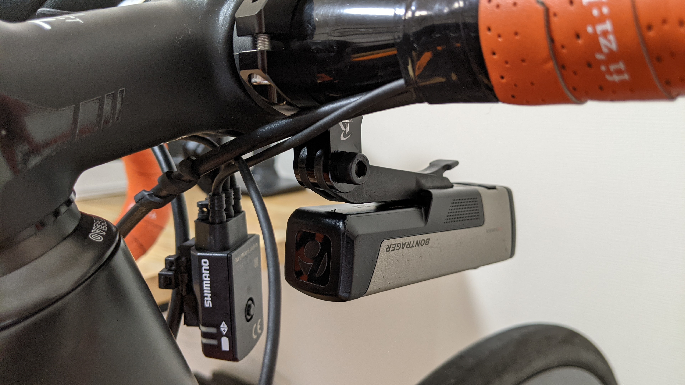
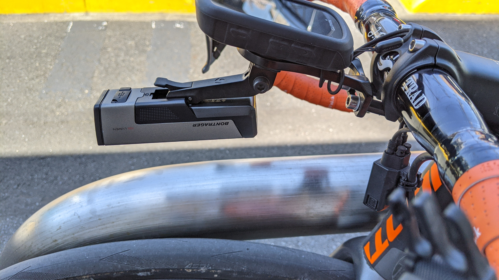
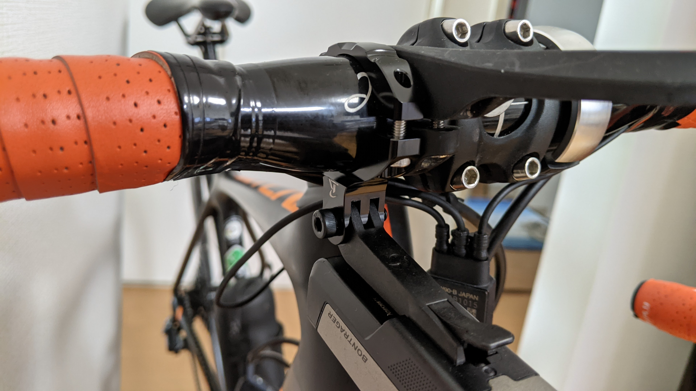
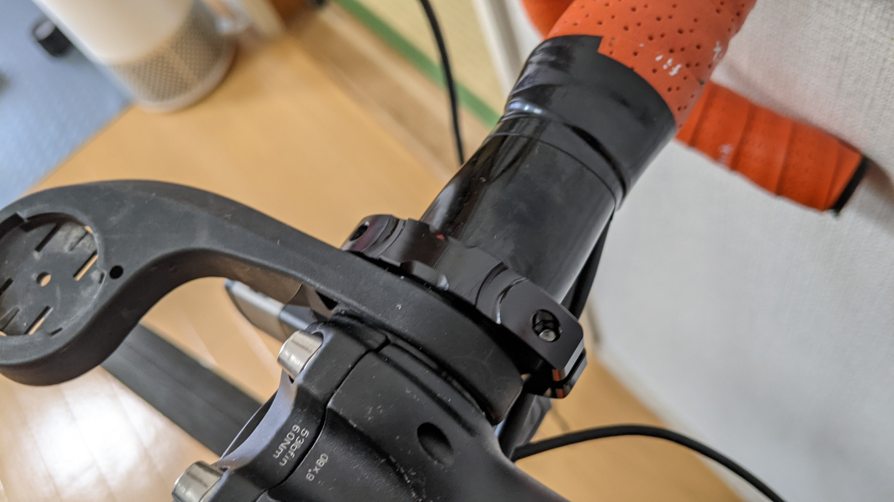

## 最近のライト、重すぎ問題

[トレックのデイライトアンバサー 1 期に選出された](https://blog.gensobunya.net/post/2021/04/bontrager_light/)際、Bontrager 製 のフロントライト Ion Comp R を頂いたのだが、困ったのが装着先である。

<LinkBox url="https://www.trekbikes.com/jp/ja_JP/%E3%82%A2%E3%82%AF%E3%82%BB%E3%82%B5%E3%83%AA%E3%83%BC/%E3%83%90%E3%82%A4%E3%82%AF%E3%82%A2%E3%82%AF%E3%82%BB%E3%82%B5%E3%83%AA%E3%83%BC/%E8%87%AA%E8%BB%A2%E8%BB%8A%E7%94%A8%E3%83%A9%E3%82%A4%E3%83%88/%E3%83%95%E3%83%AD%E3%83%B3%E3%83%88%E3%83%A9%E3%82%A4%E3%83%88/bontrager-ion-comp-r-front-bike-light/p/30762/?colorCode=grey" />

付属しているゴムバンドが厚くて調整幅も少なく、一言で言うと機能も見た目もあまりイケていない。

当時試験していたステムプレート共締め型中華マウントの GoPro マウント部に取り付けることで暫定対処していたが、このマウントがイマイチ信頼できないので利用を取りやめることに。

これに伴い、シンプルな樹脂コンピューターマウントに切り替えたのだがそれには GoPro マウントがついていない。しかし、ハンドル部にはどでかいゴムバンドを取り付ける余裕はない。

そこで、GoPro マウントを上手く使って省スペースに取り付けるための製品を買うことにした。

## REC-MOUNT Type7

[REC-MOUNT Type7](https://amzn.to/3DRMo23)は複数モデルある「GoPro マウントを円形ハンドルバーに**直接**生やす」モデルだ。

<LinkBox url="https://www.amazon.co.jp/dp/B00HU3LCOS/" isAmazonLink />

REC-MOUNT 製品にしてはそこそこお安い（2000 円未満）というのもポイントが高い。

幅 9mm で、ゴチャついているステム回りでも隙間を縫うように取り付けることができる細さだ。

ボントレガーのマウントが、本来ステムプレートから生える想定になっていることもあり、非常に収まりがよくなった。

アウトフロントマウント下だと、取り付け位置が前過ぎる上に、場所の影響から振動で緩みやすかったのでかなり安定するようになった。

ロゴがなければ中華製品とあまり変わらないように見えてしまうが、角のしっかりとれた CNC 加工で涙ぐましい軽量化の溝が入っているあたりは流石だ。

### 安心と信頼？の精度

中華マウントでも生命維持に関わる事故になる場所ではないので、中華メーカーのマウントを利用することも考えたが、今回のように重量物を支える用途の場合は精度が重要になってくる。

特に、アルミ製品の場合は樹脂と違い誤差吸収の余地が少ない。そのため特に工作精度が重要になってくる。

本当は万一精度が良くない場合や、老朽化した場合にも備えてハンドルとの接触部にはゴムシートがあってほしかったのだが…

製品写真には貼ってあるゴムシート関して丁寧に注意書きがある

> ※画像はイメージです。ハンドルにゴムシート付いておりません。

<LinkBox url="https://www.amazon.co.jp/dp/B00HU3LCOS/" isAmazonLink />

ヨドバシでも同じ写真を使っているし、公式写真くらいはちゃんと更新していただきたい…

お祈りしながら取り付けたところ、Dixna の[ジェイフィット トラッド](https://amzn.to/3DPRtrL)には精度よく取り付けられ、ずれることもなかった。よかった。

<LinkBox url="https://www.amazon.co.jp/dp/B00UWB6ZSI/" isAmazonLink />

ダメならビニールテープなどで対応することになっていただろう。

アルミ製品は疲労で折れるし誤差吸収しづらいし、高級感は出るけど精度ガチャになりがちな点がどうもイマイチだ。

### 派生

同じ Type7 のハンドル側がヒンジタイプになっている"450GP-350"なる製品も存在する。

<LinkBox url="https://www.amazon.co.jp/dp/B085444YVV/" isAmazonLink />

バンド部分が細いように見えるので、自由度はさらに大きくなると思われる。

ただ、余程ハンドル周りが窮屈な状態でなければ気にするほどではないという点と、価格が 1.5 倍にもなるので今回は見送った。
