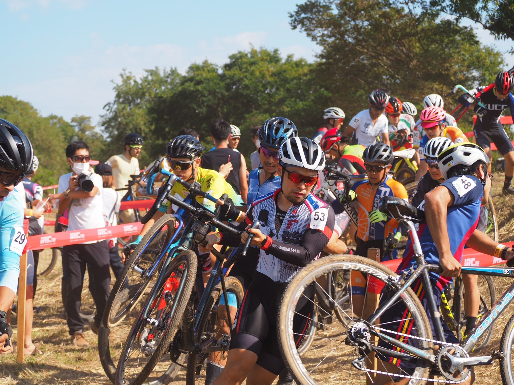

## Summery

普段であれば 50 位以降をうろちょろするのが JCX レースでの定位置であったが、今年は毎週火曜日の Meetup トレーニングとマグマ生活の肉体改造、いつものシーズン前タバタでリザルトジャンプアップに成功！

## リザルト

35/81 位(-3 lap)

### 機材

- メインバイク
  - GIANT TCX ADVANCED PRO
  - Farsports CX TU + A.Dugast Smallbird 33mm (F: 1.5bar, R: 1.7Bar)

## 試走レビュー

台風襲来！コース水没！という懸念があったものの、前日設営では何箇所かが水たまりになる程度で済んでいた今回のコース。

懸念していた路面は、午前中はいい感じのドロドロ具合を見せていたものの、昼試走の頃にはいい感じに乾いていてよくグリップする路面になっていた。

ちなみに前日の様子はこちら

https://www.youtube.com/watch?v=9uYE90Fh68w

F1.6Bar, R1.7Bar の空気圧高めが良い感じにグリップしていたが、試走コースがエリートクラス占有となってスピードが上がってからコーナリングのグリップにやや不安定さが出たため、フロントの実 0.1Bar 下げて出走することに。

## レース

https://www.youtube.com/watch?v=IJYQnt5Ya5U

スタートから外側と降車を上手く使うことができ、人生最大のスタートジャンプアップ。

その後、いつも通り後ろからどんどん抜かされ……ない！

試走中感じた調子の良さをそのままレースに持ってくることができ、逆にテクニカルセクションでスピードを落とさず踏むことで前のパックを捕まえるほうがメインとなる。

小貝川といえば長いバックストレートだが、テクニカルセクションは細かい切り返しが多く、コーナリングでかなりのタイムを稼ぐことができる。今シーズンから投入した GIANT TCX ADVANCED PRO もコースの細かいコーナーをクリアするのに一役買ってくれた。

途中調子に乗って攻めすぎ、杭にペダルを引っ掛けて落車するもすぐに抜かされたパックに復帰。昨年では考えられない。

終盤に捕まえたパックが泥の処理で崩壊した隙をついて、全員の前に出ることに成功したのでそのまま 1 周引き離して足切り……の予定がもう 1 周走らされることに。予定外の周回で脚がなくなってしまい抜いたパックに吸収されながらの 80%カットとなった。

昨年までより上の方の順位で走っても、まだまだコーナリングでアドバンテージ取れることがわかったが、同時に直線で全部取り返されてしまうくらい平坦のパワー差があることもわかった。

ここまで長々とした直線のあるコースは小貝川コース特有のものなので、むしろこの不利条件の中ここまで持ち込めたと言えるのかもしれない点はプラスに捉えることもできる。
