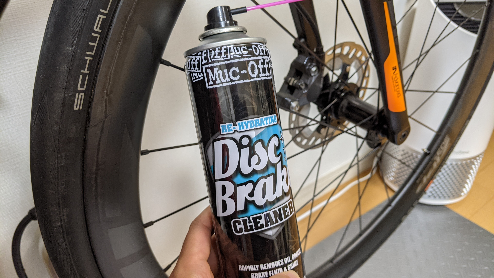
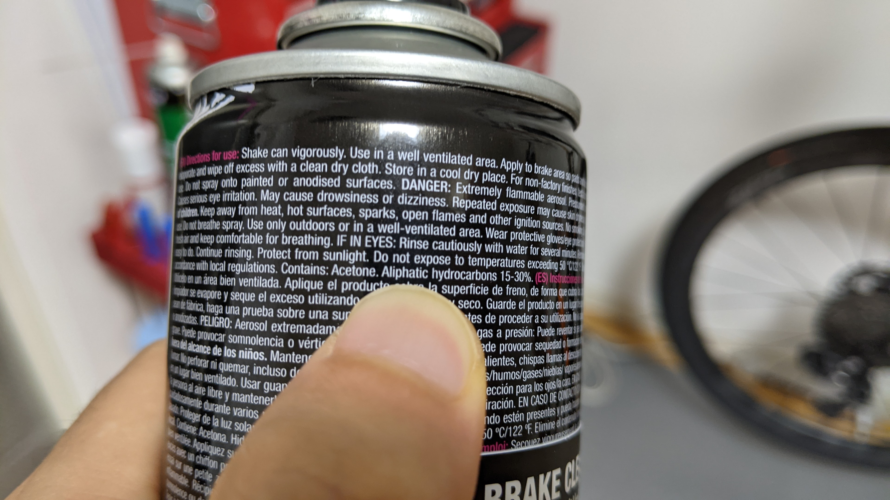
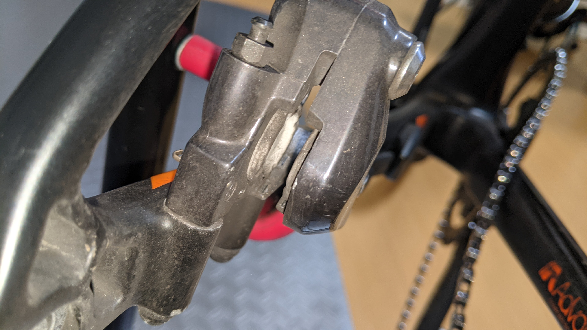
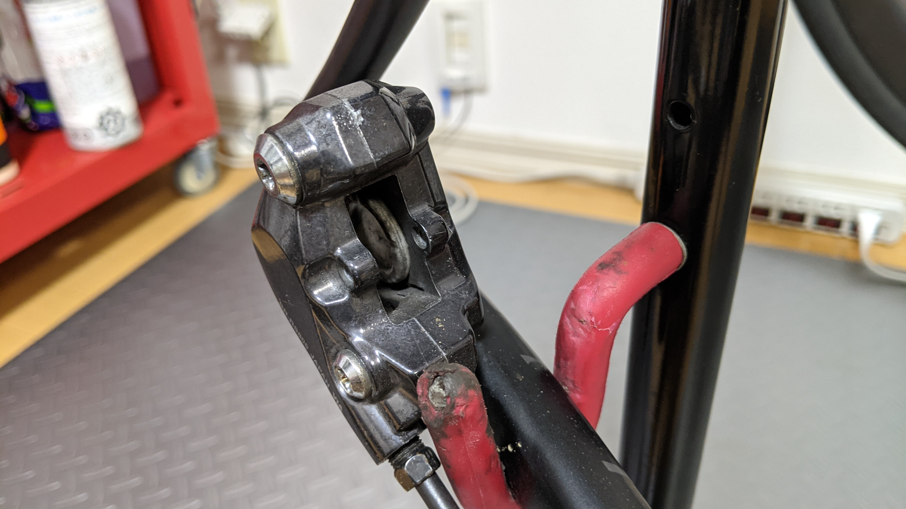
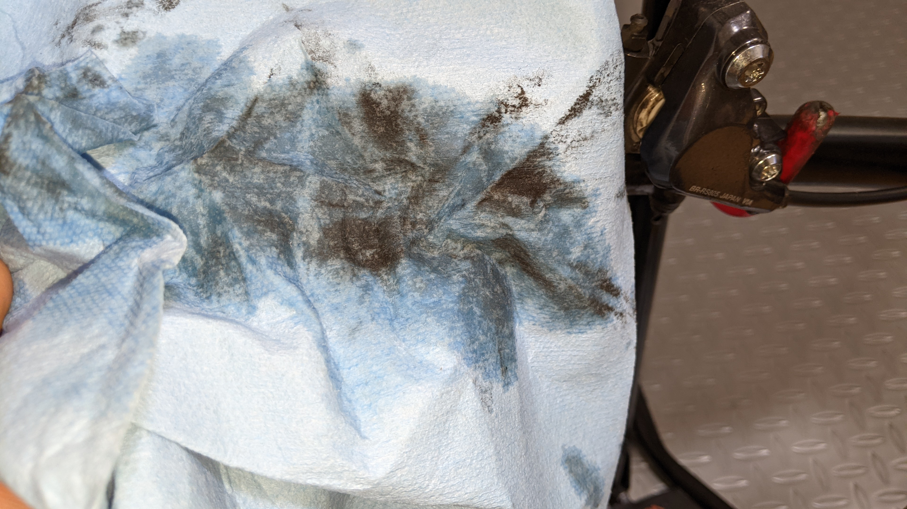
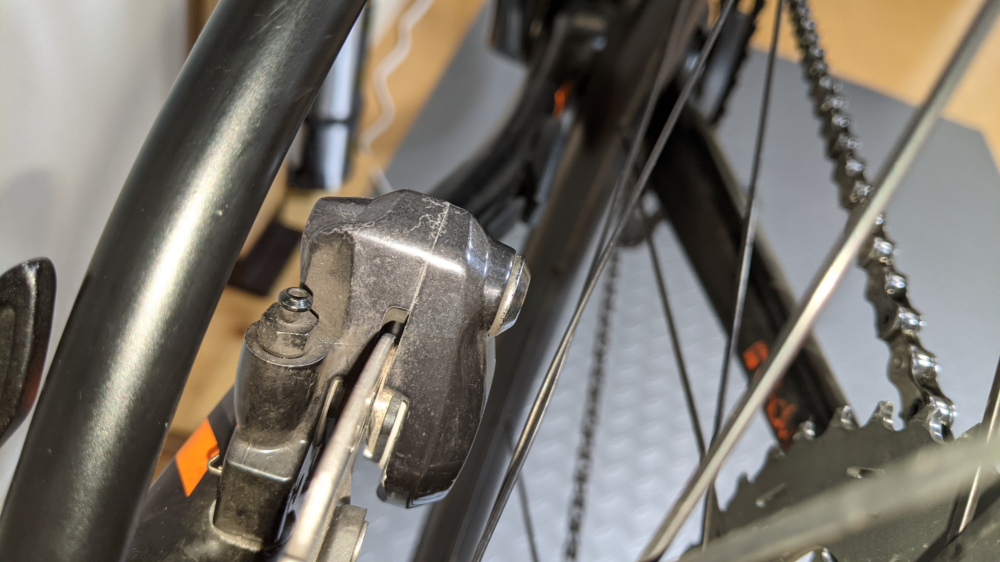

泥汚れを効率よく落とす[ナノテッククリーナー](https://amzn.to/3iT2nnJ)でもお世話になっている Muc-Off, これだけでも自転車を綺麗にするには十分なのだが、ディスクブレーキ特有の不具合に対応するための[ディスクブレーキクリーナー](https://amzn.to/3oTDgEZ)なる製品も出している。

<LinkBox url="https://www.amazon.co.jp/dp/B07T1YV83D/" isAmazonLink />

ブレーキがやたらと鳴くようになったり、油が付着したと思しき効きの甘さが目立った時によくある民間療法は、パッドとローターを煮たり焼いたりすることだ（文字通り）

ただ、**経験上この方法は手間に見合った効果が得られない**ことが多いので、せっかくならと専用のクリーナーを一度は使ってみることにした

## 内容物

アセトンと、脂肪族炭化水素…つまり溶剤。情報量はこれだけだった。

代理店である[ダイアテックのページ](https://catalog.diatechproducts.com/shop/g/g09-7510001404/)にも詳細は下記のように書かれている。

> ディスクブレーキのほこりやオイル、さらには全てのブレーキ部品から汚れを素早く除去することでブレーキ性能の回復・向上を可能にするクリーナー。
>
> MUC-OFF 独自の配合によるコンディショナーで、ブレーキの鳴きを軽減し、ディスクパッドの寿命を延ばし、ブレーキング機能を回復させます。
>
> ご使用後は残留物を残さず、そのままで素早く乾燥します。
>
> ラバー、プラスチック、アルミニウム、カーボン、塗装面にもダメージを与えず使用できます。

基本的にアセトンは塗装を侵すという認識だったが、それでも塗装面にダメージを与えないと謳っているあたりが**独自配合**なのだろうか…

ちなみに、FINISH LINE のディスクブレーキクリーナーはアセトンフリーをセールスポイントとして打ち出している

<LinkBox url="https://www.amazon.co.jp/dp/B07R5C7VF6/" isAmazonLink />

## 作業

泥汚れが目立つようになるたびに洗っているロードバイクのリアブレーキを、パッドの交換がてら洗浄してみた。

ブレーキダストは簡単な水洗い程度では落ちてくれないので、かなり汚れが残っている。

外側もそうだが、一番綺麗にしたい箇所はブレーキの動きに直結するピストン周辺。何回かブレーキ操作してピストンを押し出してからブレーキクリーナーをぶっかける。

クリーナーはある程度の汚れを流してくれるが、正しい使い方はこの**クリーナーが乾くまで待った上で、ウエスで拭き取る**という手順。

そこそこ高価なケミカルなのだが、クリーナーという性質上、汚れの部分に噴射する量は確保したい。そういう際にノズルが付いてくれているスプレータイプは、一番洗いたい内部にピンポイントで噴射することができて非常にうれしい。

もちろん、油の付いていない綺麗なウエスである必要がある。普段から紙ウエスを使っているので、大したハードルではなかったが、布ウエス派の人には負担かもしれない。

この後、綿棒や紙ウエスで内部と外装を綺麗にしてから、ピストンをコインドライバーで押し戻したうえでパッドを取り付ける。特にピストンの動きに対して影響の大きいであろう側面を綺麗にしておきたい。

**作業直後のピストン写真を撮り忘れる**という大失態を犯したので、キャリパー部を後から洗浄した写真でご勘弁いただきたい。

しつこかったブレーキダストも、軽くこするだけで落ちてくれるのでアルテグラ特有の金属光沢も復活してくれる。

見てわかるように、拭き掃除していないであろう箇所はあまり綺麗になっていない。あくまで汚れを浮かせる役割と思った方がよさそうだ。

## 効果

ディスクブレーキの鳴きや、ローターに残った黒い筋などの洗浄には劇的な効果を発揮する（写真が無くて申し訳ない）

また、今回のロードではないが、街乗り CX で効きが甘くなったローターの洗浄でも大きな効果を発揮してくれたので、謳っている効果に間違いはなさそうだ。（この時は、煮たり焼いたりしても一向に治らなかった）

## まとめ

プロのメカニックはディスクブレーキ周りの洗浄にイソプロピルアルコール(IPA)を使っていることが多いらしい。

ml 単価は 1/4 ほど。

<LinkBox url="https://www.amazon.co.jp/dp/B01ASJ1PCO/" isAmazonLink />

一応、ディスクブレーキクリーナーは『独自の配合でブレーキ性能が回復・向上』と謳われているのでディスクブレーキに特化した製品であるのだろう。

元々このノウハウを知っていたので、IPA を購入することも検討したのだが、ピンポイントで噴射できるというエアゾールのメリットを重視したほか、自宅で揮発性の液体を大量に長期保管できる自信が無かったということもあり、専用品の購入に至った。

高い分はノズルとエアゾール・保管の手間代と考えれば納得の価格と言えるのではないだろうか。

### ディスクブレーキ特有のトラブル

特に、リムブレーキから移行した人はディスクブレーキの不具合に不安があるかと思うが、トラブルか？と思った際にとりあえず洗ってみて問題の切り分けをしてみるのに丁度いいだろう。

塗装や樹脂・ピストンのシールに攻撃性がないことが配慮されている専用品なので、気兼ねなく使って、汚れているだけなのか、そうでないのか確認できる。

予備パーツを手配するにも一苦労のご時世なので、洗って済むトラブルは洗って解決したい。

<LinkBox url="https://www.amazon.co.jp/dp/B07T1YV83D/" isAmazonLink />
