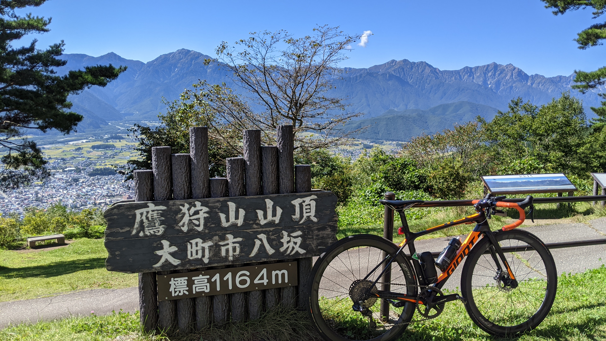

2020年の頭から1年10カ月ほど、TCRという"THE ROADBIKE"ともいえる性質の自転車をフロントシングルで運用する試みを続けてきたので、グラベルロードを買う前に総括してみる。

<LinkBox url="https://blog.gensobunya.net/post/2020/01/tcr_allroadize/" />

<LinkBox url="https://blog.gensobunya.net/post/2020/08/wt_nw/" />

当初からの機材変更点は下記の3点。

- チェーンリングを48Tから46Tに換装
- GIANTの純正ホイールを [ZIP303S](https://shopping.yahoo.co.jp/search?p=ZIPP+303S&cid=&pf=&pt=&area=14&dlv=&first=1&tab_ex=commerce&sc_i=shp_pc_store_searchBox) に換装
- クランク9000から[中華 PM のついた R7000](https://s.click.aliexpress.com/e/_AS7Nb6) に換装

## 総評

<PositiveBox>

- メンテナンスの負担が大幅に減少
- ワイヤー・ケーブルの数が減り見た目すっきりする

</PositiveBox>

<NegativeBox>

- 軽量化にはならない
- ギアレンジやギア比の飛び解決に若干の気合が必要
- どうあがいてもクロスレシオにならないのでレーシング用途（特にTT全般）には不向き

</NegativeBox>

### FD が無いという解放感

まず第一のメリットは**フロントディレイラーが存在しないが故に様々な作業がなくなる**こと。

- FD調整・注油からの解放
- 洗車時に入り組んだ場所が減る

運用面ではこの2点が大きい。

走行時にフロントシングルであることのメリットは、概ねCXと同じでギア比の調整（フロント変速したから、ギア比が大きく変わらないようリアを何枚か変速）が必要なく、**思考のリソースが取られない**という点。

Di2なんだからシンクロシフトで解決してもいいのだが、変速ショックも比較的小さいのでフロントシングルならではのメリットの1つに数えていいだろう。

当然見た目もかなりスッキリする。

見た目のスッキリさと、**BB周りの洗車しやすさ**は自転車を眺めたときの満足感につながるのであながち馬鹿にできないと、改めて感じた。

**チェーンリングはいいものを使わないとすぐ消耗する**ので、Wolftoothを推奨。

<LinkBox url="https://www.chainreactioncycles.com/jp/ja/wolf-tooth-110-bcd-%E3%83%81%E3%82%A7%E3%83%BC%E3%83%B3%E3%83%AA%E3%83%B3%E3%82%B0/rp-prod192988" />

## デメリット

スプロケットが大きくなるので、リアが重くなる。**フロントシングルにしても、大抵の場合重量的なメリットはない**と計画時点でわかっていたので、これは予想通り。

### 最大ギア比・最低ギア比の制限

フロントダブルに比べて**カバーできるギア比が小さい。**

CXやMTBのような限定された状況ではデメリットにならないが、ロードバイクはさらに広範囲なシチュエーションへの対応が必要となる。

激坂では10km/hを割る低速から、最高速では60km/h ~ 70km/hへの対応が必要…と考えるが、フロントシングルでは全てに対応することは物理的に不可能だ。

自分の場合はR:11-42T, F46Tとして、**最高速を犠牲にして、登りはダブルで言うところの36-32Tよりやや軽い程度のギア比**までを設定、軽い未舗装路までカバーできるギア比にした。

SRAMのようにトップ10Tが使えるのであればややこの状況は改善されるが、それでもこの後の課題は残る。

<LinkBox url="https://paypaymall.yahoo.co.jp/store/qbei/item/pi-810753" linkurl="https://ck.jp.ap.valuecommerce.com/servlet/referral?sid=3171302&pid=887657037&vc_url=https%3A%2F%2Fpaypaymall.yahoo.co.jp%2Fstore%2Fqbei%2Fitem%2Fpi-810753" />

### ギアがクロスしていないことのストレス

ロードバイクとして見たときはこれが一番のストレス。

特に、山岳TTのように**トルクとケイデンスのバランスを気持ちいいところに保ちたいような局面には全く向かない**。アタックに反応する際はある程度のトルク差は気にならないかもしれないが、

前述のようにトップ11Tである限り、超高速域への対応も厳しいのでスプリントも難しいし、総じてレースシーンには合わないだろう。

## まとめ

レーシング用途には厳しいが、シビアでないツーリング用途ならギア比を軽い方に寄せることで、メンテナンス頻度や変速ストレスを低減させることができる。

グラベルロードやエンデュランスロードをオールロードとして使うには、フロントシングルではギア比は足りないだろう…自分もグラベルロードに移植した直後はシングルのままで運用する予定ではあるものの、R8100か新型GRXが出てきた段階でフロントダブルに戻す予定。

長期運用してわかったことと、当初計画していた段階で想定していたことがほぼ一致してるが、予想通りだったということで…

<PositiveBox>

- 洗車・シフトに関する悩みからの解放
- 故障ポイントの減少

</PositiveBox>

<NegativeBox>

- ギア比が飛ぶことによるストレス
- ギアレンジの狭さ

</NegativeBox>

<LinkBox url="https://www.amazon.co.jp/dp/B07RSRGQLS/" isAmazonLink />
