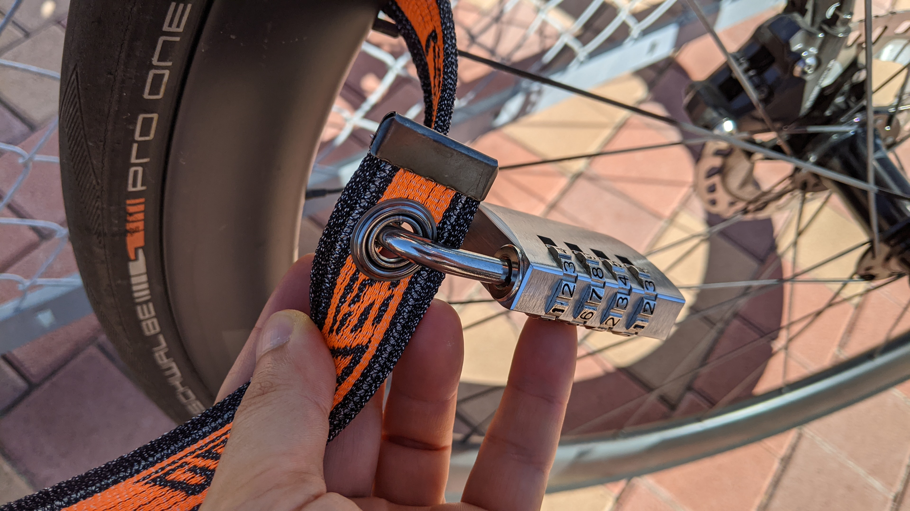
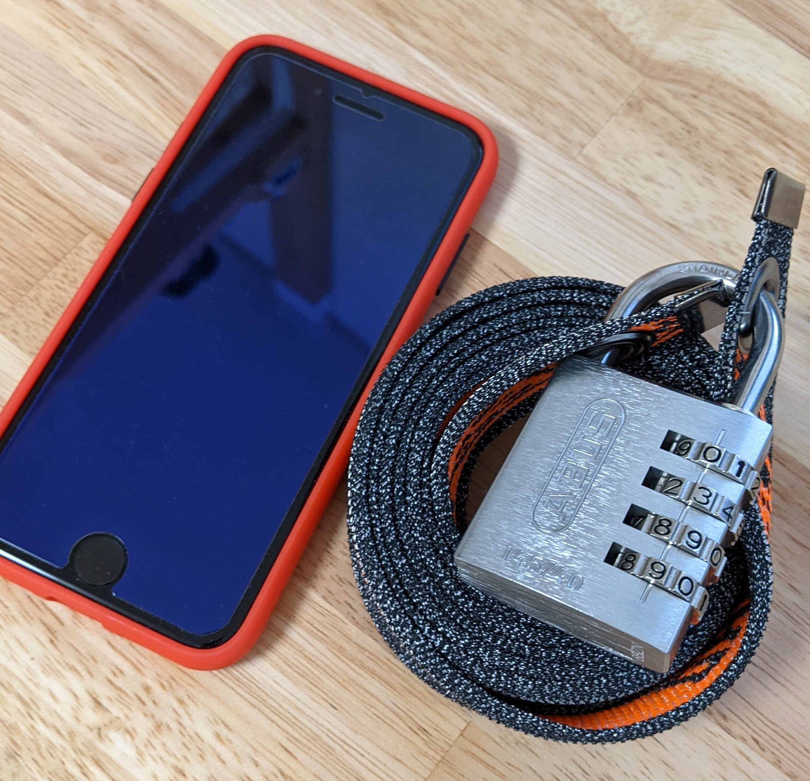
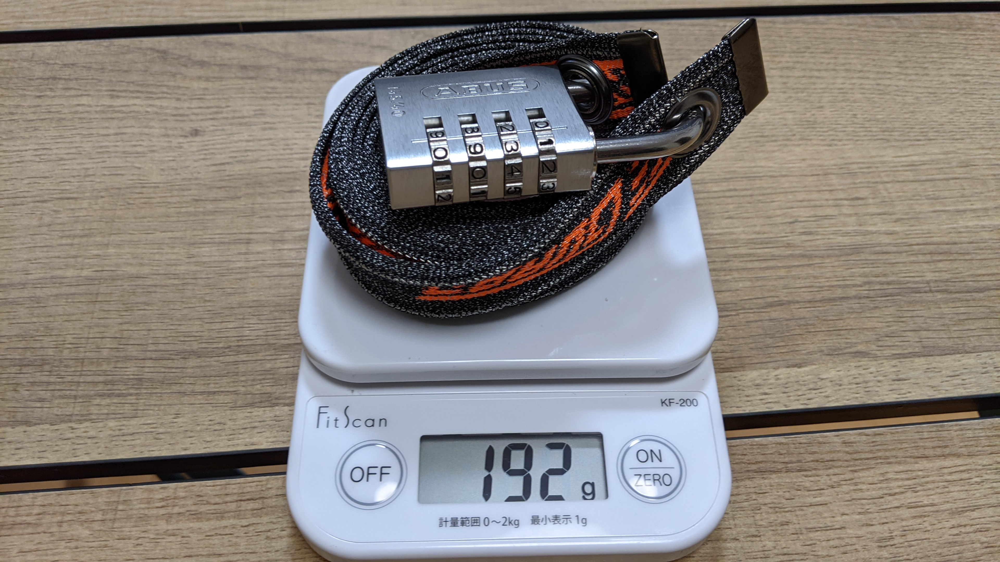
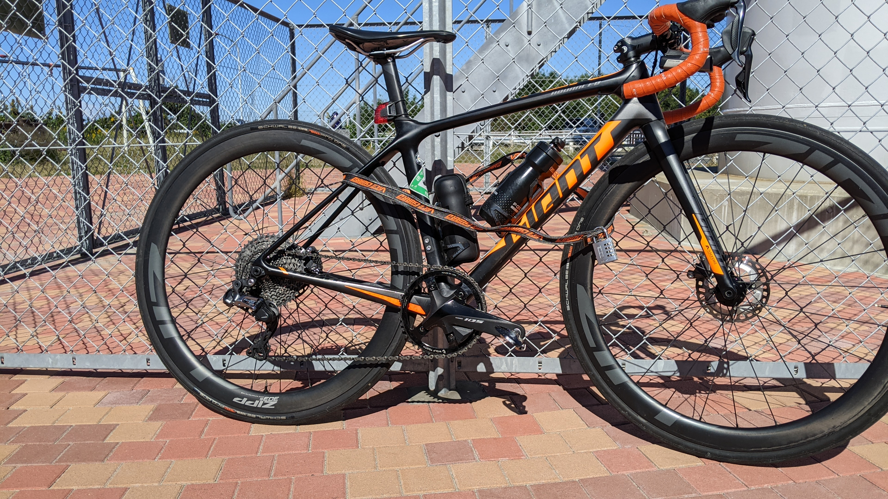
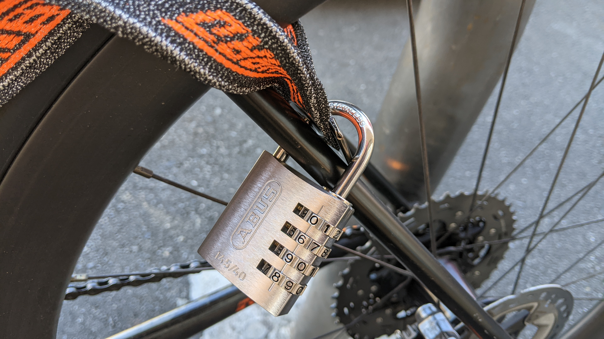

ロードバイクの鍵問題は悩ましい。

防犯性を重視すれば重くなり、肝心の走行性能をスポイルしてしまうし、かといって軽量なワイヤーロックではニッパーで簡単に切断されてしまう。

今回、その点を解消してくれるかもしれない軽量防刃ベルトを使ったロックを購入してみた。

## ロードバイクにも最適？バイスガードエア

今回購入したのはミツバサンコーワ製のバイスガードエアという製品。

<LinkBox url="https://www.amazon.co.jp/dp/B097XQT8N2/" isAmazonLink />

> 刃物や切断工具に強い二層構造。警察官などが着用する防護ベストの素材としても採用実績のある特殊防刃繊維をベースに、ステンレスワイヤーを編込んだ専用素材を採用。

という謳い文句で、柔軟性と防犯性、更には軽量性も併せ持ったロックとなっている。本体に鍵の機能はないので、通常南京錠と組み合わせて利用する。

本来はエンジン付きのバイク製品ではあるが、コンセプト的にロードバイクにも合うだろうということで購入。長さは350mm, 900mm, 1500mmの三種類から選ぶことができる。

今回は地球ロックや2台まとめてロックすることを想定して1500mmを購入した。

南京錠のほうだが、**軽量さを求めて南京錠側を破壊されては意味がない**ので、安心のABUS製をチョイスした。ベルト側の穴が9mm径なので、それ以下でなるべく太い方がよいだろう。

<LinkBox url="https://www.amazon.co.jp/dp/B00ME90XUM/" isAmazonLink />

コンパクトさは失われるものの、6mm径の大き目ダイヤルモデルを注文。

このモデルはアルミニウムボディにステンレスシャックルと錆びにくいこともポイント。

末端のベルト穴に南京錠を嵌めてロックするシステム。

シンプルだが、ロック機構を南京錠に任せているので、鍵式もダイヤル式もスマートロックも選択可能というメリットがある。

## サイズ

iPhone SE(第二世代）と比較。1500mmだと巻いてもそこそこの大きさになるが、南京錠の大きさもあるのでバランスはいい。

ジャージのサイドポケットにちょうど収まるサイズ感。鉄パーツのある南京錠でも、外側にすれば汗で錆びることもないだろう。

## 重量

最も興味深い重量問題。

ベルト単体では軽いのは当たり前だが、気になるのはシステム全体の持ち運び重量。

なんと200gを割る軽量さ。

今時のフラッグシップスマートフォンより軽い。

Pixel6やiPhone13シリーズが軒並み200g越えであることを考えると、非常に軽量！**ポケットに入れてもジャージがずり落ちてこない**重量だ。

## 使用感

1500mmモデルは地球ロックをするには十分な長さ、というよりは少し長め。柔軟性もあるので、色々なものに地球ロックできる。

**片輪＋フレームで地球ロックするなら 900mm モデルで十分**だろう。

持ち運びは前述の通りジャージのポケットのジャストフィットなので、荷物が増えすぎることもない。

南京錠ロックの小技として、写真のように**フレームをかませてロックしたり、ペダルのボディ部分に南京錠をかませてロックしたり**とちょっとした工夫で防犯レベルを上げることができる。

また、触り心地は布ベルトなのでフレームを傷つける心配がない点も非常に安心感がある。

もちろん南京錠は金属製だが、ペダルに固定すればフレームに接触することはない。

## 肝心の防犯能力は？

流石に試すには高い品物なので、先人の検証を参照したい。

<LinkBox url="http://blog.livedoor.jp/wason/archives/20210917_cyclespice_viceguardair.html" />

結論からすると、切れるか切れないかで言えば、特定の相性のいい工具を使うことで切ることもできるのだが、**自転車ドロがまず最初に使ってくる工具**で切れないことが重要な点。

このロックが流行って泥棒側も対応してしまったら意味がないが…少なくともニッパーで取りにくるイタズラや、ボルトクリッパーでU字ロックでもお構いなしに来るようなタイプには効くと考えると、重量比でかなり役に立つ方だと考える。

## まとめ

ややお高めではあるものの、実用的な防犯能力をもちつつ軽量なカギとしてはトップクラスのパフォーマンスだと思われる。

持ち運びしやすい点もGood。

単品だけでなく南京錠セットもあるので、相性が心配な人はこちらを買えばよいだろう。

<LinkBox url="https://www.amazon.co.jp/dp/B097XQPZXQ/" isAmazonLink />
