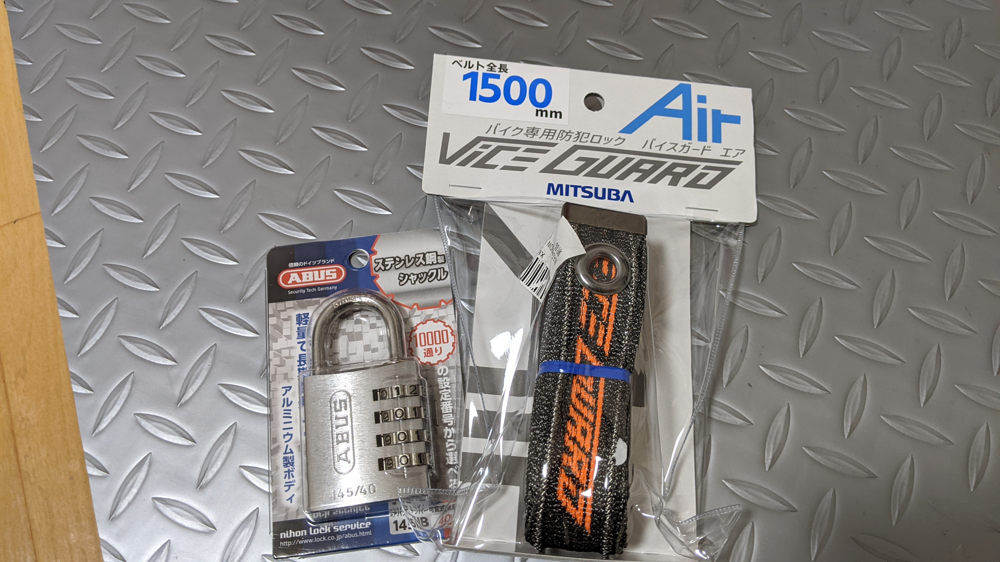

本体
<LinkBox url="https://www.amazon.co.jp/dp/B097XQT8N2/" isAmazonLink />

ABUS
<LinkBox url="https://www.amazon.co.jp/dp/B00ME90XUM/" isAmazonLink />

南京錠がボトルネックになっては意味がないので、安心の ABUS。

鍵を持ちたくないので、コンパクトさは失われるものの、6mm 径の大き目ダイヤルモデルをチョイスした。

検証記事
<LinkBox url="http://blog.livedoor.jp/wason/archives/20210917_cyclespice_viceguardair.html" isAmazonLink />

**自転車ドロがまず最初に使ってくる工具**で切れないことが重要な点。

セット
<LinkBox url="https://www.amazon.co.jp/dp/B097XQPZXQ/" isAmazonLink />
