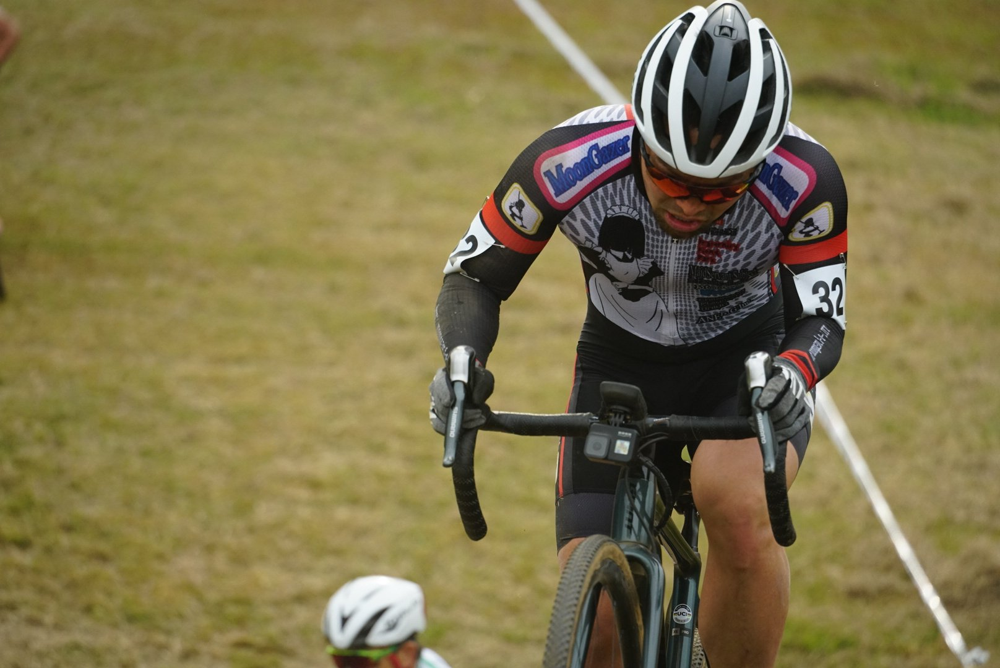

## Summary

序盤の落車やカオスに気を取られ、集中力を欠いたレースをしてしまった。

よくよく考えると、全日本選手権出場がほぼ決まっていてレース前の準備も甘かったように思える。ゼッケンから大きく順位を落としてフィニッシュ。

## リザルト

54/79位（-4 lap)

### 機材

- メインバイク
  - GIANT TCX ADVANCED PRO
  - Farsports CX TU + A.Dugast Smallbird 33mm (F: 1.65bar, R: 1.75Bar)

## 試走レビュー

過去何回か烏丸半島のレースは走ったが、数年あけて復活した今年、コースは大幅にレイアウトが代わり、キャンバーが追加された。

路面や芝の質も代わり、硬く重くなっており直線すらしんどい。路面もボコボコしており腰に悪いコース。

急斜面を駆け上がるセクションが数か所用意されており、エリートレーサーたちがガッツリラインを試していた。どう考えても乗車クリアとそれ以外でタイムが開く。

キャンバーそのものは楽しいので、1時間ほど楽しんだ。前日試走組の様子はこちら。

<iframe width="560" height="315" src="https://www.youtube.com/embed/89-ku-KMvbw" title="YouTube video player" frameborder="0" allow="accelerometer; autoplay; clipboard-write; encrypted-media; gyroscope; picture-in-picture" allowfullscreen></iframe>

### 昼試走の感触

午前レースで芝が倒れて、直線が軽くなった気がする。その他は、午前レースで斜面が若干荒れた程度。

## レース

<iframe width="560" height="315" src="https://www.youtube.com/embed/ODqRriRlmeA" title="YouTube video player" frameborder="0" allow="accelerometer; autoplay; clipboard-write; encrypted-media; gyroscope; picture-in-picture" allowfullscreen></iframe>

スタートの落車に巻き込まれ、大きく順位を落とす。その後、キャンバーでジャンプアップするものの、集中力を維持できず細かいミスを繰り返し、なかなか上がったポジションをキープできずに54位に沈んだ。

オンボードは諸事情でスタートだけ。

昼試走から時間が開き、なんとなく空気圧を調べたらセッティングより落ちていたので、試走時より0.05bar高めていたのがよくなく、平坦セクションの伸びが非常に悪かった。前日試走の空気圧（昼試走の-0.1bar）でも良かった気がする。

リアエンドも曲げてしまい、今週に復旧が必要な状態に。GIANTはこういうときGPM以上のディーラーに頼めば2日でスペアが届くのでありがたい。

久しぶりに関西に顔を出せて、懐かしいメンツに挨拶できたはいいものの、今年分のJCFランキングには何の影響ももたらさない遠征になってしまった…

## Photo

Cover photo by [@AKIOcom](https://twitter.com/AKIOcom)
