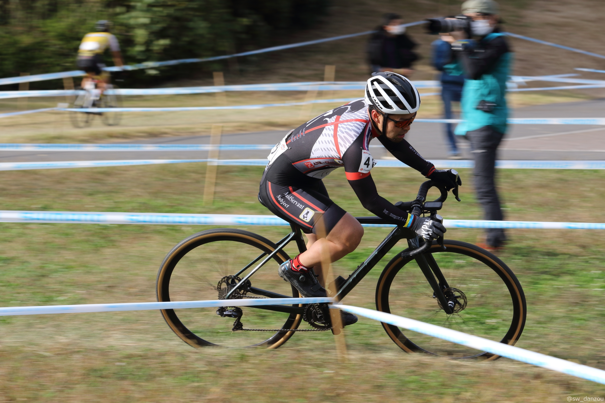
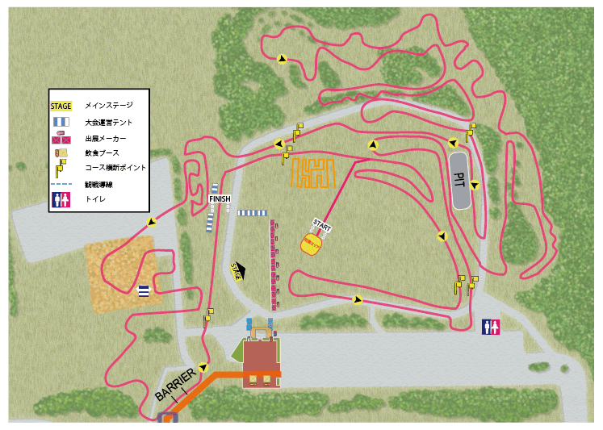

## Summary

JCX 取手につづき、（当人比）良い位置で展開することができた。

ゼッケン番号以上のリザルトをゲットし、結果に納得できるレースではあった。しかし、振り返ってみると完走まであと 1 分ほど。1 周当たり 10 秒短縮できれば国内トップクラスの選手がいるレースでも完走での完走が見えてくる。

手ごたえと課題を同時に掴んだとも言えるレースだった。

### お知らせ

今回から、レポート末尾に公開写真の紹介リンクを追加することにしました。

もし削除依頼があれば Twitter までご連絡ください。

## リザルト

39/85 位(-1 lap)

### 機材

- メインバイク
  - GIANT TCX ADVANCED PRO
  - Farsports CX TU + A.Dugast Smallbird 33mm (F: 1.55bar, R: 1.65Bar)

## 試走レビュー

例年、幕張はスタートエリアの問題により事前整列ができず時間が押しがちという運営上の欠点があったが、コースのマイナーチェンジによりこの欠点を克服した。

その代わりにホームストレートの舗装路が消滅して深い芝の区間が長くなり、パワーの絶対値勝負となる区間が多くなっていた。

さらに、スタートループのレイアウトによって幅の狭い区間が 1 周目後半にさしかかるまで存在しないコースとなっており、1 周目はスタートからそのまま集団が引き延ばされる展開が容易に想像できるコースに進化していた。

前日試走組の様子はこちら。

https://www.youtube.com/watch?v=jqJWF2QAOfk&t=6s

### 昼試走の感触

F1.6Bar, R1.7Bar の空気圧高めでスタートしたものの、ヤシの木エリアや BMX コース周辺で不安さを感じたので若干落としてスタートすることにした。

幕張の名物でもある忍者返し\*2 は、登るラインはわかりやすく存在するものの、コース幅をいっぱいに使っての 1 本ラインだったため前に人がいる場合は遠慮なく降りる方向に決定。

## レース

試走レビューの通り、序盤で順位の入れ替わりが起きづらいことは予測していたので大きなミスをせず、流れるように集団の中を走ることに集中。

あわよくばドラフティングで楽をしようと思っていたが、深い芝がそれを許さず脚をゴリゴリと削っていく。

忍者返しはまったく乗車できる気配はなく、潔く降りて担いでいく。

ハンドル持って押していく人がいっぱいいたが、あの角度でそれをやるとただ遅いだけなのでしっかり肩に担いで、素早く登ることだけを意識。これだけで細かくポジションを上げられる。

1 周目で形成されたパックがそのままずっと維持され、パック内での序列に変化はあったり、後ろから爆速で追い上げる数名がいた以外は一定ペースでの展開が続く。

こうなると我慢比べの様相を呈してくるので、つまらないクラッシュや芝でのタレだけをしないように、集中力を維持するだけ。

ガヤから中々いいペースで走っていることを察しながら 45 分を過ぎたあたりでラストスパートでパックの先頭を狙っていく。狙い通りシケインをいいポジションで越えて足切り…のはずが無情にももう 1 周という判決を受けてしまう。

-1Lap という世界までやってきたことに満足しつつも、脚や心肺は完全に売り切れ。ギャラリーに愛想を振りまきながら適当なペースで走ることしかできない燃え尽きムードになり、殿を務めてレース終了。

目の前で聖のゴールを見ることができて感激した。今まで JCX でトップのレースが終わるころには自分の陣地で倒れていたので。

例年にも増して芝が長い影響で、脚が回復する余地が少なく、持久力に乏しい自分の筋肉では終盤のタレを抑えきることができなかったことが反省点。終盤は露骨に芝区間でふみ負けしていた。パワーか…パワトレつらいよ。

## 役立った装備

茨城の反省から、[すのこ](https://amzn.to/3FipbXB)と着替え用の[ポップアップテント](https://amzn.to/3isxA0Q)を陣地にセッティング。

<LinkBox url="https://www.amazon.co.jp/gp/product/B00K1WWRYE/" isAmazonLink />

<LinkBox url="https://www.amazon.co.jp/gp/product/B017LI8HD0/" isAmazonLink />

そして、これらすべてを運ぶためのアウトドアカート。

<LinkBox url="https://www.amazon.co.jp/gp/product/B08P729HZ4/" isAmazonLink />

事務用の荷台でもいいかと思ったが、タイヤが太くないとオフロードでは沈んでしまうというアドバイスを受け購入。全部運べて車と往復しないの最高すぎた。

## Photo

Cover photo by [@sw_danzou](https://twitter.com/sw_danzou)

### Photographers

https://twitter.com/sw_danzou/status/1457615121979559940

https://twitter.com/PW10_SR20DE/status/1457339840362475522

https://twitter.com/pulancha/status/1457298148271869955

https://twitter.com/kuotasyan/status/1457314144776974345

https://twitter.com/ryo04mayu/status/1457327878228492288

https://twitter.com/yuki_asato/status/1457452889731854338

https://twitter.com/K_kazumasan/status/1457667659219144705
