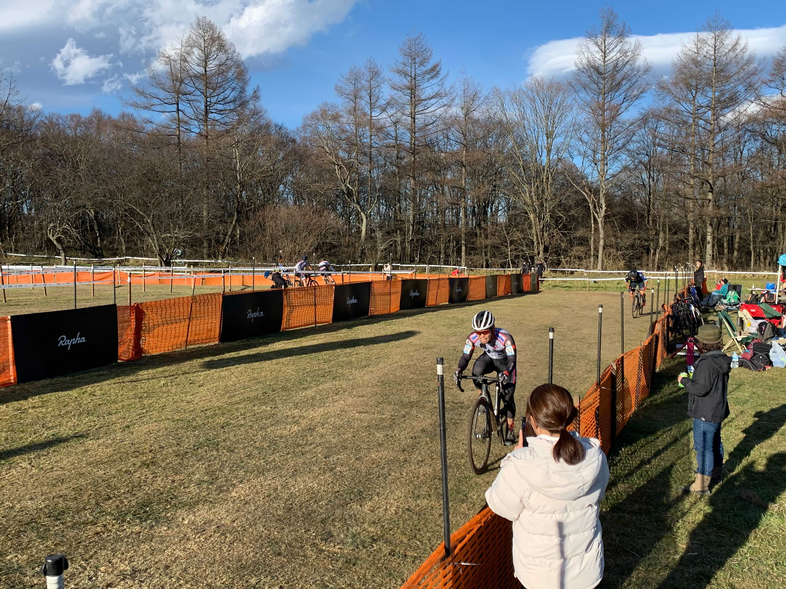

## Summary

登り舗装路でごぼう抜きされて沈むのがこれまでの定番になっていた野辺山だったが、今年は抜かれることを許容しつつ下っている間に押し返せるようになっていた。

多分全日本選手権出場に十分なポイントも得られたはず。

ドーピングコントロールのランダム抽選分に当たるという貴重な機会も得ることができた。面白い話と体験だったので、そのうち単独で記事にしようと思う。

## リザルト

Day1: 50/93 位
Day2: 47/96 位

2 日目は UCI レースだったので、グローバルなウェブサイトにもリザルトが載る。

<LinkBox url="https://cyclocross24.com/race/11017/" />

### 機材

- メインバイク
  - GIANT TCX ADVANCED PRO
  - Farsports CX TU + A.Dugast Smallbird 33mm

#### 空気圧

Day1: (F: 1.58bar, R: 1.63Bar)
Day2: (F: 1.63bar, R: 1.68Bar)

## 試走レビュー

### Day1 試走

今年の野辺山は非常に珍しく、ほぼドライ。

ありとあらゆるところがしっかりグリップ…するわけではなく、カリカリになったバギーコースと、小石の浮いたコーナーが恐ろしい。

カリカリのコーナーでは、途中で曲げようとせずに、入り口で十分に減速して方向を決めてからコーナーにつっこむ意識を持つのが重要。あと出口をしっかり見る。

広くなったように見えたキャニオンは飛んでみてもしっかり広く、練習ではミスなくいけたものの、初回が 1 番うまくいったという不安要素を抱えた（そして後ほど回収することになる）

### Day2 試走

泥区間のコースが一部変更され、コース内の小石もかなり撤去されおりますますイージーなコースとなった。

例外は、林間のドロップオフとエリートコースのキャニオン越え。共に昨日・本日に使い込まれて路面が削れたことで難易度が高くなっている。共に事故を起こしかねないのでこの二つだけ丁寧にいくことにして、空気圧を 0.05Bar 上げることに決定。

## レース

### Day1 JCX

取手・幕張とポイント芸人力を見せたので、ポイントのない西日本ライダーと混ざる野辺山ではかなりいいスタート位置、4 列目に陣取ることができた。

とはいえ、登坂力が上がったわけではないので、抜きたい人には抜かせておき、得意なところでしっかり追いついたり追い込んだりする戦法に集中。

結果的にこれがよく当たり、登りで時間を空けられてもなんだかんだで追いつきつつミスした人から抜き返すというスタンスで周回を重ねることができた。

失策はキャニオン越えを行けると勘違いして 1 回大転倒したこと。登りを VO2MAX で踏んだ後で高さが出せず着地をミス。昨シーズン終盤で習得したはずのバニーホップ的なジャンプを忘れてしまっていたこともあり、リスクのある飛び方をしすぎたと反省して以後一切飛ばずに降りてロスを小さくするよう大股で越えるような動きをすることに集中した。

なんだかんだで 50 位。

### Day2 UCI-JCX

ゼッケン番号がやや下がった以外、やることは同じと決めてかかった。周りには自分より脚力のある人しかいない。

この日は（比較的）落ち着きのあった昨日と違い、1 周目から落車が頻発するナーバスな展開となった。コーナーに突っ込む人数が多いのだが、何故か内側の人も外側のラインと同じスピードで突っ込んでいるので「そりゃ転ぶよ…」というコケ方をしている人が多数。UCI レースで気負いすぎているのか…

自分は完全に開き直ってどうぞどうぞと速い人に道を譲っていたので、落ち着きがいい方に働いたのか大半の落車を避けて展開することができた。

ミスのない分抜かれずに、47 位でフィニッシュ。UCI レースで U23 クラスの兵も多数いる中、50%を切るリザルトを残せて満足。

ゴール後即 JADA のシャペロンさんに声をかけられる。ドーピング検査は高圧的に進むのかと思いきや、非常に気さくで親切に対応していただいた。~~レースで出会う自転車レース関係者とは大違いだ~~

ドーピング検査という単語でくくられていた部分を実際に体験して、新しい知識をインプットできて楽しかったので、後日この部分については記事にしていく。

検査の方は、マイプロテインのサプリメントくらいしか摂っておらず、処方薬市販薬共に直近では飲んでいないので、かなりクリーンな状態なはず…

とはいえ、全ての食事に気を使っているわけではないし、普段のラーメンに使われている豚骨や鶏ガラが汚染されていたらおしまい。万一ひっかかったらグラベルおじさんに生まれ変わろうと思う。
