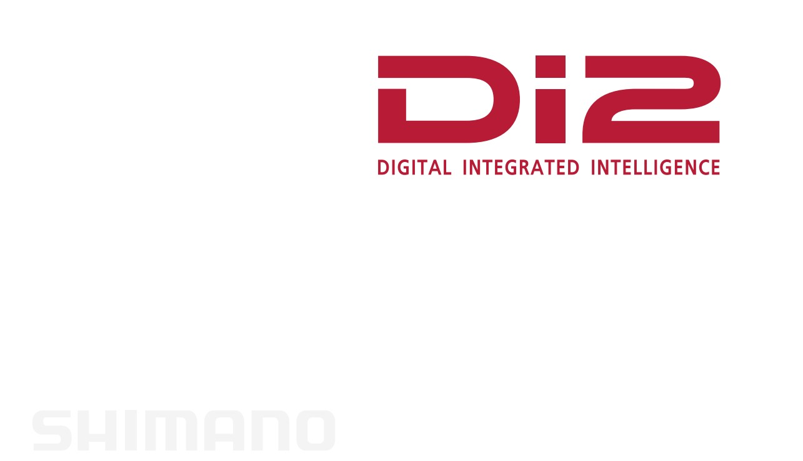
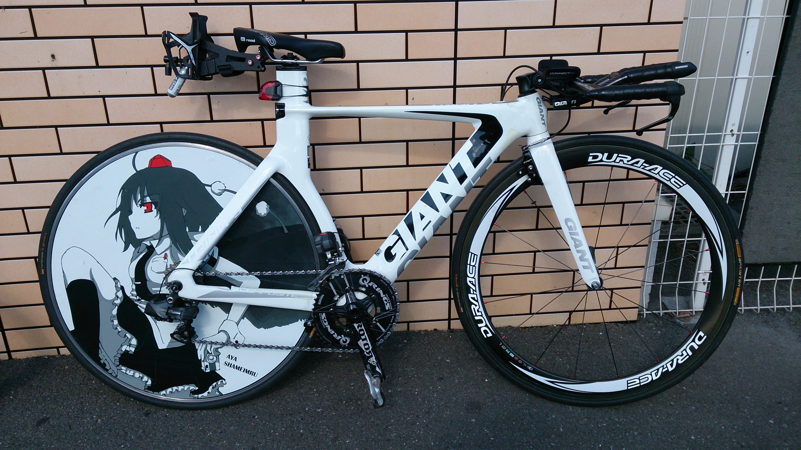
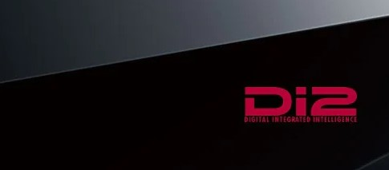
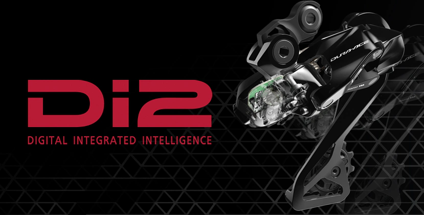

9000 シリーズからの Di2 ユーザーであり、以降電動変速の虜になって 6770 世代から R9100 世代のコンポーネントまで手を出し続けている。

R9200/R8100 Di2 で完全な別物になったこともあって、一度自分の機材を見直すとともに、これまでの Di2 システムの歩みを整理してみた。

あくまで、Di2 システムとして契機になったタイミングで**勝手に**世代と呼んでいるだけなので、全く持って公式用語ではない点には注意してもらいたい。

## 7970 世代

オープンベータ世代と書こうとしたが、良心がとがめたのでやめておいた。

シマノが満を持して投入した電動コンポーネント第 1 号。

今日までその流れが続く、カブトガニと呼称されるクランクデザインと合わせて、様々な議論を巻き起こしていたと記憶している。ワイヤーのフィーリングが云々言う勢力はこの頃からずっと一定数存在している。

この世代のみ Di2 ケーブルが 4 軸で、そもそも e-tube という呼称もない。

様々な拡張スイッチが追加されているという Di2 特有のメリットはこの世代からプッシュしており、サテライトスイッチも 79 世代用が存在したのだが、ケーブル規格の問題で 7900 番台デュラエースのみ利用可能となっている。

※カブトガニは 78 世代から言われていたらしい

<LinkBox url="https://store.shopping.yahoo.co.jp/cycleparadise/cps-2109298007-pa-037660173.html" />

## 第 1 世代

7970 デュラエースの翌年(2011 年)に発売された 6770 以降の **e-tube システムを導入**したシリーズがこちら。

初代はジャンクション A がアウターワイヤーに共締めするタイプであった(SM-EW67)

ケーブル部分が共通規格化され、拡張用にサテライトスイッチ・TT レバーをはじめとした多様なシフトスイッチが次々と発売された。

以後、この e-tube 規格が 2021 年に R9200/R8100 シリーズが発表されるまで長らく続くことになる。

## 第 2 世代

Di2 システムを拡張すべく、**ワイヤレスユニット**が発売され、Blueetooth によりサイクルコンピュータや、Andoird / iOS アプリと連携をするようになった世代。

現在流通しているパーツはだいたいここに含まれるだろう。

やたら大きかった RD のサイズが小さくなったり、FD のモーターパワーが強くなったりとマイナーな強化を繰り返していたが、ある時を境に決定的な進化が起きた。

カギを握っているのはマスターユニットであるバッテリー部分とジャンクション A。

バッテリーの型番が**DN-xxx**になっており、これと対応しているワイヤレスユニット([SC-MT800](https://paypaymall.yahoo.co.jp/store/qbei/item/pi-542102/), [EW-WU111](https://amzn.to/3CQlqab), [EW-WU101](https://paypaymall.yahoo.co.jp/store/crowngears/item/4524667853978)など)と組み合わせることで Bluetooth によるファームウェアアップデート・メンテナンス・サイクルコンピュータ連携機能を利用することができる。

<LinkBox url="https://www.amazon.co.jp/dp/B076J6DZ1M/" isAmazonLink />

**レバーやディレイラーは第 1 世代と共通のパーツを利用できる。**

Di2 の心臓部分たるバッテリーユニットが別物になったのだが、走行やメンテに関してはあまりドラスティックな変化が起きたわけでもなく、この変化に対応せずとも特に気にせず走り続けることもできた。

現に我が家にはワイヤレス対応のバッテリーユニットは 1 つしか存在していないし、ワイヤレスユニットは持っていない。

第 1 世代時に発売された [SM-PCE1](https://bike.shimano.com/ja-JP/product/component/duraace-r9150-di2/SM-PCE1.html) を購入しており、ファームウェアアップデートと故障診断を両方行えたという点が大きかった。

SRAM の etap AXS のようにギアの使っている割合やシフト傾向を見られたら面白かったとは思うが…そうはならなかった。

<LinkBox url="https://bike.shimano.com/ja-JP/product/component/duraace-r9150-di2/SM-PCE1.html" />

## 第 3 世代（現行）

STI が無線化した最新最高の Di2 コンポーネント（R9200, R8100）

無線化したことに加え、これまでバッテリーが担っていた**マスターユニットがリアディレイラーに統合**されたというのも大きなポイント。

今のところ、全然触ったこともないがこの世代の GRX が発売されたら是非とも購入したい。

<LinkBox url="https://store.shopping.yahoo.co.jp/worldcycle/shi-p-r9270.html" />

## まとめ

Di2 は割と何でも組み合わせられるようで、実はここに上げた世代間で互換性のない組み合わせが存在している。

特に最新世代ではこれまでのパーツとほぼ一切組み合わせることができないので、完全な別物と言って良いだろう。

パーツそのものの互換性は以下の記事に譲る。

<LinkBox url="https://skmzlog.com/shimano-di2-compatibility/" />
