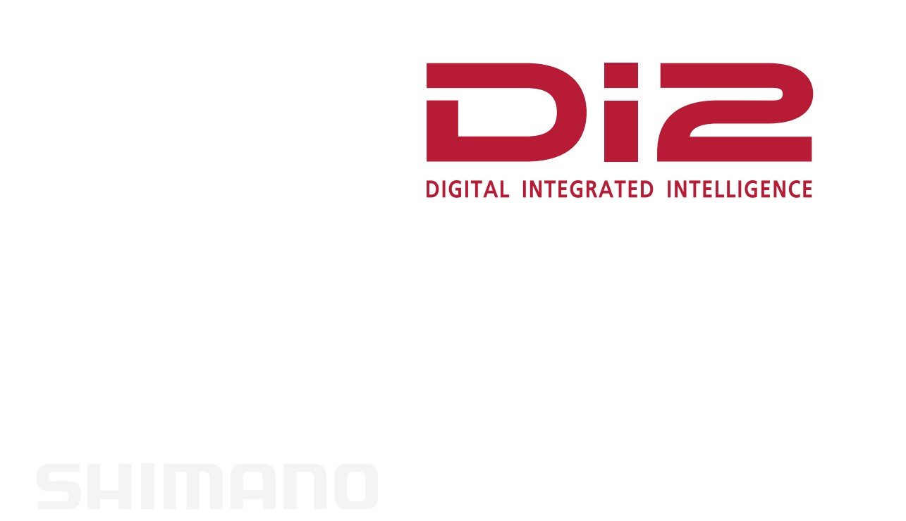
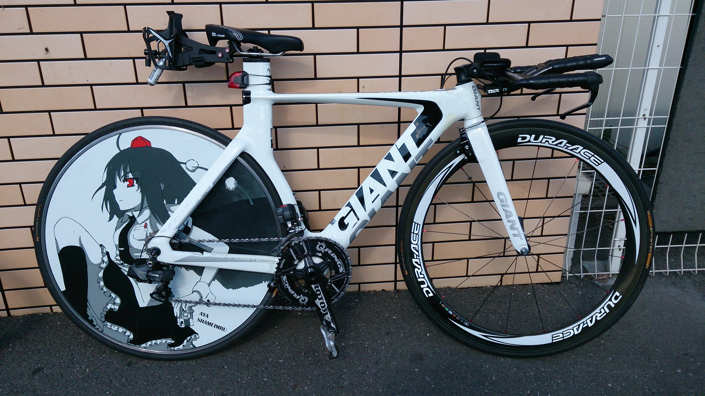
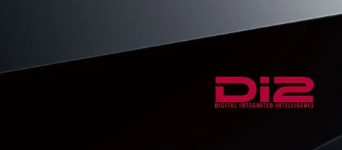
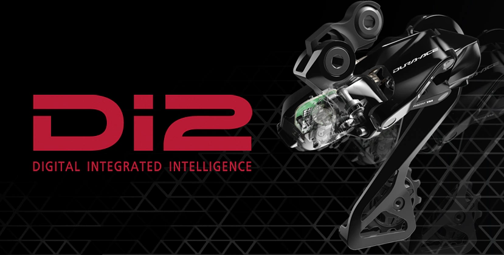

9000シリーズからのDi2ユーザーであり、以降電動変速の虜になって6770世代からR9100世代のコンポーネントまで手を出し続けている。

R9200/R8100 Di2で完全な別物になったこともあって、一度自分の機材を見直すとともに、これまでのDi2システムの歩みを整理してみた。

あくまで、Di2システムとして契機になったタイミングで**勝手に**世代と呼んでいるだけなので、全く持って公式用語ではない点には注意してもらいたい。

## 7970 世代

オープンベータ世代と書こうとしたが、良心がとがめたのでやめておいた。

シマノが満を持して投入した電動コンポーネント第1号。

今日までその流れが続く、カブトガニと呼称されるクランクデザインと合わせて、様々な議論を巻き起こしていたと記憶している。ワイヤーのフィーリングが云々言う勢力はこの頃からずっと一定数存在している。

この世代のみDi2ケーブルが4軸で、そもそもe-tubeという呼称もない。

様々な拡張スイッチが追加されているというDi2特有のメリットはこの世代からプッシュしており、サテライトスイッチも79世代用が存在したのだが、ケーブル規格の問題で7900番台デュラエースのみ利用可能となっている。

※カブトガニは78世代から言われていたらしい

<LinkBox url="https://store.shopping.yahoo.co.jp/cycleparadise/cps-2109298007-pa-037660173.html" linkurl="https://ck.jp.ap.valuecommerce.com/servlet/referral?sid=3171302&pid=887657037&vc_url=https%3A%2F%2Fstore.shopping.yahoo.co.jp%2Fcycleparadise%2Fcps-2109298007-pa-037660173.html" />

## 第 1 世代

7970デュラエースの翌年（2011年）に発売された6770以降の **e-tube システムを導入**したシリーズがこちら。

初代はジャンクションAがアウターワイヤーに共締めするタイプであった（SM-EW67)

ケーブル部分が共通規格化され、拡張用にサテライトスイッチ・TTレバーをはじめとした多様なシフトスイッチが次々と発売された。

以後、このe-tube規格が2021年にR9200/R8100シリーズが発表されるまで長らく続くことになる。

## 第 2 世代

Di2システムを拡張すべく、**ワイヤレスユニット**が発売され、Blueetoothによりサイクルコンピュータや、Andoird / iOSアプリと連携をするようになった世代。

現在流通しているパーツはだいたいここに含まれるだろう。

やたら大きかったRDのサイズが小さくなったり、FDのモーターパワーが強くなったりとマイナーな強化を繰り返していたが、ある時を境に決定的な進化が起きた。

カギを握っているのはマスターユニットであるバッテリー部分とジャンクションA。

バッテリーの型番が**DN-xxx**になっており、これと対応しているワイヤレスユニット（[SC-MT800](https://paypaymall.yahoo.co.jp/store/qbei/item/pi-542102/), [EW-WU111](https://amzn.to/3CQlqab), [EW-WU101](https://paypaymall.yahoo.co.jp/store/crowngears/item/4524667853978)など）と組み合わせることでBluetoothによるファームウェアアップデート・メンテナンス・サイクルコンピュータ連携機能を利用できる。

<LinkBox url="https://www.amazon.co.jp/dp/B076J6DZ1M/" isAmazonLink />

**レバーやディレイラーは第 1 世代と共通のパーツを利用できる。**

Di2の心臓部分たるバッテリーユニットが別物になったのだが、走行やメンテに関してはあまりドラスティックな変化が起きたわけでもなく、この変化に対応せずとも特に気にせず走り続けることもできた。

現に我が家にはワイヤレス対応のバッテリーユニットは1つしか存在していないし、ワイヤレスユニットは持っていない。

第1世代時に発売された [SM-PCE1](https://bike.shimano.com/ja-JP/product/component/duraace-r9150-di2/SM-PCE1.html) を購入しており、ファームウェアアップデートと故障診断を両方行えたという点が大きかった。

SRAMのetap AXSのようにギアの使っている割合やシフト傾向を見られたら面白かったとは思うが…そうはならなかった。

<LinkBox url="https://bike.shimano.com/ja-JP/product/component/duraace-r9150-di2/SM-PCE1.html" linkurl="https://ck.jp.ap.valuecommerce.com/servlet/referral?sid=3171302&pid=887657037&vc_url=https%3A%2F%2Fstore.shopping.yahoo.co.jp%2Fmekaanikko%2Fr9200.html" />

## 第 3 世代（現行）

STIが無線化した最新最高のDi2コンポーネント（R9200, R8100）

無線化したことに加え、これまでバッテリーが担っていた**マスターユニットがリアディレイラーに統合**されたというのも大きなポイント。

今のところ、全然触ったこともないがこの世代のGRXが発売されたら是非とも購入したい。

<LinkBox url="https://store.shopping.yahoo.co.jp/mekaanikko/r9200.html" />

## まとめ

Di2は割と何でも組み合わせられるようで、実はここに上げたように、世代間で互換性のない組み合わせが存在している。

特に最新世代ではこれまでのパーツとほぼ一切組み合わせることができないので、完全な別物と言って良いだろう。

パーツそのものの互換性は以下の記事に譲る。

<LinkBox url="https://skmzlog.com/shimano-di2-compatibility/" />
