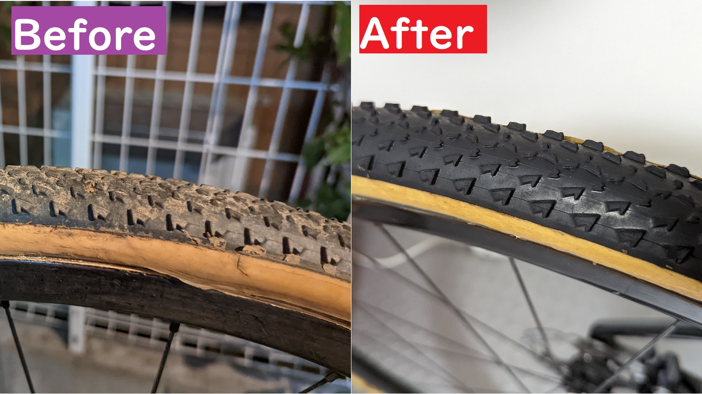

## 泥汚れもすっきり落としてタイヤの黒さも復活

## 作業手順

1. 軽く自転車全体を濡らす
2. [ナノテッククリーナー](https://amzn.to/3GZvYpO)を全体にかけ、**数分待つ**
3. タイヤを[亀の子たわし](https://amzn.to/30aQ93B)などの適度な硬さのブラシでこすって泥を浮かせる
4. 全体をしっかりゆすぐ
5. 水気を切って乾燥させる

### 1. 水で自転車全体を濡らす

### 2. クリーナーをかけて、待つ

![しばらく待って汚れの分解を待つ]](./soap.jpg)

### 3. タイヤをこすって泥を浮かせる

ブラシの硬さはダメージを与えすぎず泥は落とせるといういい塩梅が必要になってくるが、[亀の子束子の製品](https://amzn.to/3H1mEBS)が、毛も抜けずに硬さも実にいい感じなので愛用している。

気が付いたら Muc-off から[洗車用のスクラブグローブ](https://amzn.to/3c6tZSB)も登場していたので、こちらを使ってもよさそう。

<LinkBox url="https://www.amazon.co.jp/gp/product/B09KL22CKH/" isAmazonLink />

https://www.youtube.com/watch?v=fEcIikdl6yE

なんかエロいなこの PV

### 4. ゆすぎ

### 5. 乾燥

## 購入・運用について

単品・ストレートの商品を買うと割高に感じる人もいると思うので、濃縮版の購入を推奨する。

<LinkBox url="https://www.amazon.co.jp/gp/product/B07T22FKHB/" isAmazonLink />

※画像は 5L パッケージだけど商品は 500ml なので注意

<LinkBox url="https://www.wiggle.jp/muc-off-%E6%BF%83%E7%B8%AE%E3%83%90%E3%82%A4%E3%82%AF%E3%82%AF%E3%83%AA%E3%83%BC%E3%83%8A%E3%83%BC-1l-" />

濃縮版が 1L あれば、2 バイク運用の CXer が 2 シーズンくらいは困ることなく利用できると思う。

自分は濃縮版だけを購入して、花王の詰め替え容器で薄めたものを利用している。

<LinkBox url="https://www.amazon.co.jp/gp/product/B0091FWSUA/" isAmazonLink />

セールの時はそれなりに安く売られていることも多いのだが、昨今の品不足に伴いセールには期待できない状況が続いている。

代わりに、Muc-off から[Winter キット](https://www.wiggle.jp/muc-off-%E3%82%A6%E3%82%A3%E3%83%B3%E3%82%BF%E3%83%BC%E3%82%A8%E3%83%83%E3%82%BB%E3%83%B3%E3%82%B7%E3%83%A3%E3%83%AB%E3%82%AD%E3%83%83%E3%83%88)なるものが発売されている。

こちらは、濃縮 1L のパッケージとほぼ同価格でその他諸々ついてくるお得なパックとなっているので、これから購入する人はこちらを買うのがいいだろう。

<LinkBox url="https://www.wiggle.jp/muc-off-%E3%82%A6%E3%82%A3%E3%83%B3%E3%82%BF%E3%83%BC%E3%82%A8%E3%83%83%E3%82%BB%E3%83%B3%E3%82%B7%E3%83%A3%E3%83%AB%E3%82%AD%E3%83%83%E3%83%88" />
