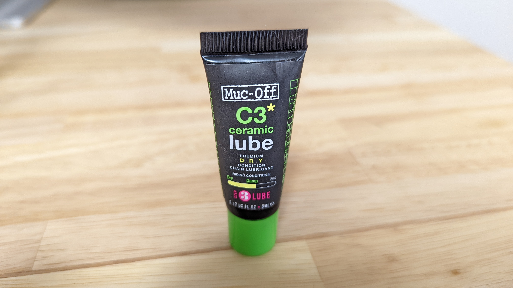

野辺山シクロクロスで試供品としてもらったルブを試してみたところ、予想を超える性能を見せてくれたので、急遽レビューを書くことにした。

## OVERVIEW

<LinkBox url="https://www.amazon.co.jp/dp/B07SYYN2J6/" isAmazonLink />

> すべての自転車チェーンに耐久性と長距離性能をもたらす独自のセラミックコーティングを配合したチェーンルブ。
> 「ドライ」はオフロードから室内まであらゆる乾燥した環境に適合し、金属同士の接触を画期的なレベルにまで低減。
> 土ぼこりの多いコンディションで比類ないチェーンの性能を発揮できる。

クリーナーでおなじみ Muc off のチェーンルブ製品、その中でもちょっとグレードお高めのドライルブがこちらの[C3 DRY CERAMIC](https://amzn.to/3GSWcto)だ。

性能は後述するが、甘い匂いがしたり、ブラックライトを当てることで塗布した部分が光るなど、作業上面白い特徴も持っている。（以下 C3 ドライルブと呼称する）

### 個人的なチェーンオイルの評価ポイント

自分の中でのチェーンオイル評価ポイントは

- 汚れないこと（最重要）
- 飛び散らないこと（必須）
- できればそれなりに長期間持ってくれると嬉しい

といった具合だ。シクロクロスではほぼ毎レースごとに注油をするし、ロードバイクも超ロングライドをするわけでもないので、性能維持能力はそこそこでよい。

代わりに、ダートに飛び込んだりしたあとでも室内のローラーに即設置して走り出すことができるくらい汚れが付かない、という期待がある。

## 施工

[グゥーキンアルファ](https://amzn.to/3p6y1BF)でチェーンをしっかり洗浄した後、この[C3 ドライルブ](https://amzn.to/3GSWcto)を塗布していく。ドライルブにしては粘度が高めに見えるが、すぐに浸透していくことがわかる。

スプロケットの全ギアに付くようにチェーンを回して、浸透を待った後余計な分を拭き取って施工完了。

## 走行感

夜のローラーと、翌日のライドで使ってみた。

正確な駆動抵抗に関しては、個人宅で計測しても大して意味がないので、あくまで走ってみた所感となる。比較対象は、普段使っている[AZ CKM-001](https://amzn.to/3yC0B0N)だ。

<LinkBox url="https://blog.gensobunya.net/post/2021/08/ckm-001/" />

[AZ CKM-001](https://amzn.to/3yC0B0N)は「これでいいんだよこれで」と言いたくなる最低限の機能と、汚れにくさ・安さを併せ持っており、お気に入りの一品だ。

さて、[C3 ドライルブ](https://amzn.to/3GSWcto)はどうかと言うと…走った時の抵抗が全く違う。**チェーンとギアで金属の接する感覚が、感じられなくなる**といったところだろうか。とにかくヌルヌルと回ってくれる感覚がある。

**汚れにくさも、過去最高に素晴らしい**。innotech 105 を頑張って施工していた頃とは隔世の感がある。普通に使うだけでここまで汚れないチェーンルブがあるとは…

100km ＋ローラー 1 時間走ったあとの状態がこちらである。

通常であれば、**ドライルブでもリンク部やローラー部分が黒くなることが当然に近い**のだが、[C3 ドライルブ](https://amzn.to/3GSWcto)はそれすらない。

流石チームイネオスが使う（使っているのは最高グレードの[ハイドロダイナミックルブ](https://amzn.to/3FcM4es)だが）ブランドだけあって、性能は折り紙つきだった。

問題はそのコスト。120ml で 3000 円近い。[CKM-001](https://amzn.to/3yC0B0N)は液体容量 210ml で 1300 円…単価は実に 4 倍である。

コストを考慮して常用するかは悩ましいところであるが、ランニングコストをかなり気にする自分でも悩むレベルまで性能が高い。通常の感覚であればお値段以上の価値はあるはずの一品だった。

<LinkBox url="https://www.amazon.co.jp/dp/B07SYYN2J6/" isAmazonLink />
