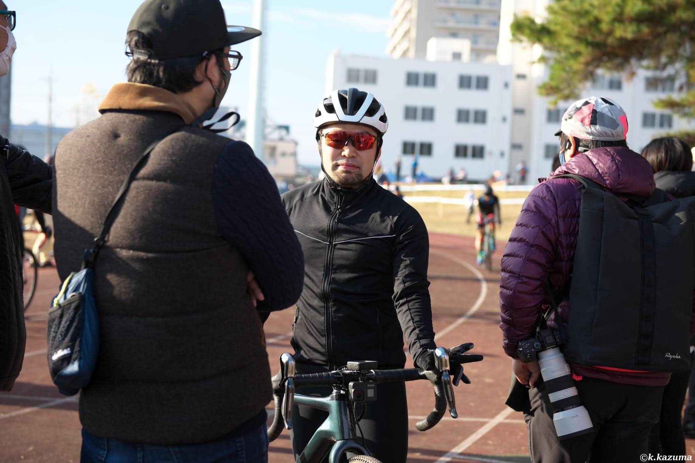
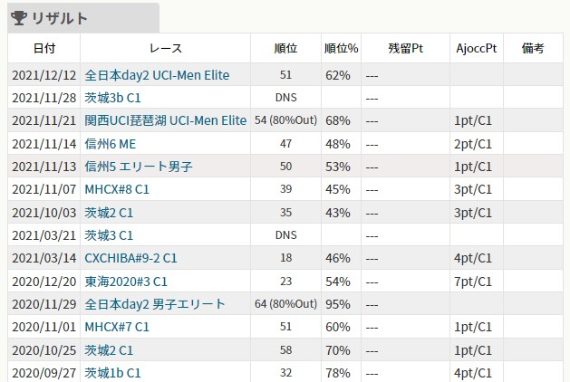

この記事は[ロードバイクアドベントカレンダー](https://adventar.org/calendars/6602)16 日目の記事です。遅刻してすいませんでした。

遅刻もアドベントカレンダーの華ということで許してほしい。

## はじめに

今シーズンが半分終了した。全日本が終わったので人によってはここでシーズン終了という人も少なくないだろう。

自分のリザルトを振り返ると、今年は概ね昨年より良いリザルトを残すことができた。

シクロクロスはレースごとに参加者の数やレベルに開きがあるので、**n 位という順位は余り比較に適しておらず**、「JCX レースかどうか」「**順位%**」の 2 点がレース間でリザルト比較するときの目安になる。

昨シーズンまでは JCX レースで順位%が 70%前後というのが相場だったが、今年は 50%を割り込むことが多くなり、明らかなリザルトの改善が見られる。

というのも、今年は昨年の全日本選手権で早々に落車してしまい、JCF ランキングのためのポイントを余り稼げなかったこともあり真面目にリザルトを改善しないと参加資格すら危ういという事情があり、（当社比で）真面目に練習へ取り組んだという点が大きい。

今年のアプローチはしっかり結果を出せる程度には良い取り組みだったため、軽く紹介していきたい。

## リザルト向上のアプローチ

シクロクロスにおけるリザルト改善アプローチは、実はレース外にも存在する。

スタート順がリザルトに大きく関わるため、**いいゼッケン番号を手に入れるだけで若干のリザルト向上を見込む**ことができる。

では、良いゼッケン番号はどう手に入れるのかというと、AJOCC ポイントや JCX ポイント順で並ぶ順番を上げるためには**「レースにたくさん参加して、尚且ついい成績を残す」**といった条件が必要となる。

自分の場合、レースは既にたくさん出ているので、後者の「いい成績を残す」という選択肢しか残らないが、そもそも参加レース数の少ない人はこれを増やすだけでもリザルト向上の余地がある点は覚えておきたい。

## レースでいい成績を残すには？

今回の本題。要するに「シクロクロスレースで速く走るには？」という点になるのだが、今回はこの目的に対して、努力する分野を 2 つに大分して考える。

1. **抵抗を少なくする**
2. **出力を上げる**

これだけでは、「重いギアをいっぱい回す」並みの意味のないお題になるので、更に分解していく。

1. **抵抗を少なくする**
   1. 機材
   2. 肉体
   3. テクニック
2. **出力を上げる**
   1. FTP 向上
   2. インターバル耐性向上
   3. 高負荷に 1 時間耐える心肺能力

わかりやすくなってきた。ここまで来ると、具体的なアプローチも見えてくる。

## 1. 抵抗を少なくする

### 1-1"機材"

既に軽量カーボンチューブラーに油圧 Di2、カーボンフレームという文句なしの装備を使っているため、今シーズン特に変更はない。

強いて言うなら、レース前はしっかり基礎的なメンテとチェックをしておくくらいか。

### 1-2"肉体"

今年最も大きかった変化。シクロクロスシーズンに合わせるため、春先から夏にかけてボディービルダーの体づくりを参考に、食生活とトレーニングを管理して肉体改造を試みた。

<LinkBox url="https://blog.gensobunya.net/post/2021/06/magma_cyclist/" />

> 栄養管理アプリ [MyfitnessPal](https://www.myfitnesspal.com/ja/) を利用して、一日あたりの摂取カロリーを基礎代謝の 1500kcal に設定することが原則。
>
> 最低限の運動パフォーマンスと、仕事のパフォーマンスを確保するために炭水化物カットは絶対 NG（以前痛い目を見たことがある）。代わりに脂質をガッツリ減らして炭水化物とタンパク質をメインの栄養源とする

上記の食生活に加え、定期的なウェイトトレーニングとランニングを用いて、有酸素運動で動ける体を作り直した。

運動量は[GARMIN のエントリーモデルスマートウォッチ](https://www.amazon.co.jp/dp/B096KJL2DS/)を活用して、週間運動量目標を高く保つことを習慣づけた。

<LinkBox url="https://www.amazon.co.jp/dp/B096KJL2DS/" isAmazonLink />

GARMIN CONNECT に運動ログを集約させたことで、**運動量はもちろんライフログ（主に安静時心拍数）を用いた体調管理**も行い、オーバートレーニングにならず**仕事にも影響が出ないラインを客観的に維持**できるように心がけた。結果として、以下の成果を出すことができた。トリプルファイブ！

- 体重**-5kg**(ピーク比)
- 体脂肪率**-5%**(ピーク比)
- 腹囲**-5cm**(前年比健康診断値)

ざっくり言うと**脂肪を減らして筋肉を増やすことができた**。かなり身軽になり、主観的には再加速やトルクの必要となる場面を楽にこなせるようになったと感じる。

### 1-3"テクニック"

これは記事に収まりきらないためこちらは C99 で頒布予定の[「Cyclocross Deep Dive」](https://www.gensobunya.net/c99/)に詳しく書いている。こちらを参照してもらいたい。

<LinkBox url="https://www.melonbooks.co.jp/detail/detail.php?product_id=1163552" />

### 2-1,2"FTP 向上・インターバル能力向上"

これに関しては、関西 CX の有志で行っている週 1 回の Zwift ミートアップに参加することで向上した。

毎週火曜日に 1 時間前後のメニューを行うというシンプルなミートアップだが、主催者が事前にメニューをお試しして、簡単だったらベース強度を上げる指示があったりその逆もあったりする。更には 2 カ月に 1 度は FTP 計測があったりと、ホスピタリティがある運営となっている。

火曜日という設定も絶妙で、週末のロングライドやレースの後でもそれなりにこなせる上に、翌週に響きづらい曜日選定となっていることも続けやすい要因だった。

こうした自転車特有の能力を向上させる際は、**「時間」「強度」をターゲットとなるレースに合わせる**ことが重要となる。ご存じの通り C1 のレースは 1 時間であり、（JCX なら 30 分から 50 分になるが）このミートアップはバッチリの時間設定ということになる。FTP は 10%ほど半年で向上した。

今年はこの練習会からアンダークラスの全日本王者も輩出しており、なんかすごい。

### 2-3"心肺能力"

パワートレーニングのインターバルでは再現できないシクロクロスのラストピース。

これに関しては**シーズン直前にひたすらタバタ**をやりこむことで適応させた。

シクロクロスでは、「ランニングで必要以上に消耗しない」という裏要素もあるのだが、これは肉体改造の時にランニングを取り入れることで解決している。

## まとめ

今年は練習の目標と効果を明確にして、そこへのアプローチは定量的に行うという方針でリザルトアップを狙ったところ、見事にハマってくれた。

体育会系でちゃんとやってきた人は**練習の目的理解とアプローチの正しさの両方が重要**だということはご存じかと思うが、自転車界であまりそういったことをいう人を見ないのでちゃんと言語化してみた。根性も重要だけど、考えて練習することで根性を何倍も活かすことができる。
