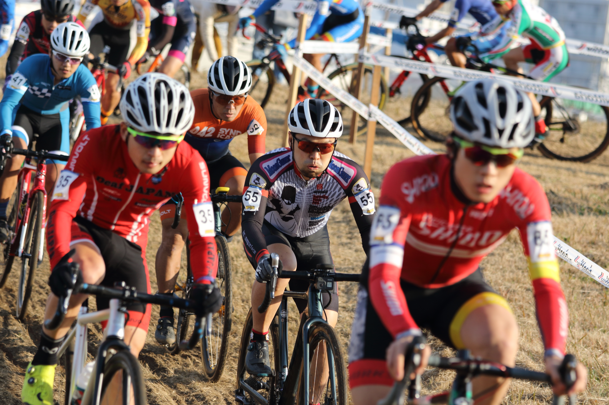

## Summary

今シーズンの成果を存分に発揮し、最低目標だったゼッケン番号以上のフィニッシュは達成。

一方で、落車でポジションを落としてリズムを崩してまた落車してしまうなど、もったいない場面もあった。ノーミスならあと 10 近くは順位を上げられたはずなのだが…

## リザルト

51/81 位(-3 lap, 62%)

### 機材

- メインバイク
  - GIANT TCX ADVANCED PRO
  - Farsports CX TU + A.Dugast Smallbird 33mm (F: 1.60bar, R: 1.70Bar)

## 試走レビュー

超どフラットかつ、直線も長い。ちょっとした登り返しから直線につながり、ひたすらにパワーを要求されるコース。

コーナーも少ないわけではないので、稼ぐことはできるが決定的な差にはなさならそう。1 か所ある激登りは処理で差が開きやすい。水はけの悪い場所は泥になること間違いなしだが、エリートレース前の試走が始まるころには轍がしっかりできておりそこまで問題にはならなさそうな具合だった。

最も問題なのは、舗装路コーナーが全て魔のコーナーと言ってもいい高速からの泥で滑りそうな具合。U23 のレースでも大勢が犠牲になっていた。

## レース

https://youtu.be/GL9BCkRjYY8

スタートは今年一の平和さ。レイアウトがいかにも行き場のない人を生みそうだったが、全員で安定したコーナーラインを作ったおかげか大乱なく序盤進行する。

序盤は 40 位台のパックに入り、自分と脚力差のある人たちばかりと一緒に走ることになる。

コーナーの連続や激登り・シケインで追いかけられるからいいものの、立ち上がりの踏み出しが圧倒的に違う。踏みなおしの必要になる局面ごとに離され、舗装路でどうにも後ろに付ききれず苦しい展開に。

ただし、苦しい展開でも細かいミスをした人をキャッチしては抜いていくことで順位はじわじわ上げることができた。調子の上がり目を感じる 4 周目に、コーナーの侵入スピードを誤り、うっかりフロントブレーキを握ってしまい落車。その瞬間はなぜ転んだかわからなかったので、直後にまた舗装路で転んでしまう。

その後は混乱してリズムに乗れない周回となったが、上記原因に気が付いてからは再度ポジションアップを開始。2 周かけて元のパックに復帰し、6 周完了時に後ろで 80%カットが行われたことを確認したので、ここで最後とばかりにパックを喰いにいく。

この周回だけで 3~5 ほど順位を上げ、予定通り 80%カットで終了。とはいえ、あと 10 秒ほど速ければもう 1 周いけたようだった。

終盤にポジションアップを図れたことは収穫、基本を忘れてコケたことは反省。

今年のレースはこれで終わり、来年千葉 CX から 2022 年をスタート予定。今シーズンは全て JCX/UCI レースとなっていて、一度もフルタイム C1 レースを走っていないので、1 時間体がもつのか心配だ…

## Photo

Cover photo by [@sw_danzou](https://twitter.com/sw_danzou)
