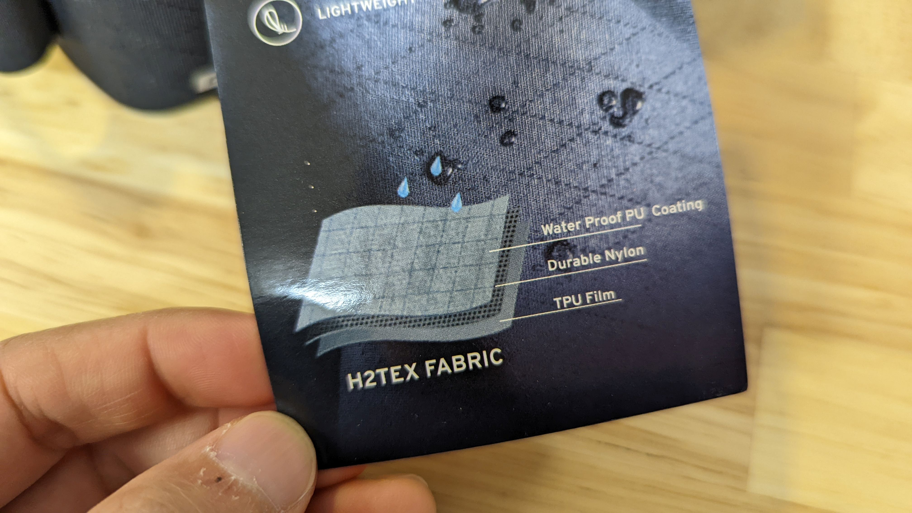

コンパクトでイマドキなサドルバッグが欲しくなった、なるべく安く。

そんな欲望のもと見つけたのがこちらの製品、GIANT の H2PRO SEAT BAG だ。

<LinkBox url="https://www.giant.co.jp/giant22/acc_datail.php?p_id=A0002824" />

ちなみに、今回イメージした「イマドキの」とは APIDURA EXPEDITION TOOL PACK のことだ

<LinkBox url="https://skmzlog.com/apidura-expedition-toolpack/" />

最低限必要な容量を保ちつつ、サドルの下で邪魔にならず、取り付けもシンプル。もちろん防水。

## 必要最低限のサイズ・ロールトップ防水・機能性

APIDURA, GIANT 共に公称容量は 0.5L だが、バッグの形状が異なっている。APIDURA がスマートな流線形になっているのに対し、GIANT はお弁当箱スタイルだ。

公式のサイズ表記も GIANT が若干大きい。

個人的には、APIDURA の方が見た目がシュッとしているが、荷物の収まりやすさという点では GIANT に軍配があがりそうだ。ブランドカラーの主張がないのも GIANT のポイント。

リアにはもちろんクリップライトの取り付け部分が用意されている。

あと気に入ったのは、GIANT H2PRO SEAT BAG はベルクロがフラップに使われておらず、完全なロールトップになっている点。若干の重量増にはなっていそうだが、防水性や耐久性ではメリットがあるはず。マジックテープの劣化は対応が難しい…

防水素材は、共に「軽量 TPU ＋ナ耐久イロン＋防水 PU」の三層構造。**利用している素材は違う**のだろうが、大きな括りでの名称は一字一句変わらないあたりに笑ってしまう。定番の構造なのだろう。

## 装着方法

H2PRO も例に漏れず、主に**バッグの外穴に通しているベルト一本で固定**する構造になっている。

最大の違いはシートポスト側のベルト。GIANT はこちらに**取り外し可能なベルクロを一本**通している。

基本的にはバッグ側のベルクロで十分固定できるが、シートポスト側のベルトも使うことで、ロードバイクなどで利用する際は左右の揺れを更に抑えることができる。

MTB やグラベルバイクで**ドロッパーポストなどを利用していて、シートポスト側に巻きつけたくないときは外して使うことも可能**だ。

残念ポイントは、このベルトがかなり硬い素材になっていること。バッグ側のベルトと共通の素材を利用しているのはやや詰めが甘く感じる。

エアロシートポストでは綺麗に巻くことが難しいので、人によっては常に取り外した状態で運用してもいいだろう。
