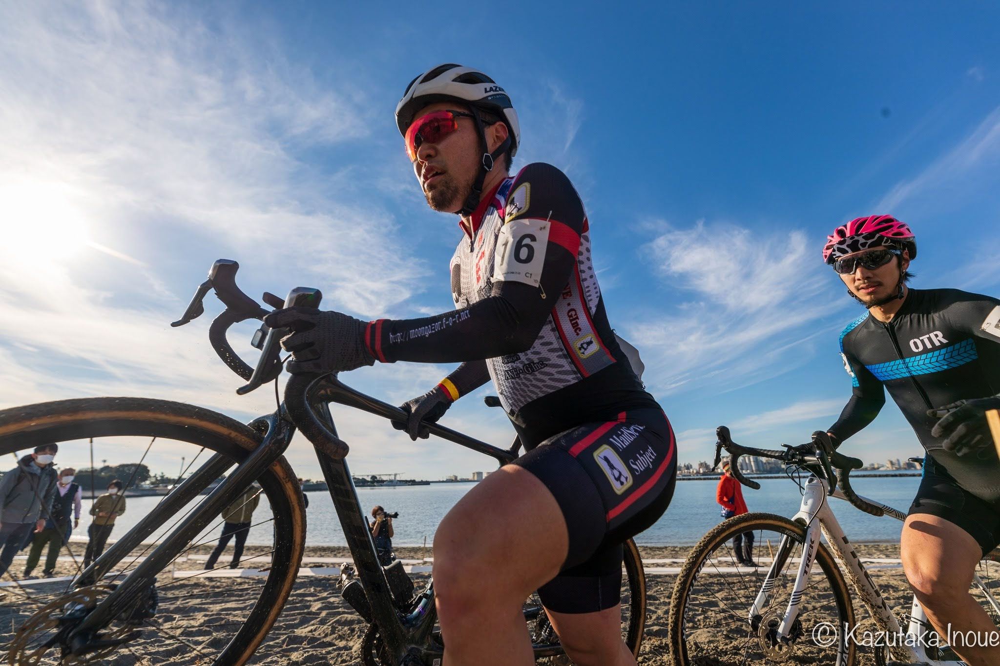

## Summary

新年一発目にして**今期初めての 80％ルール非適用レース**。

ラップタイムはまとまっていたものの、全日本以来の高強度ということもあり、パフォーマンスの上限が低い状態だったように思う。残念ながら20秒ほどの差でフルラップできなかった。

## リザルト

28/52位（-1 lap)

### 機材

- メインバイク
  - GIANT TCX ADVANCED PRO
  - Farsports CX TU + A.Dugast Smallbird 33mm (F: 1.??bar, R: 1.??Bar)

## 試走レビュー

首都圏が雪に覆われた後の会場、日照のないエリアに雪や凍結が残るコースだったものの、昼試走から午後レースにかけてほぼ水や泥は引いていたので影響は少なかった。

砂の部分も例年に比べて特に難しいということもなく、斜度のきつい丘の登りと砂エリアの疲労で後半ペースが落ちないことが重要だと思われた。

## レース

JCXレースと違い、スタートエリアが舗装路ではないローカルCXにしかないレイアウト。

この日はスタートグリッド内がバッチリ泥でぬかるんでおり、場所を選ばなければグリップが怪しいという状態。なるべく乾いている左のグリッドを選びたかったが、自分はゼッケン16番と選択肢のない番号を引き当ててしまった。

余っていた2列目グリッドを手に入れたはいいものの、フラグ回収とばかりに自分の前の1列目ライダーがスタートに失敗した。マリオカートさながらのスリップを見せてスタートしたころには既に中盤後方エリアとなってしまった。

その後はペースを刻んで、砂エリアと下りで徐々に落ちてくるライダーをキャッチしたり後ろからの追い上げにキャッチされたり。チャンピオンシステムの高田君さんが1周目でシケイン大前転をかましているのを横目で見ていたが、後からしっかり追いついてきて、しかもそのあとフルラップ完走していたので非常に感心していた。

自分はフルラップギリギリのペースであることがなんとなくわかったので、後半ペースを上げて追い込んだものの、最初から最後までデッドヒートしていた先頭パックから逃げ切ることはかなわず、-1 Lapでゴールとなった。

体の感触としては悪くなかったものの、JCXで40％台に食い込むことが多くなっていたシーズンということもあり、28位（53%）というリザルトはやや不満。烏丸でもスタートで出遅れてそのままポジションを大幅アップできずにフィニッシュとなってしまっていたことを思い出した。

リザルト安定のためにはペースアップをする余力や、インターバルの上限を上げるような能力が必要になりそうだ。

## Photo

Cover photo by Kazutaka Inoue
