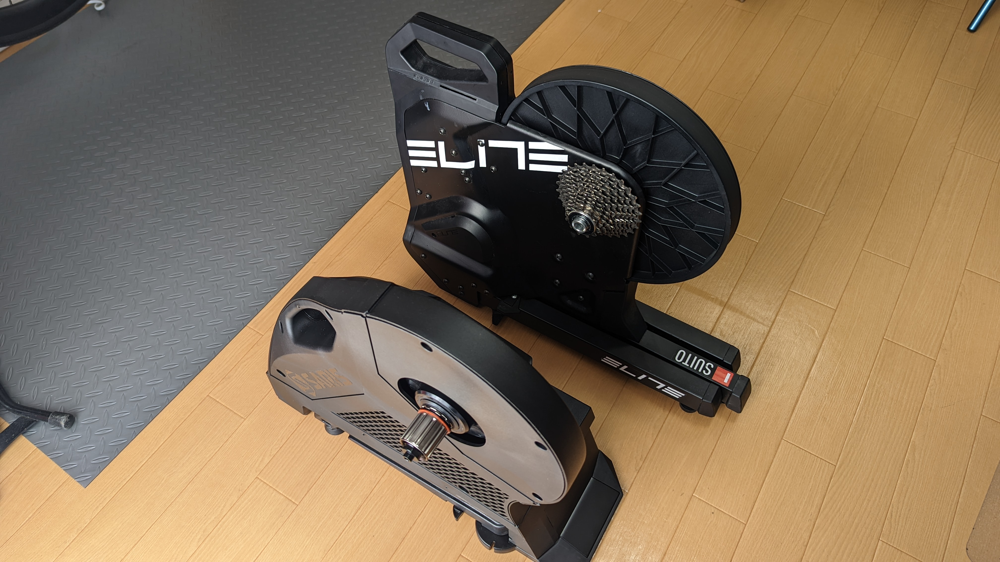
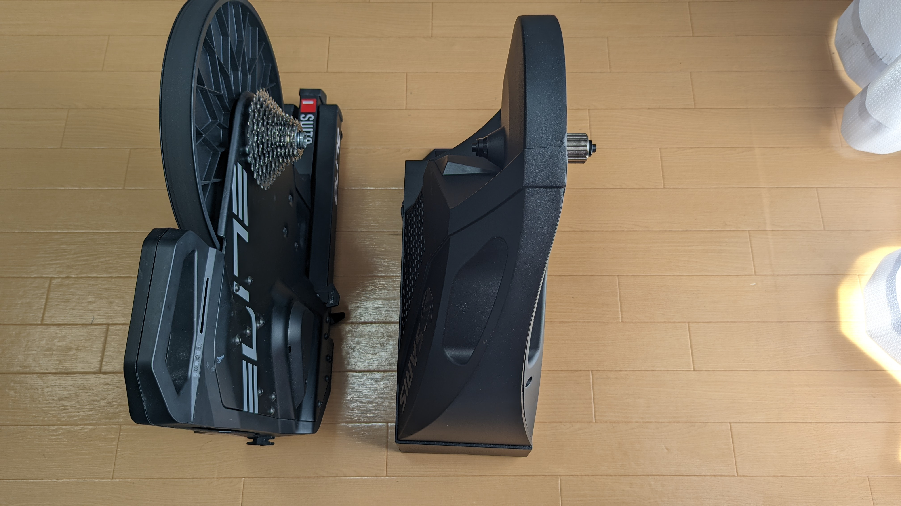
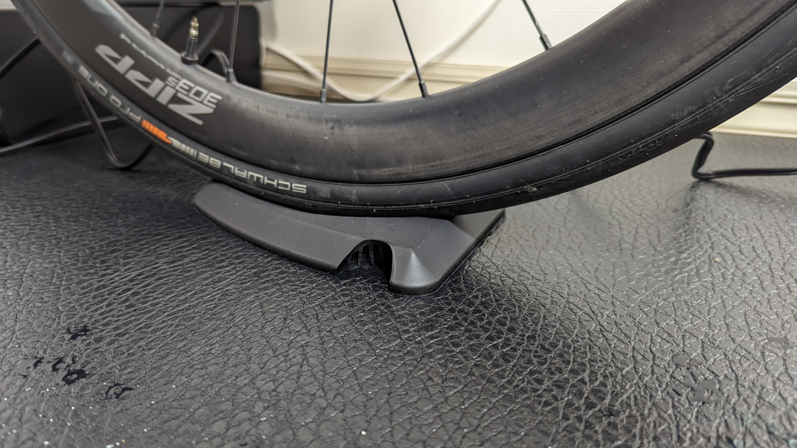
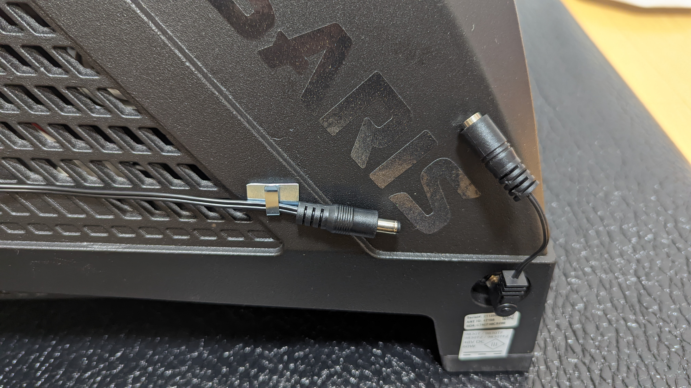
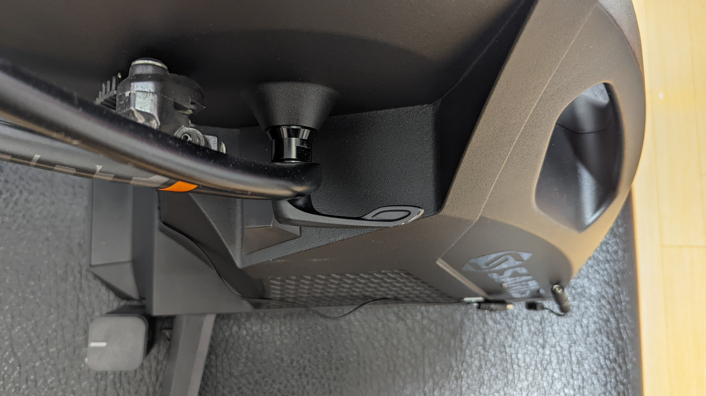
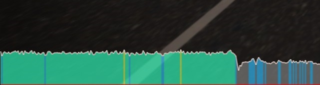
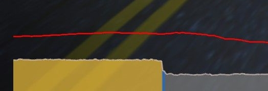

## Saris H3 ダイレクトドライブ・スマートトレーナー

発売からしばらく経っているので、スマートトレーナーに興味を持っているサイクリストで [Saris H3](https://amzn.to/3nLl0fQ)を知らない人はおそらくいないのではと思う。

Saris は元々サイクルキャリアのブランドで、老舗パワーメーターのパワータップを販売していた CycleOps というブランドを傘下に持っていた。

今ほどパワーメーターが一般的でなかった時代に、最も安いパワーメーターの選択肢として PowerTap を使っていた・検討していた古株のサイクリストも多いだろう。

CycleOps ブランドは現在 SRAM 傘下だが、Saris(CycleOps)としては以前からスマートトレーナーを発売していて、現在の Latest モデルがこの[H3](https://amzn.to/3nLl0fQ)だ。

<LinkBox url="https://www.amazon.co.jp/dp/B07WP6JTN4" isAmazonLink />

## スペック・取り回し

現存するメインストリームのリアエンド規格への対応や、ダイレクトドライブ方式など一般化した点は省くと、スペックで気にする点は以下の通り。

- 最大パワー 2000W
- パワー計測誤差 +-2%
- 最大幅 収納時 215.9mm, 展開時 787.4mm
- 重量 21.3kg

格納時はそこそこ小型になる印象だが、収納性をウリにしている [Elite SUITO](https://amzn.to/3IoJwLp)(収納時幅 150mm)に比べると流石にずんぐりと大きめに見える。

<LinkBox url="https://shopping.yahoo.co.jp/products/z79dtn4n2v" />

[SUITO](https://amzn.to/3IoJwLp) は非常にコンパクトで、14kg という重量も相まって常時ローラーエリアを作ることのできない住宅でも折りたたんでしまうという行為が非常にやりやすかった。

<LinkBox url="https://blog.gensobunya.net/post/2020/09/elite_suito/" />

[H3](https://amzn.to/3nLl0fQ) は**大きさこそコンパクトになっているものの、重量が 21kg とかなり重い**ので、出したり仕舞ったりする用途には向かないだろう。

展開してみると、脚がほぼ 90 度に開き、筐体下部に納められていたライザーブロックが出てくる仕組みになっている。

イケている仕組みではあるが、そう何度も仕舞うものではないので、このギミック自体は大した意味を持たないのだが、重要なのはその薄さ。

Elite やミノウラのローラーになじみのある人間からすると**非常に低いライザーブロック**だ。

この影響で、今まで使っていたどのローラーよりも**サドルの地上高が抑えられる。そのおかげで乗り降りがしやすい。**この点は非常に良いと感じた。

飛び乗りやペダルを軸に乗り込んでもいいが、フレームに悪いことは明らかなので、自然に乗れるというのはストレスが低い。

また、電源アダプタのケーブルが真横に飛び出る設計はどうかと思ったが、L 字アダプタがついてくるので配線も自由度が高くなる点が Good。

自分は電源の ON/OFF のしやすさと、ルンバがぶつかってこないようにフックを取り付けてケーブルが床におちないよう工夫してみた。

### ここがダメだよ

スマートトレーナーを何代か生産しただけあって、様々な点が考えられているのだが、1 点明らかに失点では？と思う部分があった。

それが反ドライブ側の構造。下の写真を見てほしい。

クリックリリースの自転車ならば問題にはならないが、**レバーを回転させる必要のあるスルーアクスルの場合、思いっきり筐体と干渉してしまう。**

**六角レンチやマグネットで取り外し可能なスルーアクスルの場合は、そこまで大きな問題にならない。**が、自分の TCR は少し古めのモデルだからか、レバーが固定されているタイプ。

レバー部分を外すことができるから良かったものの、そうでなかったらそもそもローラーへの取り付けができないところだった。

スルーアクスル対応しつつ、この構造は片手落ちとしか言いようがない

## トレーニング時の感触

Zwift で 10 分ほどウォーミングアップして、キャリブレーションを行った後にワークアウトを一本行ってみた。

### 負荷調整の優秀さ

**負荷の自動調整が滑らかである**ことがすぐわかった。[SUITO](https://amzn.to/3IoJwLp) では、コースの起伏に対する負荷の上下に若干の遅れがあるのは仕方ないものと思っていたが、H3 はすぐに負荷が切り替わり、**実走行とさほど変わらないタイミングでシフトチェンジして気持ちよく走ることができる。**

ワークアウトでは、インターバル時に**ターゲットパワーに入るまで 10 秒前後調整される点は変わらない**ものの、その後の安定性に大きな差がある。

まずはこれまでのワークアウト。

ターゲットとなるパワーバンドを維持しているものの、パワー値そのものは上下を繰り返している。一方で[H3](https://amzn.to/3nLl0fQ)でワークアウトをした時の絵がこちら。

**同じセクションで、パワー値の変動がほとんどない。**これまでは、+-15W ～ 20W 程度の誤差は ERG モードのご愛嬌だと思っていたが、これほど安定しているとメニューの難易度がかなり変わってくる。

これまでのメニューがマイクロインターバルに思えるほどだ。

### 安定性

もう一つ特筆すべき点があり、重量と脚の設計から来るものと思われる剛性・安定性の高さがある。

パワーをかけても余計な振動は発生しないし、車体ごと左右に振れる感覚も小さく、安心してペダリングできる。

トレーナーに限らず、ステムなどの剛性の高さが重要なパーツは、実際に良いものを体感しないとその意義がわからないことも多い。トレーナーでもこの感覚を得るとは思わなかった。

## まとめ

総じて高品質なバーチャルライドをするために、機能のみならず品質も作りこまれているスマートローラー。

その分、定価もお高くなっているので、この品質を必要とする層としては**パワートレーニングをやりこむライダーや、バーチャルレースを積極的に行う層には価格なりのメリットがある**だろう。

バーチャルサイクリングを楽しむだけなら、10 万円を切る価格帯のスマートトレーナーで十分だと感じた。**ライドクオリティに 1.5 倍の価格を投入してもよいが、機能的には変わらない**点には注意。

<PositiveBox>

- 高精度な ERG モードによる安定したワークアウト体験・リアルなバーチャルコース体験
- 大型筐体とほぼ直角に出る脚による安定感の高さ
- スタックハイトが低い設計による乗り降りのしやすさ

</PositiveBox>

<NegativeBox>

- スルーアクスルレバーとの相性の悪さが致命的
- フットプリントの大きさ（安定感とトレードオフ）
- 価格はあくまで品質の向上に使われているため、機能は 10 万以下のトレーナーと余り変わらない

</NegativeBox>

<LinkBox url="https://paypaymall.yahoo.co.jp/store/cycle-yoshida/item/00649537?sc_e=slga_fpla" />

<LinkBox url="https://www.amazon.co.jp/dp/B07WP6JTN4" isAmazonLink />
