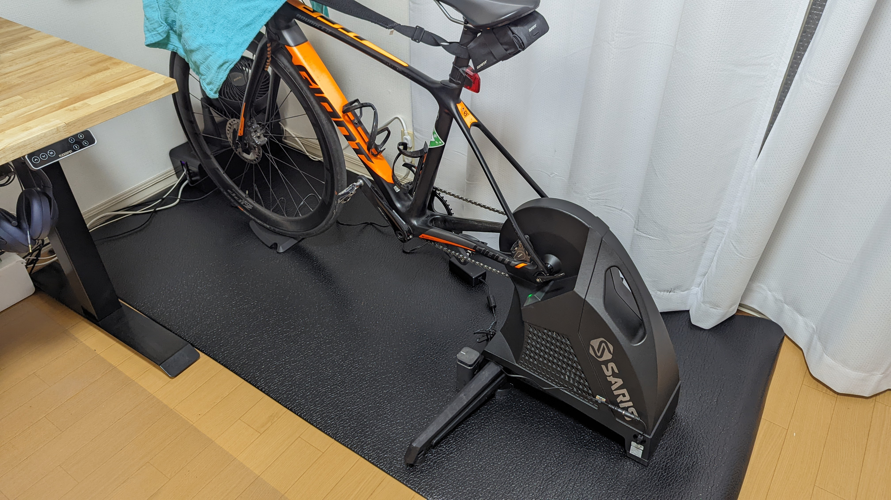

## Saris H3 ダイレクトドライブ・スマートトレーナー

<LinkBox url="https://www.amazon.co.jp/dp/B07WP6JTN4" isAmazonLink />

<PositiveBox>

- 高精度な ERG モードによる安定したワークアウト体験・リアルなバーチャルコース体験
- 大型筐体とほぼ直角に出る脚による安定感の高さ
- スタックハイトが低い設計による乗り降りのしやすさ

</PositiveBox>

<NegativeBox>

- スルーアクスルレバーとの相性の悪さが致命的
- フットプリントの大きさ（安定感とトレードオフ）

</NegativeBox>

<LinkBox url="https://paypaymall.yahoo.co.jp/store/cycle-yoshida/item/00649537?sc_e=slga_fpla" />

<LinkBox url="https://www.amazon.co.jp/dp/B07WP6JTN4" isAmazonLink />

<LinkBox url="https://online.ysroad.co.jp/shop/g/g0012527018642/" />
