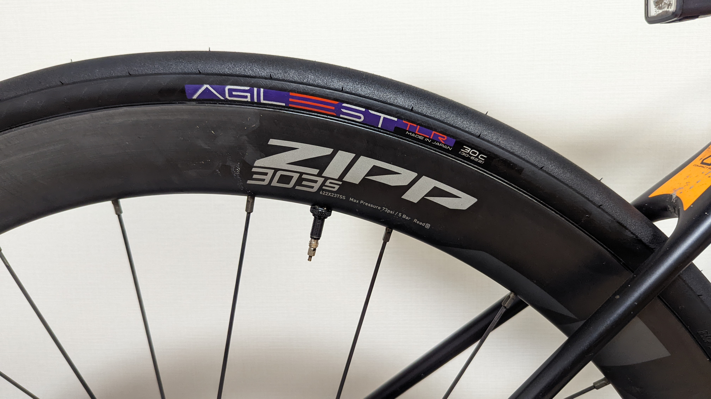

「ROAD 再定義」をキャッチフレーズに 2 月下旬に発表された Panaracer の新ロードタイヤシリーズである AGILEST シリーズ。

<LinkBox url="https://prtimes.jp/main/html/rd/p/000000005.000070119.html" />

発表時に、春以降に発売とされていたチューブレスレディモデルだが、Panaracer 様の厚意で一足先に 30c 現物をワンセット手に入れたので、実走を交えてレビューを行った。（筆者は Panaracer アンバサダーではない）

珍しく、多くの画像を交えた長い記事となるので、時間のない人向けにポイントのみ先に掲載しておく。

## TL;DR

<PositiveBox>

- 装着の簡単さ
- 購入コストの低さ
- 25c, 28c の TLR タイヤを遥かにしのぐ乗り心地と走行抵抗の低さ
- 良くグリップするコンパウンド
- グリップに反した転がりの軽さ
- 低圧でも腰砕けにならない剛性と、軽さを活かした登坂性能

</PositiveBox>

<NegativeBox>

- オールロード用途にはやや不安の残るしなやかさと構造
- (おそらく)寿命は短め？価格で相殺か

</NegativeBox>

## 目次

1. 観察
2. 装着
3. 実走
4. 推測

今回レビュー時に浸かったホイールは、リム内幅 23mm の[ZIPP 303S](https://paypaymall.yahoo.co.jp/store/qbei/item/pc-810594/)。

ワイドリム・フックレスと近年のトレンドをいち早く取り入れたホイールで、ロードからグラベルまで幅広く使えつつフックレスの恩恵によるエアボリュームの高さ・低圧走行で走行抵抗を抑えることができる。

1 年半ほど利用しているが、他のホイールを買う気持ちが一切起きない。

<LinkBox url="https://blog.gensobunya.net/post/2020/10/zip303s/" />

交換前のタイヤは[PRO ONE Tubeless Easy](https://www.amazon.co.jp/dp/B07WPV58SC/?tag=gensobunya-22)。十二分に優秀なタイヤで、オールロード的に使えるしなやかさを持った TLR タイヤで転がりも軽く、愛用していた。

<LinkBox isAmazonLink url="https://www.amazon.co.jp/dp/B07WPV58SC/" />

## 1. 観察

何はともあれ、まずは重量計測からスタート。30c タイヤの公称は 270g だ。

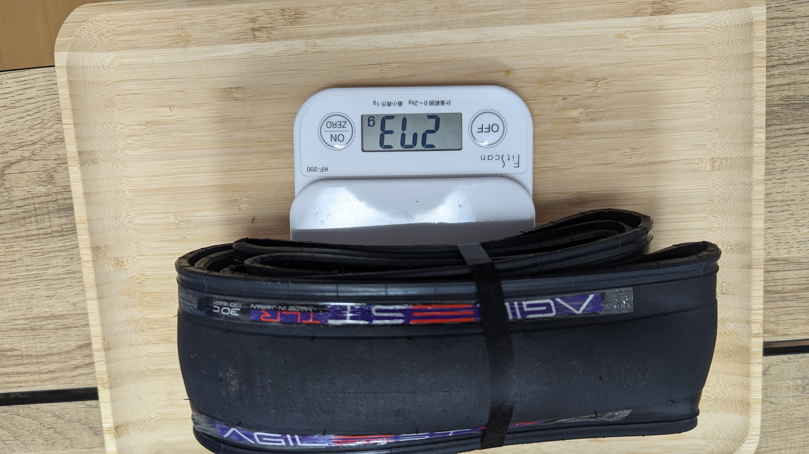

計測結果は 276g, 273g。タイヤをまとめているバンドが 1g だったので、各 275g, 272g が実重量だった。

30c の TLR タイヤとしてはかなり優秀な公称値であったが、**実測値も公称とほぼ変わらず、同幅タイヤ内でトップクラスの軽さとなっている**

なお、比較対象にてしていく **[Pro One TLE](https://www.amazon.co.jp/dp/B07WPV58SC/?tag=gensobunya-22) は公称 305g に対して、実測 290g だった。**

<LinkBox url="https://blog.gensobunya.net/post/2020/06/proonetle/" />

タイヤの各部には、これでもかと Panaracer の新ロゴが入っている。

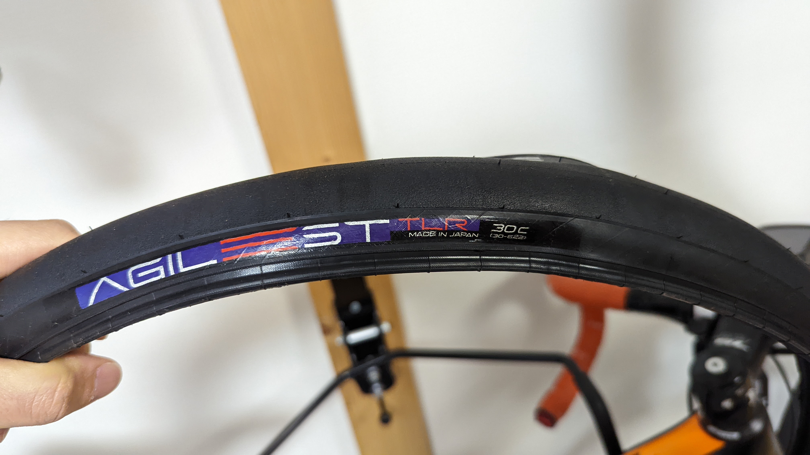

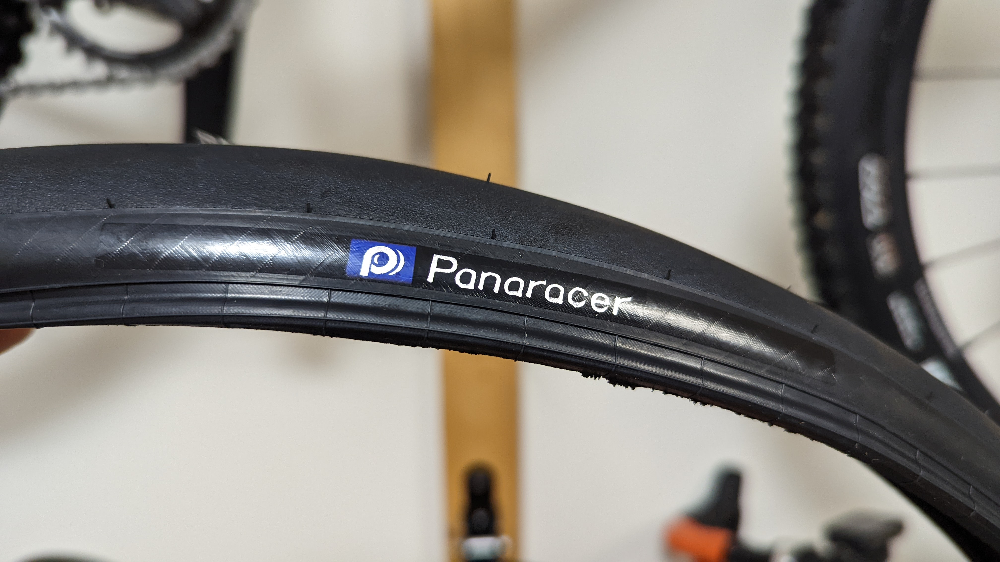

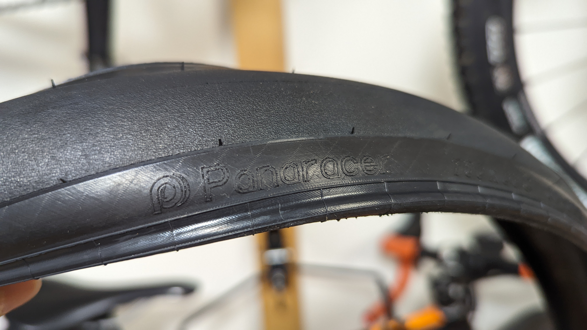

エンボス部分でもロゴがしっかりフォントまで刻印してあるのは笑った。

**最大空気圧は 6Bar**と規定されている。ただし、**30c だと上限まで上げることはほぼ無いと言える。**

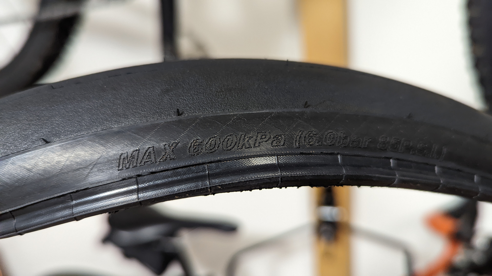

**フックレスリムで運用する場合の常用空気圧は、体重にもよるが 3.5Bar から多くても 4.5Bar を越えるくらい**となるだろう。

そもそも 6 気圧も入れたらリム側の許容値を越えてしまう。

タイヤの摩耗インジケーターも入っている。が、経験上見てきたものと比べ、やや浅いか…？

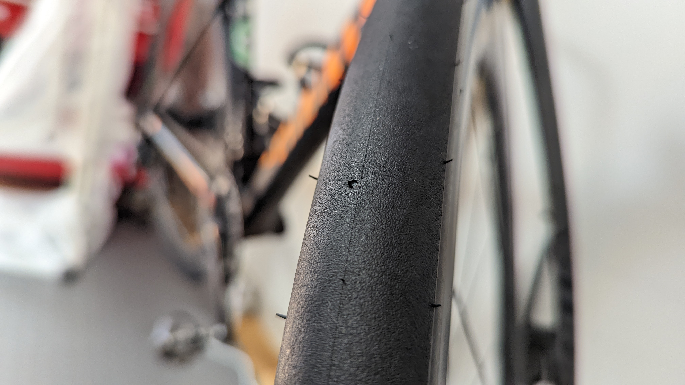

折りたたまれていたタイヤを広げても、癖がついておらず、すぐに綺麗なタイヤの形になったのが印象的だった。

## 2. 装着

**チューブレスレディタイヤの最大の壁**である装着難度。

新しいタイヤを試すとき、ビードを上げ直すとき、常に長期化の覚悟が必要だった。

導入で挙げた[ZIPP 303S](https://paypaymall.yahoo.co.jp/store/qbei/item/pc-810594/)の購入時、後輪だけは中々ビードが上がらずリムテープを追加で 2 重巻きにしていたが、今回のレビューでは素の実力を測るためにあえて付属のリムテープだけの状態にしてスタートした。

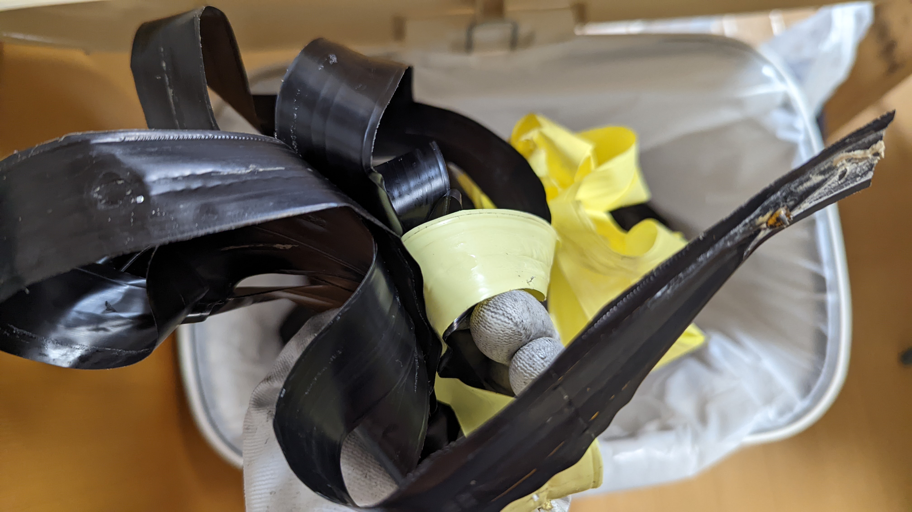

工業製品なので、どうしても製造誤差が出てしまうのは仕方がない。

ホイール側の直径にマイナス誤差が出たらテープを追加で巻いて対応するのが定番。それを今回捨ててからスタートする。

シーラントは、エア漏れを防ぐ能力だけは非常に高い OrangeSeal のエンデュランスシーラントを用意した。

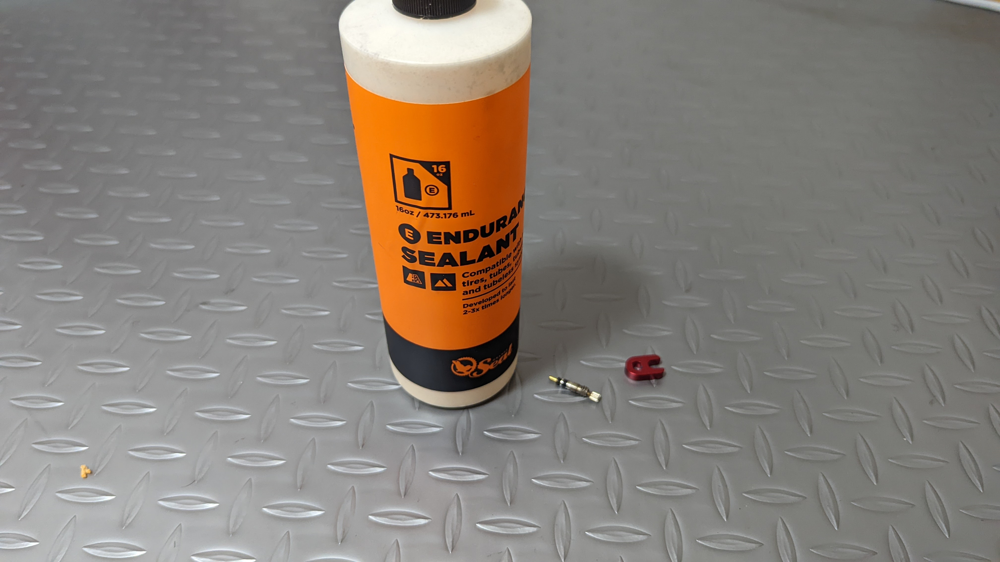

<LinkBox url="https://www.chainreactioncycles.com/jp/ja/orange-seal-endurance-sealant-refill/rp-prod179168" />

これに加え、ビードが上がらなかった時に追加するための[リムテープ](https://amzn.to/3tIoeCV)や、[チューブレスタンク](https://amzn.to/3vWdJOP)を用意して臨んだ。

<LinkBox isAmazonLink url="https://www.amazon.co.jp/dp/B08QCHSTC7/" />

<LinkBox isAmazonLink url="https://www.amazon.co.jp/dp/B07XHGM23B/" />

[Pro One TLE](https://www.amazon.co.jp/dp/B07WPV58SC/?tag=gensobunya-22)で簡単に装着できた前輪は手とフロアポンプのみでビード上げが完了し、苦戦を強いられた**後輪ではコンプレッサーの使用や、追加のリムテープ巻きが必要となると予想。**

**しかし、結果として両輪ともあっさりと手とフロアポンプのみでビード上げに成功!!**

使ったケミカルは潤滑用のハンドソープだけ。**予想以上のビードの上げやすさに感動**した。安直な表現だが神 TLR タイヤと言ってもいい。

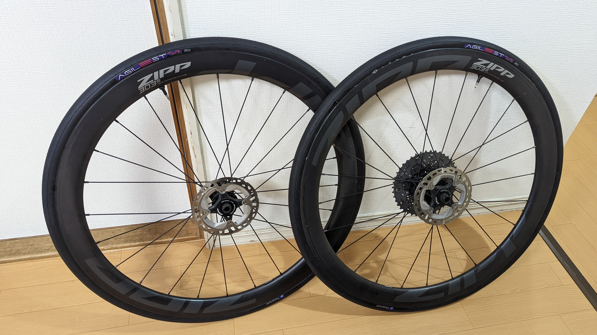

思わず喜びをパナレーサーの担当者に伝えたところ、「1mm 単位で周長を詰めた甲斐がありました」とのこと。<strike>世の中のタイヤはミリレベルの誤差を許容していたのか……</strike>

フィットするであろうと考えていた前輪はほぼ空気抜けの予感すらないが、後輪は若干空気の抜ける音がしていた。

もちろん、TLR タイヤである以上気密は完全ではなく、シーラントを入れて完成となるので、このあとバルブからシーラントを入れて作業はあっさりと完了。

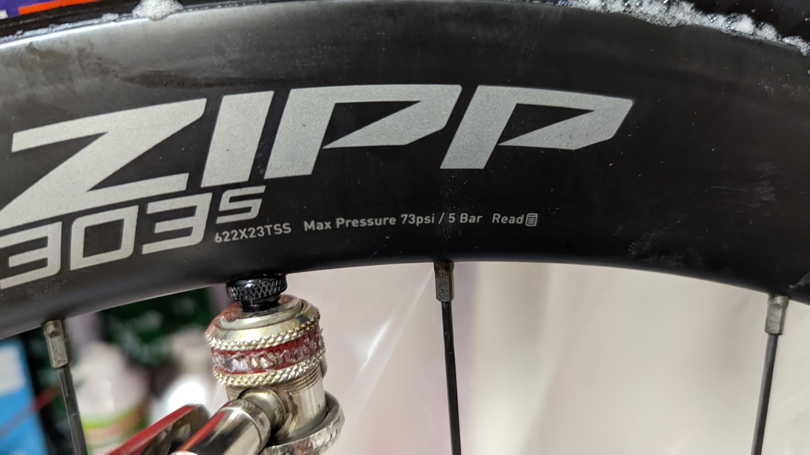

[ZIPP 303S](https://paypaymall.yahoo.co.jp/store/qbei/item/pc-810594/)の上限空気圧は 5Bar なので、ここまで空気圧を上げてシーラントを全周になじませて一晩置く。

翌日朝の空気圧は前後共に 4.5bar 程度。この程度の減少ならば許容範囲内だ、**一発で前後とも装着が決まるロード用 TLR タイヤはこれまでなかったので、最高クラスの装着体験だと言える。**

## 3. 実走

### 転がり

### グリップ

### 衝撃吸収

### 走行感・剛性

## 4. 推測

### オフロード走行性能

### 最強のコストパフォーマンス、だが寿命は？

税抜参考価格は 6700 円となっているので、PR TIMES を信じるのであれば税込定価は 7370 円となる。今回比較対象ベンチマークとした**シュワルベのプロワン TLE 30c が税込 12100 円**であることを考えると相当に安い。

<LinkBox url="https://prtimes.jp/main/html/rd/p/000000005.000070119.html" />

## まとめ
