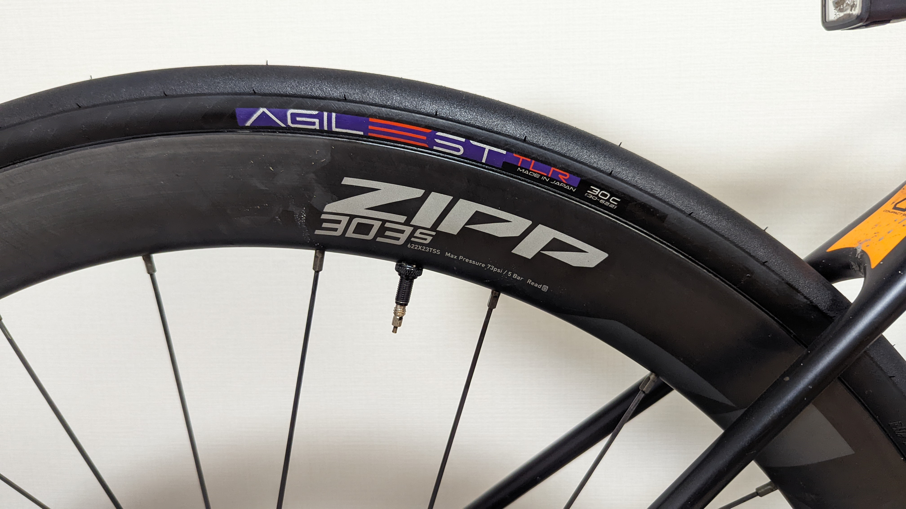

「ROAD 再定義」をキャッチフレーズに 2 月下旬に発表された Panaracer の新ロードタイヤシリーズである AGILEST シリーズ。

<LinkBox url="https://prtimes.jp/main/html/rd/p/000000005.000070119.html" />

発表時に、春以降に発売とされていたチューブレスレディモデルだが、Panaracer 様の厚意で一足先に 30c 現物をワンセット手に入れたので、実走を交えてレビューを行った。（筆者は Panaracer アンバサダーではない）

個人的に注目している**28c, 30c のロードチューブレスレディタイヤ**。太いタイヤは転がり抵抗の低減・乗り心地の改善・ワイドリムとのフィット・装着性の改善と様々なメリットがありながら、まだ世間的には流行っていないように感じる。（デメリットは重量）

リムブレーキではキャリパーにより 28c というタイヤ幅制限があったロードバイクだが、**ディスクブレーキ化によって太いタイヤを履けるようになっている**にもかかわらず、そのメリットは主にオールロードやグラベルロードのものという先入観があるのではないだろうか？

端的に言ってしまうと、**AGILEST TLR はロードバイクのために存在している 30c チューブレスレディタイヤ**だった。

珍しく、多くの画像を交えた長い記事となるので、時間のない人向けにポイントのみ先に掲載しておく。

## TL;DR

<PositiveBox>

- 装着の簡単さ
- 購入コストの低さ
- 25c, 28c の TLR タイヤを遥かにしのぐ乗り心地と走行抵抗の低さ
- 良くグリップするコンパウンド
- グリップに反した転がりの軽さ
- 低圧でも腰砕けにならない剛性と、軽さを活かした登坂性能

</PositiveBox>

<NegativeBox>

- オールロード用途にはやや不安の残るしなやかさと構造
- (おそらく)寿命は短め？価格で相殺か

</NegativeBox>

<LinkBox url="https://paypaymall.yahoo.co.jp/store/cycle-yoshida/item/00656140/" />

## 目次

1. 観察
2. 装着
3. 実走
4. 推測

### レビュー前提

レビュー時に使用したホイールは、リム内幅 23mm の[ZIPP 303S](https://paypaymall.yahoo.co.jp/store/qbei/item/pc-810594/)。

ワイドリム・フックレスと近年のトレンドをいち早く取り入れたホイールで、ロードからグラベルまで幅広く使えつつフックレスの恩恵によるエアボリュームの高さ・低圧走行で走行抵抗を抑えることができる。

1 年半ほど利用しているが、他のホイールを買う気持ちが一切起きない優れもの。レースで使うならFirecrestシリーズも検討するかも。

<LinkBox url="https://blog.gensobunya.net/post/2020/10/zip303s/" />

交換前のタイヤは[PRO ONE Tubeless Easy](https://www.amazon.co.jp/dp/B07WPV58SC/?tag=gensobunya-22)。十二分に優秀なタイヤで、転がりよしグリップよし重量よしの万能レーシングモデル。

しなやかさを活かしてオールロード的にも使うことができる。主にこのタイヤとの比較をベースにレビューしていく。

<LinkBox isAmazonLink url="https://www.amazon.co.jp/dp/B07WPV58SC/" />

## 1. 観察

### 重量

何はともあれ、まずは重量計測からスタート。30c タイヤの公称は 270g だ。はっきり言ってとても軽い。

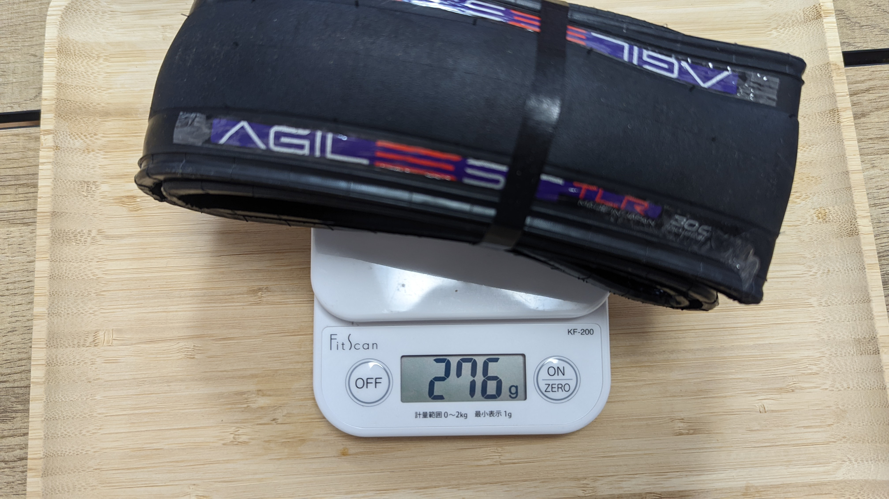

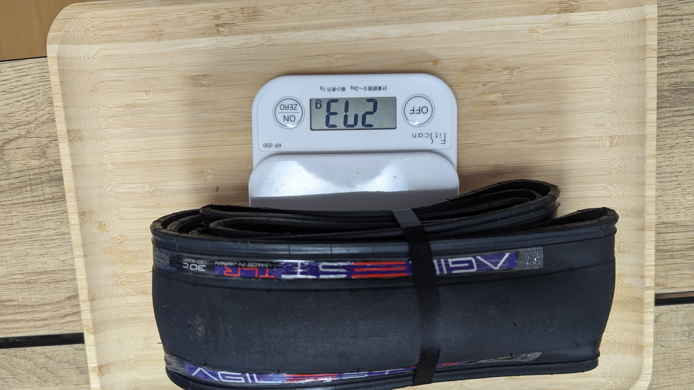

計測結果は 276g, 273g。タイヤをまとめているバンドが 1g だったので、各 275g, 272g が実重量だった。

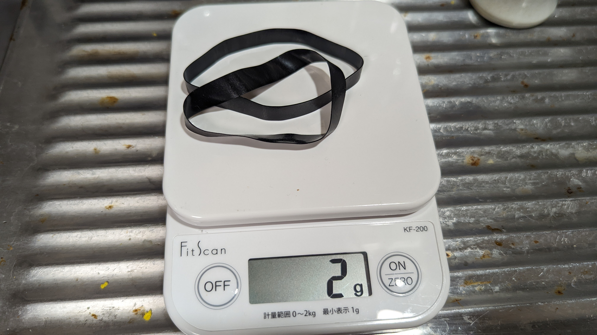

30c の TLR タイヤとしてはかなり優秀な公称値であったが、**実測値も公称とほぼ変わらず、同幅タイヤ内でトップクラスの軽さとなっている**

なお、比較対象にてしていく **[PRO ONE TLE](https://www.amazon.co.jp/dp/B07WPV58SC/?tag=gensobunya-22) は公称 305g に対して、実測 290g だった。**

<LinkBox url="https://blog.gensobunya.net/post/2020/06/proonetle/" />

実測レベルで比較対象より軽量で、なおかつAGILEST TLRは**チューブドモデルと比べても、シーラント込みでも同等レベルの重量となる。**

AGILESTの通常モデルの28cは210g, TLRの28cは250g。

チューブもパナレーサーで揃えるとして、R-Airが公称75gなので、カタログベースではチューブド28cは合計285g。チューブレスでは35gシーラントを入れて同等となる。

### 構造

軽さの要因と推測されるのは、後述するトレッドの厚みを節約？したことに加え、若干細めのタイヤ幅、それに加え**耐パンクベルトを排するという思い切った構造。**

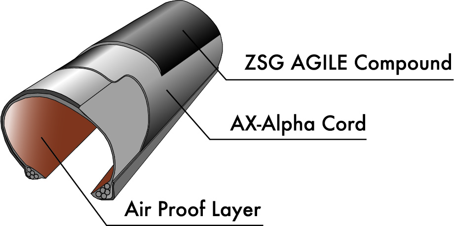

チューブレスレディなので、**シーラントにより貫通パンクへの耐性がある程度確保されているという考え**なのだろうか？

一応の筋は通っている。シクロクロス用のチューブラーも耐パンクベルトなんて入っていないし…

1 レイヤー少なくすることにより**得られるであろうメリットは、軽量性に加えてタイヤのしなやかさ**。ラテックスチューブをイメージしてもらうと分かりやすく、変形しやすくなるだけでパンク耐性もあがりやすい。

ロードレース向けタイヤを自称しつつ、これだけ大々的に投入するモデルでパンクテストを行っていないのは考えづらいので、社内基準をクリアするレベルにはあるのだろう。

### 外見・記載スペック

タイヤの各部にこれでもかと Panaracer の新ロゴが入っている。

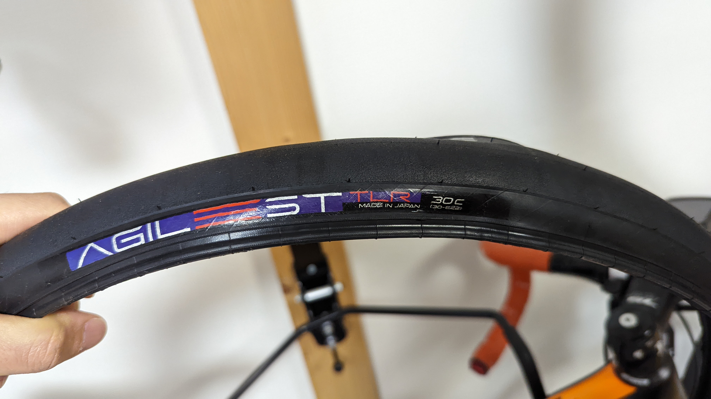

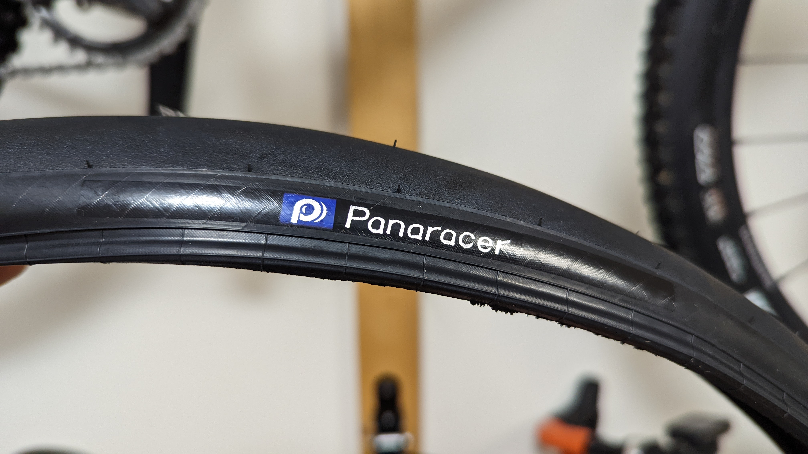

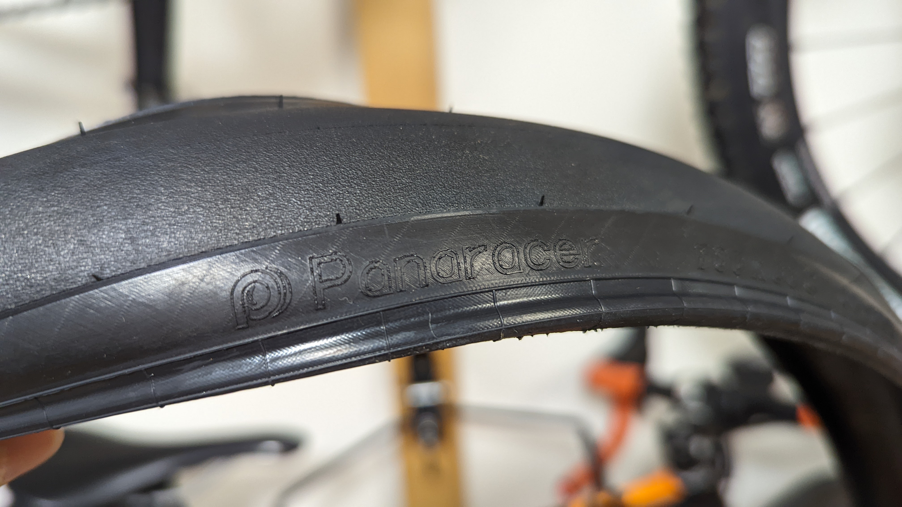

エンボスロゴがしっかりフォントまで再現して刻印してあるのは笑った。

**最大空気圧は 6Bar**と規定されている。ただし、**30c だと上限まで上げることはほぼ無いと言える。**

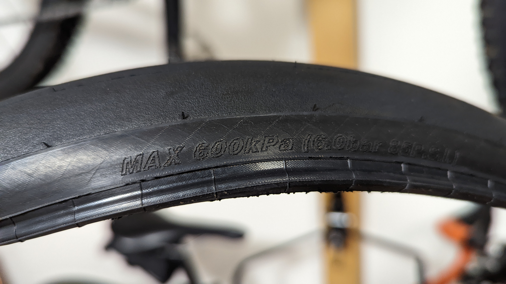

**フックレスリムで運用する場合の常用空気圧は、体重にもよるが 3.5Bar から多くても 4.5Bar を越えるくらい**となるだろう。

そもそも 6 気圧も入れたらリム側の許容値を越えてしまう。

タイヤの摩耗インジケーターも入っている。

他のタイヤで見てきたそれと比べ、やや浅いように思える。そもそものトレッドが薄い可能性がある。

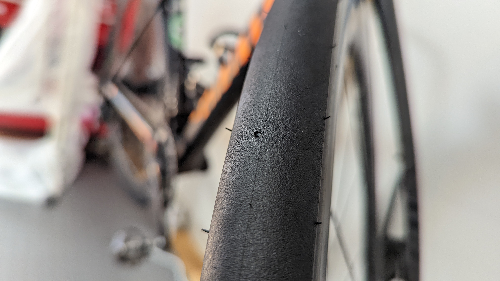

折りたたまれていたタイヤを広げても、癖がついておらず、すぐに綺麗なタイヤの形になったのが印象的だった。

## 2. 装着

### 準備編

**チューブレスレディタイヤの最大の壁**である装着難度。

新しいタイヤを試すとき、ビードを上げ直すとき、常に長期化の覚悟が必要だった。

導入で挙げた[ZIPP 303S](https://paypaymall.yahoo.co.jp/store/qbei/item/pc-810594/)の購入時、**後輪だけは中々ビードが上がらずリムテープを追加で 2 重巻きにしていたが、今回のレビューでは素の実力を測るためにあえてそれらを破棄。**付属のリムテープだけの状態にしてスタートした。

工業製品なので、どうしても製造誤差が出てしまうのは仕方がない。

ホイール側の直径にマイナス誤差が出たらテープを追加で巻いて対応するのが定番。それを今回捨ててからスタートする。

シーラントは、エア漏れを防ぐ能力だけは非常に高い OrangeSeal のエンデュランスシーラントを用意した。

<LinkBox url="https://www.chainreactioncycles.com/jp/ja/orange-seal-endurance-sealant-refill/rp-prod179168" />

これに加え、ビードが上がらなかった時に追加するための[リムテープ](https://amzn.to/3tIoeCV)や、[チューブレスタンク](https://amzn.to/3vWdJOP)を用意して臨んだ。

<LinkBox isAmazonLink url="https://www.amazon.co.jp/dp/B08QCHSTC7/" />

<LinkBox isAmazonLink url="https://www.amazon.co.jp/dp/B07XHGM23B/" />

[Pro One TLE](https://www.amazon.co.jp/dp/B07WPV58SC/?tag=gensobunya-22)で簡単に装着できた前輪は手とフロアポンプのみでビード上げが完了し、苦戦を強いられた**後輪ではコンプレッサーの使用や、追加のリムテープ巻きが必要となると予想。**

### 装着編

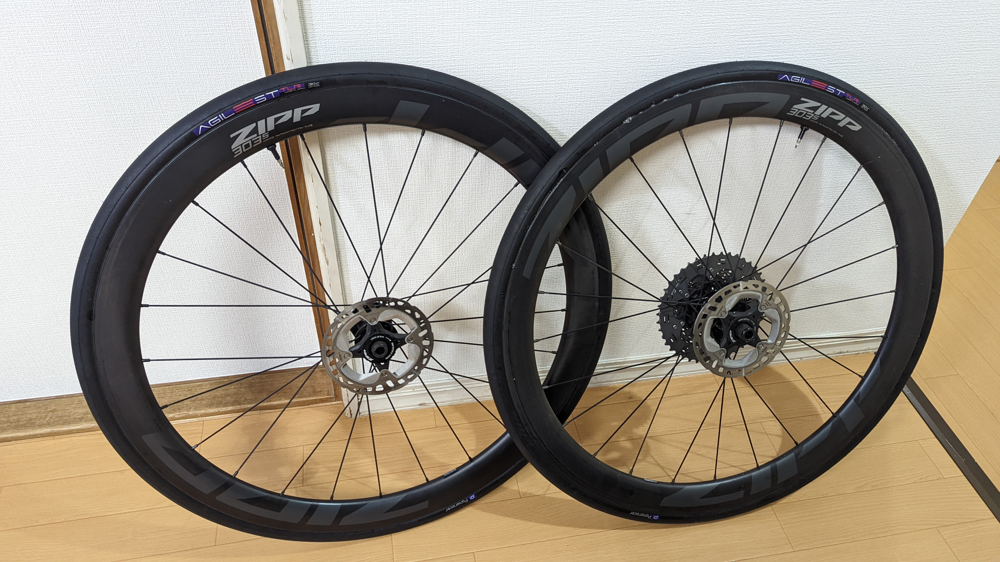

**予想を裏切り、両輪ともあっさりと手とフロアポンプのみでビード上げに成功した**

使ったケミカルは潤滑用のハンドソープだけ。**予想以上のビードの上げやすさに感動**した。安直な表現だが神 TLR タイヤと言ってもいい。シーラントは前後各 30ml 利用したのみなので、30c としては少なめで済んでいる。

思わず喜びをパナレーサーの担当者に伝えたところ、「1mm 単位で周長を詰めた甲斐がありました」とのこと。<strike>世の中のタイヤはミリレベルの誤差を許容していたのか……</strike>

フィットするであろうと考えていた前輪はほぼ空気抜けの予感すらないが、後輪は若干空気の抜ける音がしていた。

もちろん、TLR タイヤである以上気密は完全ではなく、シーラントを入れて完成となるので、このあとバルブからシーラントを入れて作業完了。

過去最速での新品タイヤ両側装着だ。

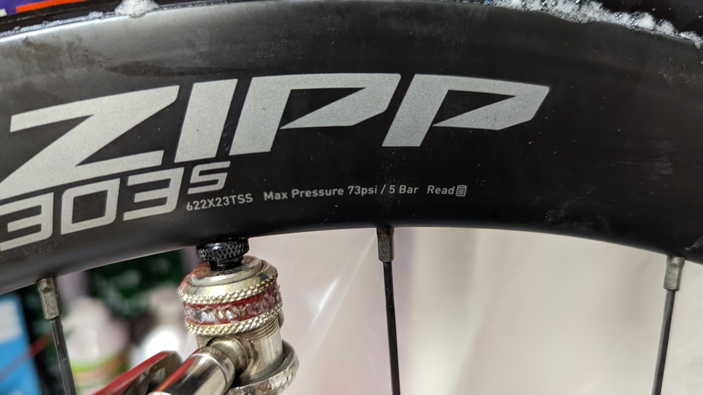

[ZIPP 303S](https://paypaymall.yahoo.co.jp/store/qbei/item/pc-810594/)の上限空気圧は 5Bar なので、ここまで空気圧を上げてシーラントを全周になじませて一晩置く。

翌日朝の空気圧は前後共に 4.5bar 程度。この程度の減少ならば許容範囲内だ、**一発で前後とも装着が決まるロード用 TLR タイヤはこれまでなかったので、最高クラスの装着体験だと言える。**

## 3. 実走

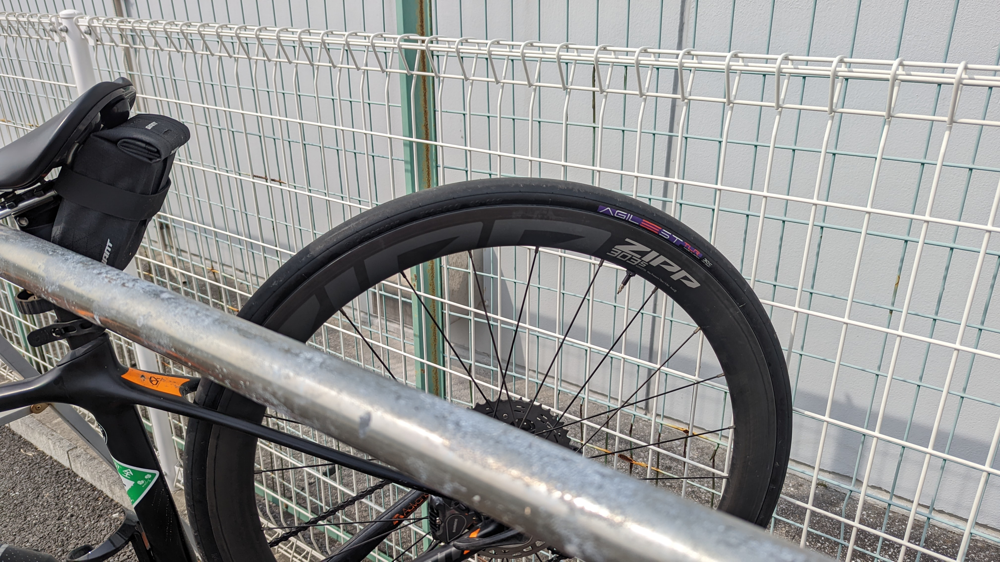

テストライドとして、湾岸エリアの大型車が荒らした平地と、横浜市特有の住宅街の急坂で挙動を確認した。

繰り返しとなるが、比較対象はシュワルベ [PRO ONE TLE](https://www.amazon.co.jp/dp/B07WPV58SC/?tag=gensobunya-22)。

<LinkBox isAmazonLink url="https://www.amazon.co.jp/dp/B07WPV58SC/" />

20km 以上は走って皮剥き（表面の保護剤落とし）をしてからの感想を記載していく。

どのロードタイヤでも言えることだが、**ある程度は乗らないと保護剤が落ちてくれず、グリップ・転がり・変形全てがイマイチな状態が続く**。

太めのタイヤは接地面が大きいせいか、変形が乗り心地に大きく影響するのでより顕著。

### 転がり・衝撃吸収

30c タイヤの真骨頂。28c までのロードタイヤに比べると、路面の粗さを感じなくなることがわかると思う。

わかりやすい段差でなくても、**路面のわずかなギャップから来る若干の跳ねがパワーロスにつながっている。**というのが太いタイヤの転がり抵抗が減る原因なのだが、タイヤのしなやかさを活かして非常に滑らかに走ることができる点がこの AGILEST TLR(30c)の魅力だ。

細かい振動をタイヤが仕事をして無効化してくれるので、**長距離では体力の温存、短期的にも転がり抵抗の低下により恩恵を受けることができる**

昨今のワイドリムのディープリムホイールでは、28c 前後のタイヤに空力が最適化されているので、空気抵抗のデメリットも小さい。ZIPP 303S を初めて履いた時の、滑らかな走行感に対する感動は AGILEST TLR でも感じることができた。

### グリップ

構造から予想するに、変形してグリップを稼ぐタイプかと予想していたのだが、**予想に反してコンパウンドでしっかり粘ってグリップするタイプのタイヤ**だった。

グリップは非常に優秀で、15%程度の下りで傾けても安心だし、ブレーキの利きも良い。**文句なしの素晴らしいグリップと言える。**

**[PRO ONE TLE](https://www.amazon.co.jp/dp/B07WPV58SC/?tag=gensobunya-22) との最大の違いがこのグリップ感**で、変形でグリップを稼いでいる感覚のある [PRO ONE TLE](https://www.amazon.co.jp/dp/B07WPV58SC/?tag=gensobunya-22) に比べて AGILEST TLR のタイヤの変形感は非常に低い。

このフィーリングは人によってかなり好みの差が出るところで、「変形＝腰砕け」に感じて恐怖を感じる人もいる。

これまで履いてきた 28~30c のタイヤは全て変形側のフィーリングだったのだが、AGILEST は 25c までのロードタイヤと似たような感覚でコーナリングできる。

### 走行感・剛性

重量的に、同程度の太さがあるタイヤより軽量なので、**理論上は登りで重量アドバンテージがある。**

そして、疲労がたまった後の登りでありがちな**「荷重が雑になってタイヤを潰してしまう」というシチュエーションでも AGILEST TLR は変形しづらかった。**

今まで使っていた [PRO ONE TLE](https://www.amazon.co.jp/dp/B07WPV58SC/?tag=gensobunya-22) の泣き所はここにあって、ハンドルに体を預けすぎるとタイヤが潰れて抵抗になりがちだったが、AGILEST でそれは起こらず、雑に踏み込んでも進んでくれる良さがあった。

## 4. 推測

### オフロード走行性能

幅なりのしなやかさを持っているものの、積極的に変形させるタイヤではないので、**耐パンクベルトを排していることも相まってダートで使うには少し抵抗がある。**

30c だとオールロード的に使いたいニーズもあると思うのだが、そういった使い方は not for AGILEST だろう。あくまでオンロードでのライドをターゲットにしたタイヤという印象だ。

……と、知った風なカタログレビューをしてみるたが、走った方が適正を把握するには早い。

**実際にグラベル走行をしてみたところ、弾かれはするものの良好なグリップを示した。AGILEST TLR でのオフロードライドは動画と別記事で存分に追記していく**

### 最強のコストパフォーマンス、だが寿命は？

税抜参考価格は 6700 円となっているので、PR TIMES を信じるのであれば**税込定価は 7370 円**となる。今回比較対象ベンチマークとした**シュワルベのプロワン TLE 30c が税込 12100 円**であることを考えると相当に安い。

<LinkBox url="https://prtimes.jp/main/html/rd/p/000000005.000070119.html" />

一方で、インジケーターを見る限りトレッドが薄い疑惑があることと、**粘りのあるコンパウンドの宿命である削れやすさ**があると予想されるので、寿命には期待薄。

なお、ロードタイヤをひび割れる前に使い切れる人はそう多くない……ので、ユーザーの交換ライフサイクルに応じた寿命が付与されているとも取れる。

## まとめ

軽量性とグリップ特性・タイヤの剛性感から、ロードレースで求められる登りでのアタックや、ダウンヒル性能まで含めて**太いタイヤのメリットを持ちながら、オールラウンドに優秀なレーシングタイヤ**になるはず。

270g に加えてシーラント 30g という重さならば、**フックレスリムの軽量性を加えれば、クリンチャーのレーシングタイヤに加えて重量ネガなく戦える。**

ただ、転がりや衝撃吸収についてはしなやかさで勝る [PRO ONE TLE](https://www.amazon.co.jp/dp/B07WPV58SC/?tag=gensobunya-22) の方が 1 枚上手といったところか。

また、オフロード性能については、同社にグラベルキングシリーズがあることからか、**AGILEST ではあえてオンロード性能に特化しているように感じた**。実はグラベルキングもかなり軽量なチューブレスレディタイヤなので、オールロード的な役割はグラベルキングに持たせていくのだろう。<strike>そろそろグラキンのモデルチェンジお願いします</strike>

<LinkBox url="https://paypaymall.yahoo.co.jp/store/cycle-yoshida/item/00656140/" />
