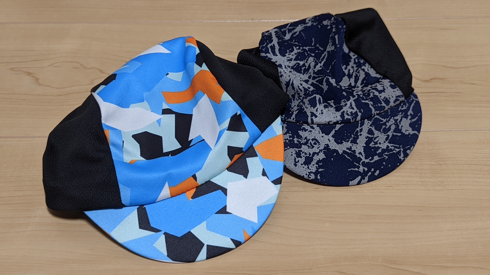
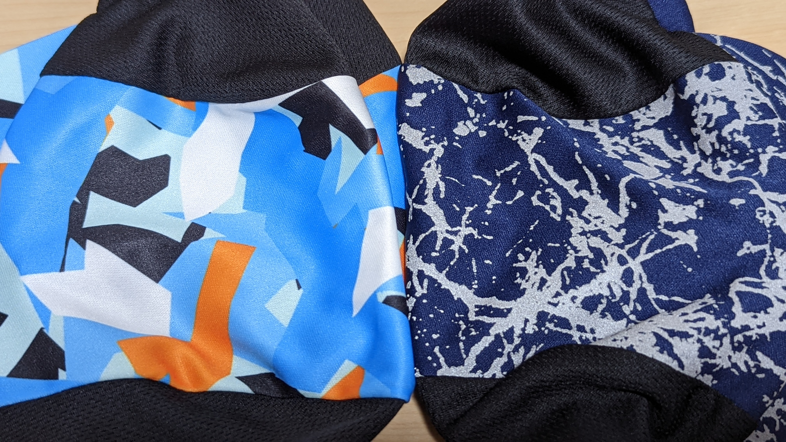
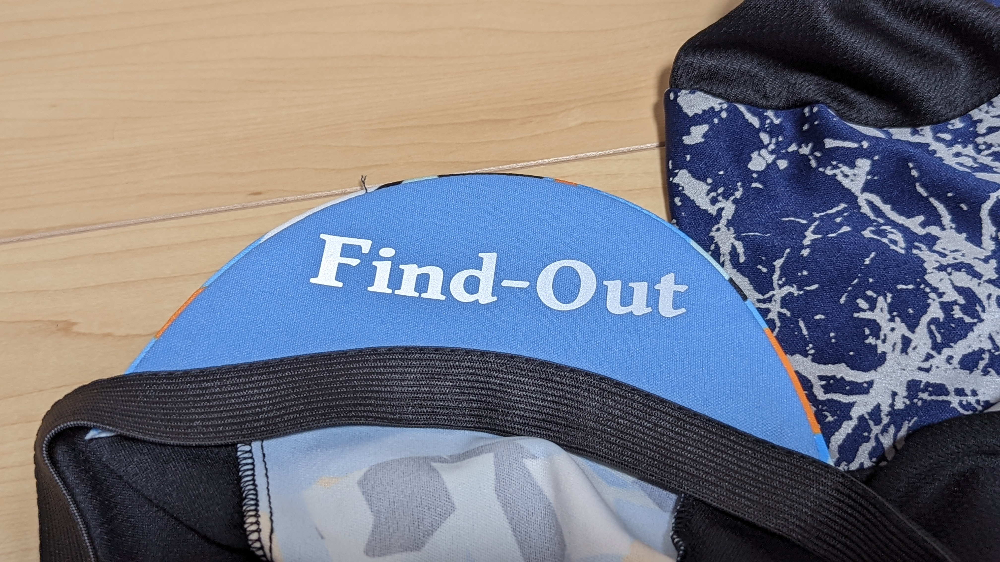
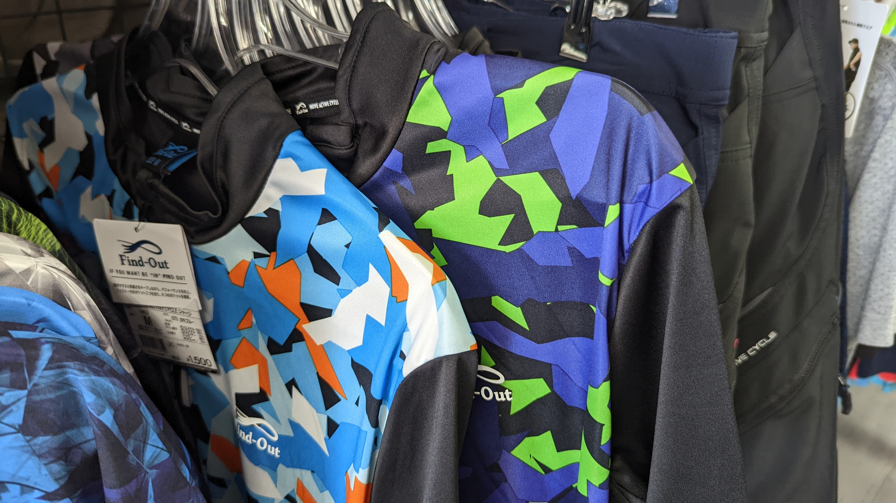
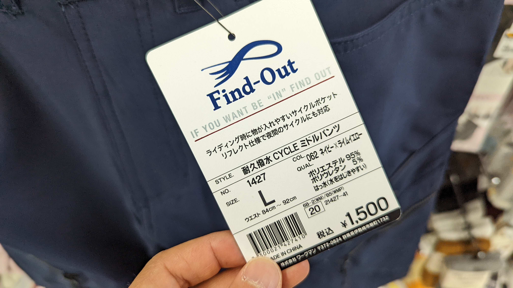

## 激安サイクルキャップ、3 年目

一昨年、わずか 780 円という衝撃的価格でデビューしたワークマンのサイクルキャップ。

<LinkBox url="https://blog.gensobunya.net/post/2021/08/workman_cap/" />

昨年に引き続き、モデルチェンジして今年も発売されるようだ。

## Find-out サイクルキャップの特徴

### フィット感

被りの深さは一般的なサイクルキャップと同じ浅めの被り。ここは昨年と変わらず。

サイズも、一般的な OGK の SM サイズの頭にはピッタリ入るし、もう少し小さくても大きくても何とかなるだろうというフリーサイズど真ん中というサイズ感

### 素材

素材そのものはポリエステル 100%で変わりなし。

ただし、**素材が非常に柔らかくなり、伸縮性が大幅に増した**。

これによって、昨年までのややゴワついた被り心地が大幅に改善されている。

反射素材の位置も改善されており、ヘルメットに隠れてしまう部分に加工されていた反射素材が、つばの裏面に変更されている。

### デザイン

サイクルジャージと合わせたデザインで発売されており、Zwift で見たような……というか完全に同じデジカモ柄のパターンになっている。

初号機カラーもジャージとセットでラインナップ。この辺のセンスについては、言及を避けておこうと思う。

## その他

今年の追加品として耐久撥水サイクルパンツも発売されていた。

後方の反射ロゴと、ジッパー付きポケットに撥水素材ということで、トレイルライドにちょうどいいのでは！？と思ったが、ウエストに対して太腿がやたらと細い。

サイクリスト的な太腿のがっしりした体形には辛いカットだ。夏用ジャージがゆったりを通り越したガバガバで、ショートパンツが細いというのはまだまだサイクルラインは製品として熟成が足りないように感じる。
