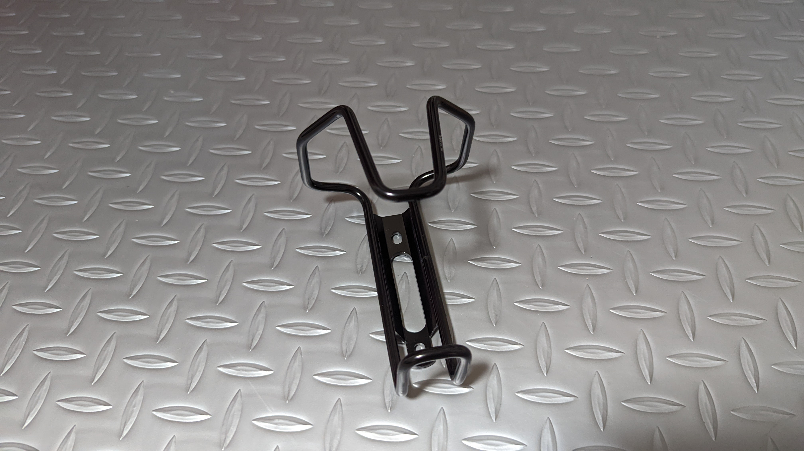

グラベルロードを買って、やってみたかったことが積載力の向上。

特に、**利用頻度は低いが場所を取る輪行袋**の効率的な保管場所にはいつも頭を悩ませていた。

背面ポケットに入れるには利用頻度が低いし、サドルバッグに入れるには大きく嵩張るし、ハンドル周りは空気抵抗への影響が大きく平坦での爽快感に欠ける。

そうなると、自然と**ダウンチューブ下や前三角の空きスペースなど、自転車におけるデッドスペースの活用**に絞られる。
