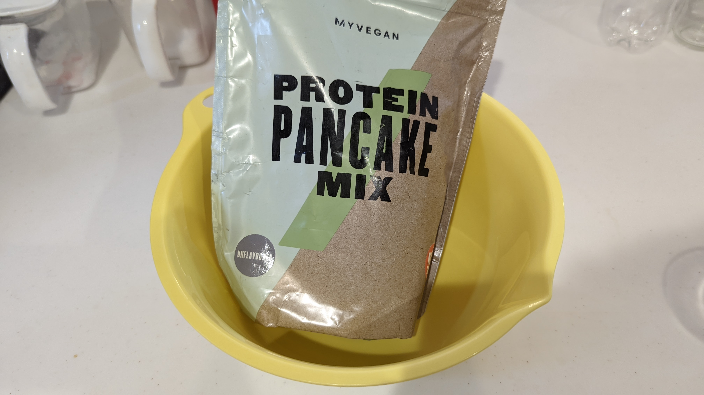
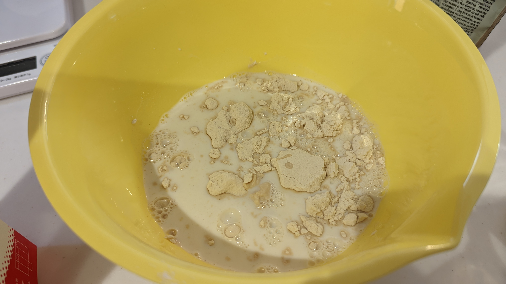
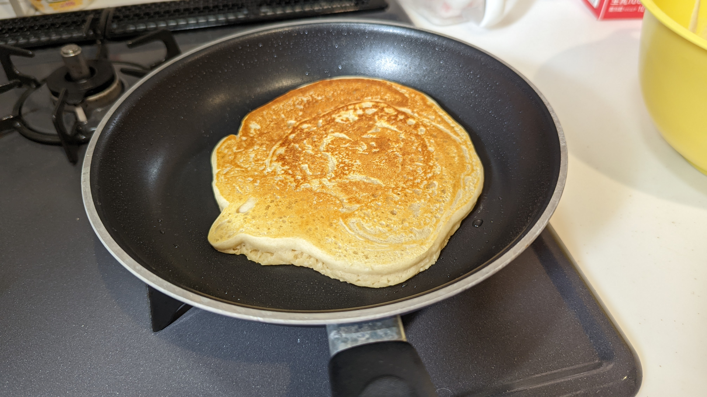

プロテイン食品レビューシリーズ第4弾は[プロテインパンケーキミックス](https://px.a8.net/svt/ejp?a8mat=3N3PXV+GF7GHE+45DI+BW0YB&a8ejpredirect=https%3A%2F%2Fwww.myprotein.jp%2Fsports-nutrition%2Fvegan-protein-pancake-mix%2F11802970.html)だ

[プロテイングラノーラ](https://px.a8.net/svt/ejp?a8mat=3N3PXV+GF7GHE+45DI+BW0YB&a8ejpredirect=https%3A%2F%2Fwww.myprotein.jp%2Fsports-nutrition%2Fprotein-granola%2F11091293.html)などと同じく、**朝食の置き換えで、タンパク質を自然に摂取する**のが狙い。

これまでのマイプロテイン食品レビューは以下のとおり。

<LinkBox url="https://blog.gensobunya.net/post/2022/05/myprotein_protein_spread/" />

<LinkBox url="https://blog.gensobunya.net/post/2022/05/myprotein_protein_spread/" />

<LinkBox url="https://blog.gensobunya.net/post/2022/05/protein_granola/" />

<LinkBox url="https://blog.gensobunya.net/post/2022/02/mp_lean_cookie/" />

## MYPTOTEIN プロテインパンケーキミックス

> パンケーキが好きではない人なんていますか？簡単に手早く作れるプロテイン パンケーキ ミックスがあれば、毎朝パンケーキを食べることができます。

ゴールデンシロップやチョコレートなどのフレーバーもあるが、まずはベーシックなものをという考えで、ノンフレーバーのパンケーキミックスをチョイスした。

習慣的に食べようとすると、**ジャムなどの付け合わせは気分で変更したいため、プレーンの方が都合がいいだろうという読み**。

よく見たら緑色のパッケージはビーガン製品でお高め。

ビーガン製品はだいたい美味しくないので、通常版を買った方がいいだろう。

<LinkBox url="https://www.myprotein.jp/sports-nutrition/protein-pancake-mix/10867261.html" linkUrl="https://px.a8.net/svt/ejp?a8mat=3N3PXV+GF7GHE+45DI+BW0YB&a8ejpredirect=https%3A%2F%2Fwww.myprotein.jp%2Fsports-nutrition%2Fprotein-pancake-mix%2F10867261.html" />

### 栄養成分

<InArticleTable>

| ---        | 100g あたり    | 1 食あたり    |
| ---------- | -------------- | ------------- |
| エネルギー | 1318kJ/313kcal | 659kJ/157Kcal |
| 脂質       | 4.0 g          | 2.0 g         |
| 炭水化物   | 50 g           | 25 g          |
| タンパク質 | 20g            | 10 g          |
| 食塩相当量 | 1.2g           | 0.62 g        |

</InArticleTable>

**1 食辺りのタンパク質量は 10g**と、マイプロテイン食品にしては控えめ。

だが、実際は1枚分50gのパンケーキミックスに対して、**70ml ほどの牛乳や無脂肪乳を合わせるので、実質的な 1 食辺りタンパク質はさらに多く**なる。

なお、ビーガン版は10gのところ、**[通常版のパンケーキミックス](https://px.a8.net/svt/ejp?a8mat=3N3PXV+GF7GHE+45DI+BW0YB&a8ejpredirect=https%3A%2F%2Fwww.myprotein.jp%2Fsports-nutrition%2Fprotein-pancake-mix%2F10867261.html)は 34g もタンパク質が含まれている**。圧倒的にこちらを買った方がいい……正直ミスった

## 調理

気を取り直して調理に移る。

ビーガン食品だが自分はビーガンではないので、積極的に牛乳を使っていく。

ああ……この香りは知っているぞ……懐かしい**プレーンソイプロテインの香り**だ

大豆の粉そのものの香り。

コツは、薄く生地を伸ばして弱火で中まで火が通るように焼くこと。**自力で膨らむホットケーキと違い、パンケーキは本当に生地に火を通すだけなので、厚いと半生になりやすい。**

## 味

食感はいい！匂いはかなりソイプロテインだ

バターはなくても大丈夫だが、**ジャムやメープルシロップがないと大豆の香りが強くて食べづらい**。

それに、ビーガン食品のせいだろうが**乳製品や卵が入っていないため、どうにも味にコクがない**

どう考えても通常版を買うべきだ。こちらを買ってまたレビューしたいと思う。

<LinkBox url="https://www.myprotein.jp/sports-nutrition/protein-pancake-mix/10867261.html" linkUrl="https://px.a8.net/svt/ejp?a8mat=3N3PXV+GF7GHE+45DI+BW0YB&a8ejpredirect=https%3A%2F%2Fwww.myprotein.jp%2Fsports-nutrition%2Fprotein-pancake-mix%2F10867261.html" />
