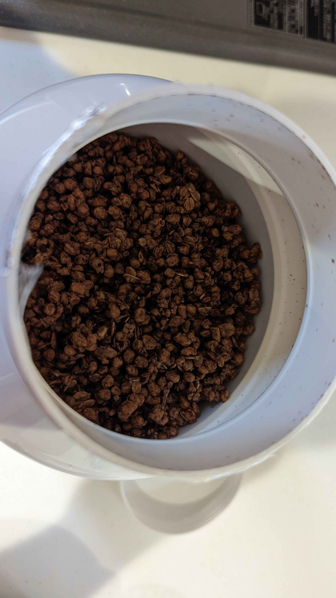
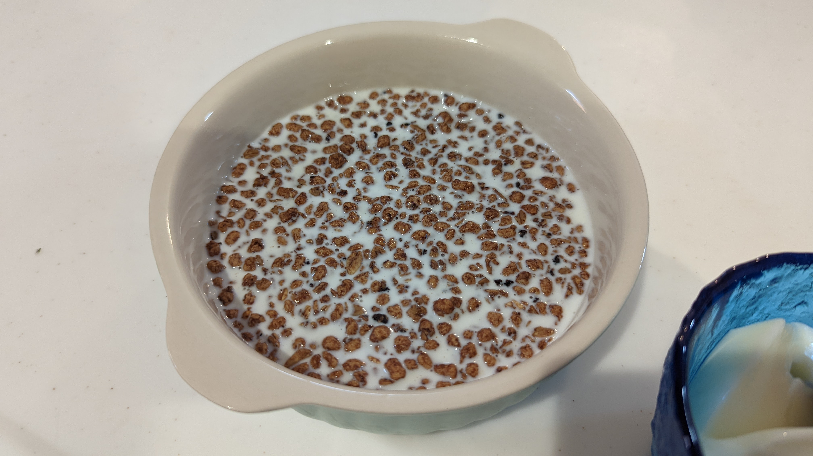

プロテイン食品レビューシリーズ第 2 弾は[プロテイングラノーラ](https://px.a8.net/svt/ejp?a8mat=3N3PXV+GF7GHE+45DI+BW0YB&a8ejpredirect=https%3A%2F%2Fwww.myprotein.jp%2Fsports-nutrition%2Fprotein-granola%2F11091293.html)だ

こちらも目的は**自然に置き換えられるメニューで、朝食の一部からタンパク質を摂取する**こと

食物繊維・適切なカロリー・（主に牛乳の影響で）バランスの取れた栄養成分になることで定評のあるグラノーラにさらにタンパク質を追加していく。

第 1 弾はプロテインスプレッドをレビューした。今回で朝食メニューをパンとグラノーラでローテーションできることになる。

<LinkBox url="https://blog.gensobunya.net/post/2022/05/myprotein_protein_spread/" />

## MYPROTEIN プロテイン グラノーラ

堂々の 750g パッケージ、もし外したらと思うと中々踏み出せない量だ。

<PositiveBox>

- 甘さは十分
- 食物繊維も（そこそこ）摂れる

</PositiveBox>

<NegativeBox>

- 粉っぽさが強い

</NegativeBox>

### 栄養成分

[[scrollableTable]]
| --- | 100g あたり | 30g+スキムミルク |
| --- | --- | --- |
| エネルギー | 1696 kJ/403 kcal | 716 kJ/170 kcal |
| 脂質 | 9.9 g | 3.2 g |
| 炭水化物 | 39 g | 19 g |
| 食物繊維 | 5.8 g | 1.6 g |
| タンパク質 | 37 g | 15 g |
| 食塩相当量 | 0.90 g | 0.47 g |

**重量当たり 37%がタンパク質**だ。

カルビーのグラノーラが実は脂質ドカ盛りであるのとは対照的に、プロテイングラノーラは**同重量の鶏ささみの 1.5 倍のタンパク質を含有する**超優秀な食品だ。

### 味

うーん……粉っぽい……

しかし妻は美味しいと言っていたので、好みが分かれるのだろうか。

チョコレート味を選んだところ、**味はチョコワに近かった**。

個人的には食感はあまり好みではないが、味そのものは頑張っていると思う。

容器内での見た目で、かつて見たイナゴのスナックを思い出した。

## まとめ

普通に食べることができるが、美味しくも不味くもないレベル。

減量中だと思えば特に問題はない

<LinkBox url="https://www.myprotein.jp/sports-nutrition/protein-granola/11091293.html" linkUrl="https://px.a8.net/svt/ejp?a8mat=3N3PXV+GF7GHE+45DI+BW0YB&a8ejpredirect=https%3A%2F%2Fwww.myprotein.jp%2Fsports-nutrition%2Fprotein-granola%2F11091293.html" />
