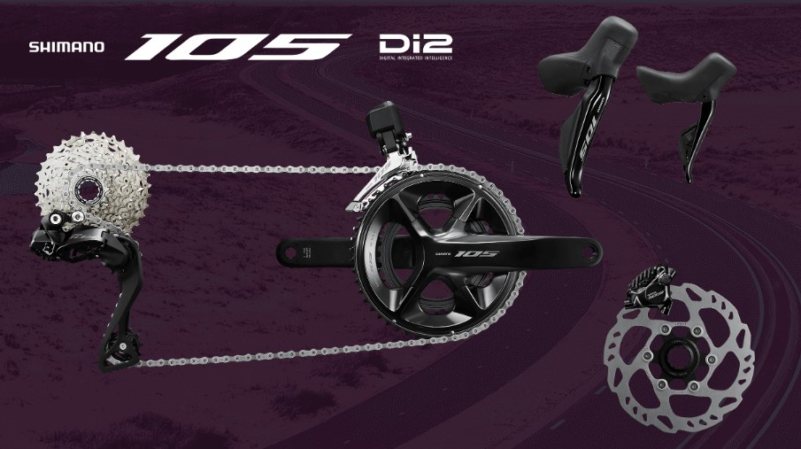
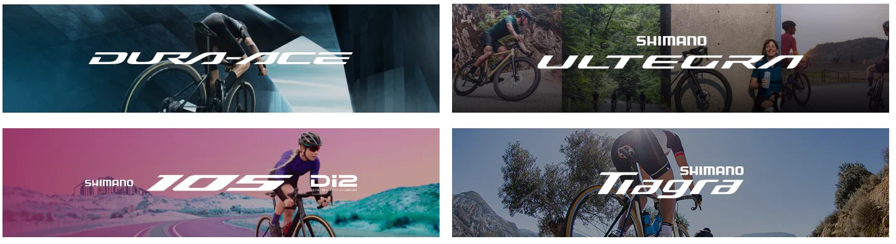

2022/6/30、満を持して電動の105コンポーネントであるR7100シリーズが発表された。

セット価格20万円、現時点では電動油圧ディスクブレーキのみのラインナップだ。

<LinkBox url="https://paypaymall.yahoo.co.jp/store/crowngears/item/2717014197234/" linkurl="https://ck.jp.ap.valuecommerce.com/servlet/referral?sid=3171302&pid=887657037&vc_url=https%3A%2F%2Fpaypaymall.yahoo.co.jp%2Fstore%2Fcrowngears%2Fitem%2F2717014197234%2F" />

電動変速油圧ディスクブレーキが次世代標準と信じて疑わず、ロード系バイクでずっと使い続けた身からすると来るべき時が来たという感覚。一方で、これまでの105でイメージされていた「本格的にロードバイクに乗り出す人のためのコンポーネント」という役割からすると、セットで20万円は前作との価格ギャップが大きい。

根本的な問題は、日本の平均所得が世界平均（特に米国）に比べ全く上昇していないことなのだが、それを論じたところで何も解決しないので、この記事では触れない。

機械式変速の扱いについてはR8100アルテグラと同じように、前世代が継続ラインナップされるかは現時点で不明。しかし、105だけアップデートされることは無いだろう。

## 電動12s時代のコンポーネント選択

デュラエース・アルテグラ・105と出そろったことで、シマノの次世代コンポラインナップが見えてきた。

結論から言うと、**自分がシリアスライダーなのか、そうでないのかで今後の選択肢が変ってくるように思える。**

現在、ロードバイク向けコンポーネントの最新版として発売されている系統を考えてみると、下記の通りだ。

1. **12スピード電動変速＋油圧ディスクブレーキ**
1. **12スピード電動変速＋機械式ブレーキ**
1. R9100,R8000(,R7000?)の**11スピード機械式変速＋油圧ディスクブレーキ**（継続販売）
1. R9100,R8000(,R7000?)の無しの**11スピード機械式変速＋機械式ブレーキ**（継続販売）
1. **Tiagraの10スピード機械式変速＋油圧ディスクブレーキ**
1. **8,9,10スピード機械式変速＋機械式ブレーキ**

電動変速＋機械式ブレーキは実質的にリムブレーキ専用品と考えると、**機械式変速の進化は止まった**ことがわかる。また、**現行Tiagraの10スピード機械式変速＋油圧ディスクだけが、グルーピングできず浮いている**ことから見ると、将来的に整理されそうだ。

価格の問題もあるが、**これからのコンポーネント選択は電動変速と機械式変速の間で、これまでより高い移行障壁が生まれることになる**。さらに、この2つの価格差がかなり大きいのもポイント。

そして、**機械式変速のアップデートは既に1度スキップされており**、これからも消極的であろうことがうかがえる。

**1%の効率増を追い求めるシリアスライダーにとっては進歩しないということは致命的**。遅かれ早かれ、電動変速を選択することになるだろう。**この層にとっては電動105は正統進化であり、レーススペックバイクの障壁を下げる形として作用する。**

一方で、**全サイクリストが電動変速を導入するのは、コスト・ラインナップ的に非現実的**。機械式変速がが無くなることは当面ないと考えられる。

気になるのは105以下のグレードでの展開だが、幸いにもシマノにはグラベルロード向けの**GRXシリーズもあり、変速・ブレーキ共に機械式・電動・油圧を選択できる**。後述するTIAGRAも、ハードなライドでなければ何ら性能的には問題がないし、いかにも11スピード化されそうな現行ラインナップとなっているのは前述の通り。

機械式変速の上位グレードが欲しいという声も多いだろうが、世界的にはグラベルバイク・MTBの需要が高く、マーケットの小さいロード系コンポーネントでラインナップをむやみに増やす未来も想像しづらく、電動変速と機械式変速の間には乗り方・機材互換性の面で溝ができそう……というのが個人的感想だ。

最高の効率を追い求めるのか？サイクリングというアクティビティを楽しみたいのか？自分のライドスタイルを問い直す必要があると思う。

多様化するロードサイクリングの世界では、万人に対する解は消えてしまったのだ（と、綺麗にまとめたい）

### メンテナンス工数削減としての電動コンポーネント

性能面で有力なのはもちろん、**電動変速・油圧ディスクブレーキコンポーネントは運用面で大きなメリットをもたらす点も触れておきたい**。

基本的にワイヤーの伸びや機械的な劣化が少なく、パッドクリアランスも自動調整されるために、**一度セッティングした後の調整箇所がほぼ存在しない**

ブレーキパッドの交換・ピストン戻しさえ習得すれば、**ショップでのメンテナンスは1年～2年に1回のブリーディングだけになるシナリオも現実的**だろう。

ワイヤー劣化に伴う交換を毎回ショップに依頼していた場合、工賃がペイする可能性も考えられる。また、ワイヤーやブレーキパッドの消耗に伴うライディング体験の悪化もない。個人的には、**お金に余裕があるのであれば電動105への乗り換えは積極的にお勧めしたい。**

メンテナンスで乗れない、というのが最も時間の無駄だ。

### 「とりあえず105」の終焉?

（既に過去のものになりつつあるが）「とりあえず105」という言葉が存在した。10年程度昔にはさも当然のように語られていた。

背景としては、歴史的に105～デュラエースは変速段数が同世代で統一される傾向にあり、**アップデートがしやすかった**という互換性の面、Tiagra以下の**リムブレーキキャリパーの剛性が不足**しており（当時は）ハードブレーキングに耐えられないという性能・安全面、これらから、「（乗り方を問わず）本格的に乗りたいなら105」という言葉は半ば教義のようになっていった。

視点を2022年に戻すと、**性能面では既にTiagraでも十分安全に走れるようになっている**。技術の進歩により解決された。

残るは互換性の面だが、そもそも**近年では、「完成車」がそのまま使えるパッケージングとなっており**、パーツ交換するという意義も薄れているという背景がある。

ホイールを鉄下駄から交換したり、ブレーキキャリパーだけ上のグレードにしたり……といった行為はすでに過去のもの。交換しないのであれば互換性を気にするという考慮点も不要になる。

自分でパーツを交換してアップグレードを楽しむ層や、結果として生まれるキメラバイクが少数派となることは少々寂しいが、**そもそも論でいえば、特定のパーツを交換してようやく目的達成する状態が不健全だった**のであり、正常化されたといえる。

入門者は入門向けにパッケージングされたバイクを購入し、シリアスライダーになったらそれなりの完成車に乗り換える、というサイクルに移行するのであれば、「最低でも105」といったパーツ交換を前提とした考え方は消えていくだろう。

## 個人の選択

ここまで、外野目線でコンポの盛衰を眺めたがそれはそれ。自分の手持ち機材でどうするか、には勿論別の個別最適がある。

フレームだけ買ったり、コンポだけ買ったりして、載せ替え・補修・予備機材として使いまわしてきた運用から、完成車を乗り換えて万事解決！という世界への移動は簡単でない。

蛇足だが、自分の今後の機材をどうするか、考えを書き出してみる。

今の手持ち自転車構成は以下の4台だ。

- シクロクロス（11speed Di2）
- グラベルロード（11speed Di2）
- 町乗りシクロクロス（SS）
- MTB（10s）

これだけの手持ち自転車をどう運用していくのかは悩みどころだ。しかも、シクロクロスという競技の特殊性も考慮する必要がある。

RDが心臓部となる最新型Di2は、心情的にシクロクロスへ導入しづらい…105 Di2の登場でコストが下がったとはいえ、予備も含めるとそれなりのコストがかかる。

現在で判断する限りでは、グラベルロードを将来的に現行の電動コンポに載せ替え、余った機材をCXの予備機材として運用するのが個人的な最適解なのではないかと考える。

町乗りシクロクロスやMTBでは、機材性能より乗ることに重点が置かれているので、コンポーネントを更新するモチベーションがないのだが、この「乗ることに重点」という感覚が今後大切になってくるのではないだろうか。

<LinkBox url="https://paypaymall.yahoo.co.jp/store/crowngears/item/2717014197234/" linkurl="https://ck.jp.ap.valuecommerce.com/servlet/referral?sid=3171302&pid=887657037&vc_url=https%3A%2F%2Fpaypaymall.yahoo.co.jp%2Fstore%2Fcrowngears%2Fitem%2F2717014197234%2F" />
